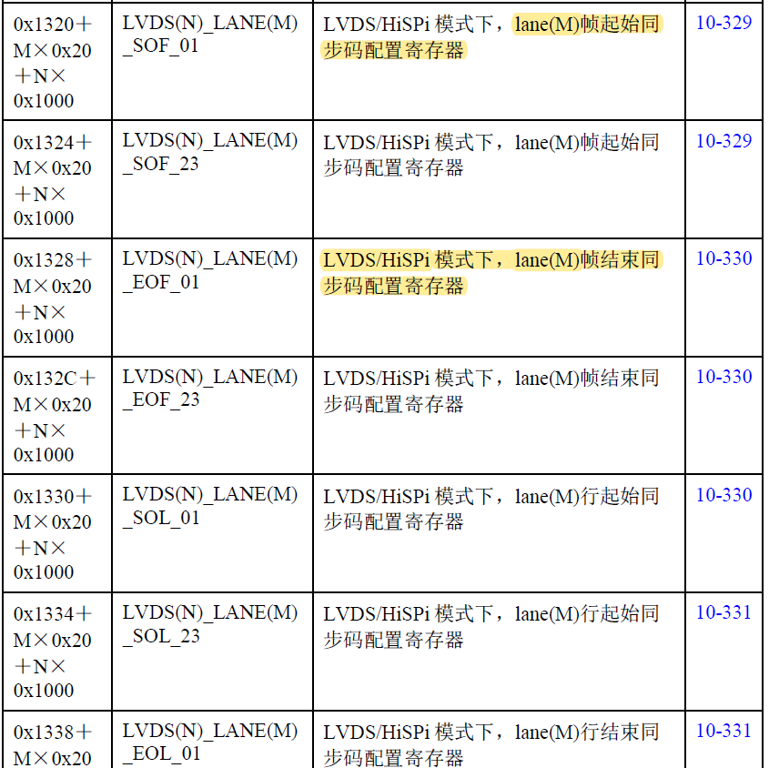
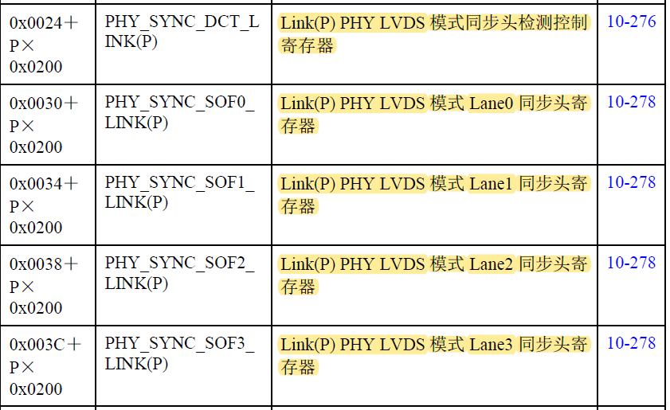
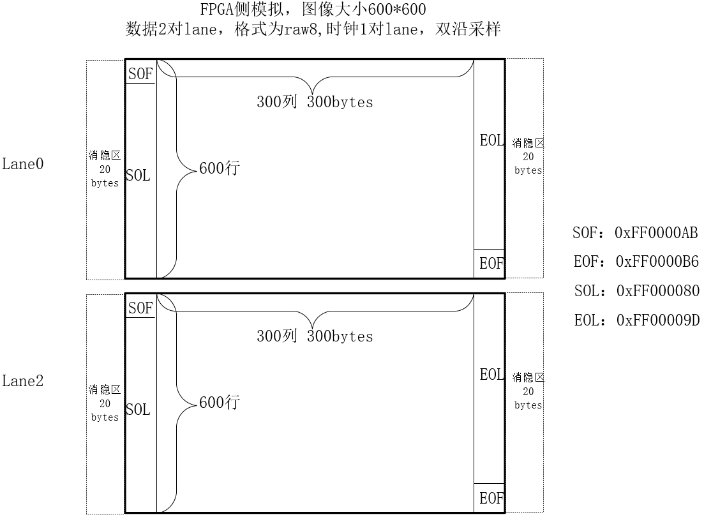
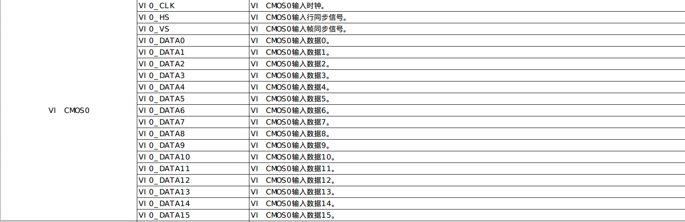
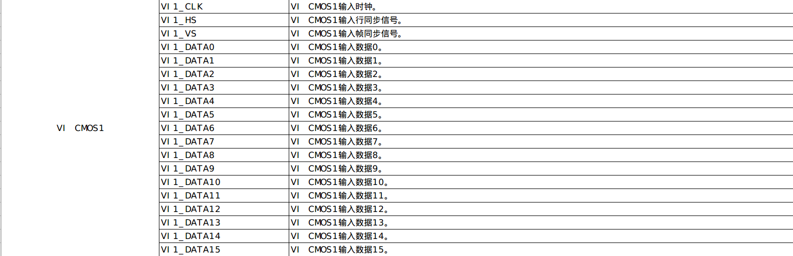
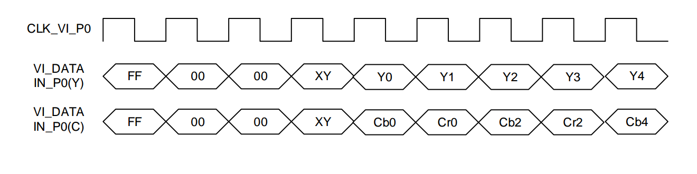
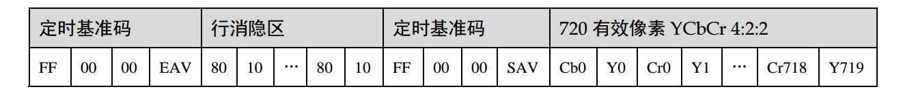
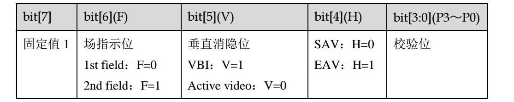
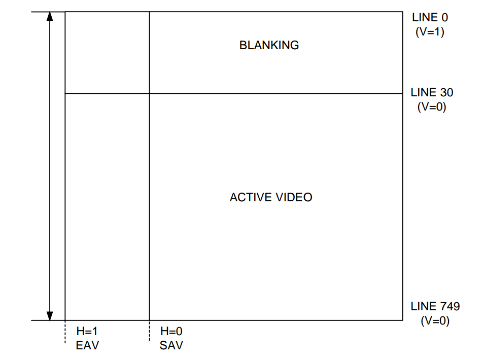

### 一 U-boot烧写

HiTool工具烧写：

拨码开关：SW5  往下是 0，往上是 1，烧写的时候拨码开关

海思U-boot调试过程中发现一直烧写不了，后发现海思一直处于复位状态，检查发现原理图`R68 1Kohm`下拉电阻不应该焊接，拆掉电阻后复位状态恢复正常；

#### 1. 烧写

因为目标板上并没有`U-boot`，所以要采用海思自带工具`HiTool`进行烧写,直接进行`Fastboot`烧写，将`U-boot`烧写进`flash`中。

目标板上的`flash`型号为`MX25U25635F`，`DDR`的型号`MT40A512M1JY-083E`.

通过海思文档`ReleaseDoc/zh/02.only for reference/Test Report`目录下的`《Hi3559A╱C V100 Compatibility Test Report (only for reference).xls》`描=描述，已有的`flash`和`DDR`型号是支持的，所以在`U-boot`中不需要进行`flash ID`的添加和`DDR`的配置修改。直接使用原有的`U-boot`即可。

- `HiTool`烧写步骤如下：

  1. 在`Hi3559AV100R001C02SPC020/01.software/pc/HiTool`目录下解压后进入`HiTool`工具，选择`HiBurn`，选择串口进行烧写（此时的目标板上没有网口驱动，不能用网口烧写）

  2. 选择`Burn Fastboot`页签，将`Flash Type`选择为`Spi Nor`，将编译好的`U-boot`传入，点击烧写，给目标板断电重启进行烧写

- `tftp`烧写指令如下：

  ```shell
  mw.b 0x41000000 0xff 0x100000 				# 对内存初始化 
  tftp 0x41000000 u-boot-hi3559av100.bin 		# U-boot下载到内存 
	sf probe 0 									# 探测并初始化SPI flash 
  sf erase 0x0 0x100000 						# 擦除 1M大小 
  sf write 0x41000000 0x0 0x100000 			# 从内存写入SPI NOR Flash,0x0表示偏移地址
  ```
  
  

#### 2. 烧写成功但串口无打印信息

烧写完成后从`minicom`进入`U-boot`，发现`U-boot`烧写成功，但是串口没有打印出相应信息（连最基本的system startup也没有打印），阅读文档`《基于Hifmcv100控制器的Flash移植指南.pdf》`发现相应问题，其中问题描述为：

```shell
`Hiburn 显示烧写成功，但串口没打印`
3Byte/4Byte地址位宽这个概念是针对于 SPI Nor 的。芯片在上电启动的时候，会去读取SPI Nor Flash 的前1MB空间，单板上的3Byte/4Byte决定了控制器读取时下发的地址宽度。
- 3Byte地址位宽最大的寻址空间是16MB，所以对于容量不大于16MB的SPI Nor Flash的 3Byte/4Byte模式拨码必须是   3Byte；
- 对于大部分 32MB 及其更大容量的 SPI Nor Flash，出厂时器件默认是 3Byte 模式，意味着只能访问前 16MB 空     间，所以此时 3Byte/4Byte 模式拨码必须是3Byte；
- 对于一小部分 32MB 及其更大容量的 SPI Nor Flash，比如 MXIC MX25L25735E 和Winbond W25Q257FV，出厂时   器件默认是 4Byte 模式，这类器件 3Byte/4Byte 模式拨码必须是 4Byte。
```

确认`3byte/4byte`的方式如下：

>`Fastboot `先选择烧写` DDR`，启动之后读写数据，如果发现读出来的数据跟原始数据对比发现数据发现错位，基本上可以确认是`3Byte/4Byte `接口问题。还 一种厂家是掉电能启动，发复位命令发现 `Flash` 启动不了，一般也是这个问题。
>
>**问题处理方法**
>
>检查一下单板拨码，或者要检查一下软件复位流程是否成功

在解决办法中发现可以将`U-boot`烧写到`DDR`中，先修改相应的程序，打印输出相应的信息，从而梳理程序的流程。发	现在`DDR`中的`U-boot`可以正常启动。

在`DDR`中启动`U-boot`打印信息如下：

```shell
System startup

Uncompress Ok!

U-Boot 2016.11 (Nov 28 2019 - 10:19:42 +0800)hi3559av100

Relocation Offset is: 176ed000
Relocating to 5feed000, new gd at 5fe4ce00, sp at 5fe4cdf0
SPI Nor:  Check Flash Memory Controller v100 ... Found
SPI Nor ID Table Version 1.0
SPI Nor(cs 0) ID: 0xc2 0x25 0x39
Block:64KB Chip:32MB Name:"MX25U25635F/45G"
SPI Nor total size: 32MB
NAND:  0 MiB
MMC:   
In:    serial
Out:   serial
Err:   serial
Net:   gmac0
Error: gmac0 address not set.
, gmac1
Error: gmac1 address not set.

Hit any key to stop autoboot: 2 口口口 1
```

根据`Hit any key to stop autoboot`定位到源代码的两个.C文件

```shell
//bootmenu.c 

if (menu->delay > 0) {
		printf(ANSI_CURSOR_POSITION, menu->count + 5, 1);
		printf(" Hit any key to stop autoboot: %2d ", menu->delay);
	}

//autoboot.c

#ifdef CONFIG_MENUPROMPT
	printf(CONFIG_MENUPROMPT);
#else
	printf(" Hit any key to stop autoboot: %2d ", bootdelay);
#endif
```

通过修改信息发现进入执行的第二个.C文件（`autoboot.c`）,定位到`static int __abortboot(int bootdelay)`这	个函数中，发现由于烧写到`DDR`中我们无法输入字符使得无法进入`boot`，因此修改程序将其返回值`abort`设为1，直	接进入`boot`，从而可以输入相关指令进行操作，确认`U-boot`是可以正常启动的。

#### 3. flash的内容拷贝到`DDR`中测试

将Flash中的文件通过以下命令拷贝到`DDR`中并进行读取（读取结果为二进制）

**在使用`sf read`、`sf write`之前一定要用`sf probe`**

`sf read <ddr_addr> offset length`：

​	读取`Flash`的`offset`处的长度为`length`的内容到`DDR`中，`DDR`地址为`ddr_adddr`

`md <ddr_addr>  length` ：

​	读取内存`ddr_addr`处长度为`length`的内容

```shell
hisilicon # sf probe        	//探测并初始化SPI Nor Flash
hisilicon # getinfo spi			//获取SPI Nor Flash信息
Block:64KB Chip:32MB*1
ID:0xC2 0x25 0x39
Name:"MX25U25635F/45G"
hisilicon # sf read 0x82000000 0x0 0x20  //从Flash的偏移0x0处读取长度为0x100的数据写入到内存												  //(DDR)中
device 0 offset 0x0, size 0x100

SF: 32 bytes @ 0x0 Read: OK
hisilicon # md 0x82000000 0x20  		  //打印从0x82000000处开始，长度为256字节的内存数据

82000000: 14000a1c deadbeef deadbeef deadbeef    ................
82000010: deadbeef deadbeef deadbeef deadbeef    ................
82000020: deadbeef deadbeef deadbeef deadbeef    ................
82000030: deadbeef deadbeef deadbeef deadbeef    ................
82000040: 12010034 00000001 00000000 0000b805    4...............
82000050: 12010034 00000000 00000000 0000b805    4...............
82000060: 12010110 00000001 00000000 00008805    ................
82000070: 120100e4 00000000 00000000 000000fd    ................
```

然后通过`UltraEdit`去读取编译好的`U-boot.bin`文件的二进制格式，对比两者发现并没有错位或者1位翻转的现象，说明将`U-boot`烧写进`Flash`这个过程并没有问题。

`HiTool`工具首先断开与烧写使用串口的连接（左上角断开连接），然后代开自带的终端工具，连接串口，进入`boot`。

在终端中然后通过一些命令将`Flash`中的内容拷贝到`DDR`中，并通过`go`命令进行执行。

```shell
hisilicon # printenv                  //查看环境变量
arch=arm
baudrate=115200
board=hi3559av100
board_name=hi3559av100
bootargs=mem=256M console=ttyAMA0,115200n8
bootcmd=bootm 0x42000000
bootdelay=2
cpu=armv8
ethact=gmac0
soc=hi3559av100
stderr=serial
stdin=serial
stdout=serial
vendor=hisilicon
verify=n

Environment size: 283/262140 bytes
hisilicon # sf probe
hisilicon # sf read 0x42000000 0x0 0x60000
device 0 offset 0x0, size 0x60000

SF: 393216 bytes @ 0x0 Read: OK
hisilicon # bootm 0x42000000  				//启动内核的命令
Wrong Image Format for bootm command
ERROR: can't get kernel image!
hisilicon # go 0x42000000					//执行相应地址的程序
## Starting application at 0x42000000 ...

System startup

Uncompress Ok!

U-Boot 2016.11 (Dec 04 2019 - 15:51:10 +0800)hi3559av100

Relocation Offset is: 176ed000
Relocating to 5feed000, new gd at 5fe4ce00, sp at 5fe4cdf0
SPI Nor:  Check Flash Memory Controller v100 ... Found
SPI Nor ID Table Version 1.0
SPI Nor(cs 0) ID: 0xc2 0x25 0x39
Block:64KB Chip:32MB Name:"MX25U25635F/45G"
SPI Nor total size: 32MB
NAND:  0 MiB
MMC:   
*** Warning - bad CRC, using default environment

In:    serial
Out:   serial
Err:   serial
Net:   gmac0
Error: gmac0 address not set.
, gmac1
Error: gmac1 address not set.

Hit any key to stop autoboot:  0 
Wrong Image Format for bootm command
ERROR: can't get kernel image!
hisilicon # 
```

#### 4. 问题解决

发现成功地打印出相关启动信息，说明烧写进入`Flash`的`U-boot`能够正确启动，将问题定位到海思芯片上的`bootrom`（片上内存，上电或者复位后执行的第一个代码）不能正确引导`Uboot`，所以不能启动。结合文档上说明的`3byte/4byte`，阅读`MX25U25635F`的文档，发现默认设置为`3byte`模式，目标板上接线模式为4线，两者存在冲突，将目标班上的接线模式改为3线之后能够正确启动U-boot。


### 二 kernel烧写

`tftp`烧写指令

```shell
mw.b 0x41000000 0xff 0x900000 					/* 对内存初始化*/ 
tftp 0x41000000 uImage_hi3559av100_multi-core	/*uImage下载到内存*/ 
sf probe 0 										/*探测并初始化SPI flash*/ 
sf erase 0x100000 0x900000 						/*擦除 9M大小*/ 
sf write 0x41000000 0x100000 0x400000 	/*从内存写入SPI NOR Flash，0x1000000偏移地址*/ 
```


#### 1. 烧写问题

用串口进行烧写完整的`uboot`，`kernel`，`rootfs`的时候，烧写成功后启动`U-boot`后加载`kernel`的时候出现以下问题：

>```shell
>Wrong Image Format for bootm command                                            
>ERROR: can't get kernel image!
>```
>
>解决办法：
>
>>1. 首先检查拨码开关是否从`flash`启动
>>
>>2. 查看文档《启动介质烧写指南》，检查是否设置启动参数
>>
>>3. 查看用`HiTool`烧写时打印的命令发现`SPI Nor Flash`和`SPI Nand Flash`的烧写指令不同，同时启动参数的设置也不同

因网口暂时还存在问题，用`HiTool`通过串口烧写kernel。开始将kernel和文件系统一同通过`HiTool`烧写进`flash`，出现以下问题：

```shell
Load fip from 0x0000000041000000 ...
Firmware Image Package ToC:
---------------------------
- EL3 Runtime Firmware BL3-1: offset=0xD8, size=0x7090
- Non-Trusted Firmware BL3-3: offset=0x7168, size=0x82E2B6
- EL3 Runtime Firmware BL3-1: offset=0x83541E, size=0x7090
- Non-Trusted Firmware BL3-3: offset=0x83C4AE, size=0x82E2B6
---------------------------
Create Entry Point info ...
Get - EL3 Runtime Firmware BL3-1 
Get - Non-Trusted Firmware BL3-3 
kernel_size[0x82e2b6] fdt_size[0x8276] fdt_addr[0x00000000448a6000]
Invalid FDT at 0x0000000046000000, hdr at 0x000000004407ffc0
exit not allowed from main input shell.
```

所以选择分开烧写，先烧写kernel。烧写完成之后设置相应的环境变量。

#### 2. U-boot内核下相关的命令解释如下

```shell
`bootargs`:设置要传递给内核的信息，主要用来告诉内核分区信息和根文件系统所在的分区
setenv bootargs 'mem=128M console=ttyAMA0,115200 root=/dev/mtdblock2 rootfstype=jffs2 rw mtdparts=hi_sfc:1M(boot),9M(kernel),16M(rootfs)' 
参数介绍：
- mem:指定内存的大小
- console：指定终端串口以及串口波特率
- root：指定根文件系统所在分区，以及读写权限
- rootfstype：指定根文件系统的文件格式，SPI Nor 需选择jffs2，SPI Nand 选择yaffs2
- mtdparts：设定flash的设备号，这是在U-boot中进行设定的，SPI Nor为hi_sfc,SPI Nand 为hinand，同时设置				U-boot、kernel、根文件系统的内存分区大小	

`bootcmd`自动启动时默认执行的一些命令
SPI Nand设置的命令：
setenv bootcmd 'nand read 0x41000000 0x100000 0x900000;bootm 0x41000000'
SPI Nor设置的命令：
setenv bootcmd 'sf probe 0;sf read 0x41000000 0x100000 0x900000;bootm 0x41000000'
```

#### 3. 调试过程记录

在最初烧写的时候打印出`Invalid FDT at 0x0000000046000000, hdr at 0x000000004407ffc0`后程序终止，在kernel的源代码中去查找：

```shell
在load_fip.c文件中
fdt = (char *)FDT_LOAD_ADDR
g_fdt_addr = fdt;
ret = fdt_check_header(fdt);
if (ret) {
	printf("Invalid FDT at 0x%p, hdr at 0x%p\n", fdt, hdr);
	goto error;
}
在一个偏移地址kernel_load_addr + 0x1F80000出加载FDT。
FDT就是扁平设备数，简单理解为将部分设备信息结构存放到device tree文件中。uboot最终将其device tree编译成dtb文件，使用过程中通过解析该dtb来获取板级设备信息。uboot的dtb和kernel中的dtb是一致的。
```

通过`md`命令去`0x46000000`处读取相应信息，发现内容全为1。怀疑烧写过程中出现问题。重新烧写`kernel`，然后通过`HiTool`自带终端连接进入`boot`。首先读取`0x46000000`处内容如下：

```shell
hisilicon # sf probe        	//探测并初始化SPI Nor Flash
hisilicon # sf read 0x82000000 0x0 0x20  //从Flash的偏移0x0处读取长度为0x100的数据写入到内存												  //(DDR)中
device 0 offset 0x0, size 0x20

SF: 32 bytes @ 0x0 Read: OK
hisilicon # md 0x82000000 0x20  		  //打印从0x82000000处开始，长度为256字节的内存数据
82000000: c4a0a3a2 a5a4a7a6 f4f5f6f7 f0f1f2f3    ................               
82000010: b1b0b3b2 50b4b7b6 e4e5b9e7 e0e1e2e3    .......P........               
82000020: c19dc3c2 c5c4c7e0 94963e14 90919293    .........>......               
82000030: d1d0d3d2 d5d4d7d6 844b866a 804f8283    ........j.K...O.               
82000040: e1e0e387 b8e4e7e6 597bb6b7 b0b1b230    ..........{Y0...               
82000050: 94f0f3fa f5f4f7f6 a4a54ba7 a0a14fa3    .........K...O..               
82000060: 01000302 60040706 549f56d2 539f52d6    .......`.V.T.R.S               
82000070: 11101b12 15141716 c7454647 40414243    ........GFE.CBA@   
hisilicon # md 0x46000000 0x20                                                  
46000000: c4a0a3a2 a5a4a7a6 f4f5f6f7 f0f1f2f3    ................               
46000010: b1b0b3b2 50b4b7b6 e4e5b9e7 e0e1e2e3    .......P........               
46000020: c19dc3c2 c5c4c7e0 94963e14 90919293    .........>......               
46000030: d1d0d3d2 d5d4d7d6 844b866a 804f8283    ........j.K...O.               
46000040: e1e0e387 b8e4e7e6 597bb6b7 b0b1b230    ..........{Y0...               
46000050: 94f0f3fa f5f4f7f6 a4a54ba7 a0a14fa3    .........K...O..               
46000060: 01000302 60040706 549f56d2 539f52d6    .......`.V.T.R.S               
46000070: 11101b12 15141716 c7454647 40414243    ........GFE.CBA@   
```

发现内容有效，说明烧写是没有问题的。然后通过设置环境变量来启动`kernel`：定位环境变量烧写错误

```shell
hisilicon # setenv bootargs 'mem=128M console=ttyAMA0,115200 mtdparts=hi_sfc:1M(boot),9M(kernel)' 
hisilicon # saveenv
hisilicon # setenv bootcmd 'sf probe 0;sf read 0x41000000 100000 900000;bootm 0x41000000'
hisilicon # saveenv
hisilicon # printenv                                                            
arch=arm                                                                        
baudrate=115200                                                                 
board=hi3559av100                                                               
board_name=hi3559av100                                                          
bootargs=mem=128M console=ttyAMA0,115200 mtdparts=hi_sfc:1M(boot),9M(kernel)
bootcmd=sf probe 0;sf read 0x41000000 0x100000 0x900000;bootm 0x41000000        
bootdelay=2                                                                     
cpu=armv8                                                                       
ethact=gmac0                                                                    
soc=hi3559av100                                                                 
stderr=serial                                                                   
stdin=serial                                                                    
stdout=serial                                                                   
vendor=hisilicon                                                                
verify=n   
hisilicon # reset
device 0 offset 0x100000, size 0x900000                                                                                                                                                    
SF: 9437184 bytes @ 0x100000 Read: OK                                                         
Load fip from 0x0000000041000000 ...                                                         
Firmware Image Package ToC:                                                                   
---------------------------                                                                   
- EL3 Runtime Firmware BL3-1: offset=0x88, size=0x7090                                       
- Non-Trusted Firmware BL3-3: offset=0x7118, size=0x82E2B6                                   
---------------------------                                                                   
Create Entry Point info ...                                                                   
Get - EL3 Runtime Firmware BL3-1                                                             
Get - Non-Trusted Firmware BL3-3                                                             kernel_size[0x82e2b6] fdt_size[0x8276] fdt_addr[0x00000000448a6000]                          hdr[0x000000004407ffc0] header_size[0x40] image_size[0x826040]                               
bl33_ep->spsr = 0x3c5 bl33_ep->pc = 0x44080000                                               
NOTICE:  BL31: v1.3(debug):multi-core                                                         
NOTICE:  BL31: Built : 10:22:46, Nov 28 2019                                                 
INFO:    ARM GICv2 driver initialized                                                         
INFO:    BL31: Initializing runtime services                                                 
INFO:    BL31: Preparing for EL3 exit to normal world                                         
INFO:    Entry point address = 0x44080000                                                     
INFO:    SPSR = 0x3c5                                                                         
Booting Linux on physical CPU 0x0                                                             
Linux version 4.9.37 (winston@winston) (gcc version 6.3.0 (HC&C V100R002C00B012_20180601) ) #1 SMP Thu Nov 28 10:22:40 CST 2019   
```

此时`U-boot`和`kernel`都正常启动，接下来烧写根文件系统。

### 三 烧写根文件系统

利用`HiTool`工具烧写文件系统烧写成功后，设置环境变量，添加根文件系统的相关信息。

`tftp`烧写指令：

```shell
mw.b 0x41000000 0xff 0x1000000 					/* 对内存初始化*/ 
tftp 0x41000000 rootfs_hi3559av100_64k.jffs2 	/*文件系统下载到内存*/ 
sf probe 0 										/*探测并初始化SPI flash*/ 
sf erase 0xa00000 0x1000000 						/*擦除 16M大小*/ 
sf write 0x41000000 0xa00000 0x1000000 		/*从内存写入SPI NOR Flash，0xa000000偏移地址*/ 
```


`reset`出现以下问题：

```shell
UDF-fs: warning (device mtdblock2): udf_fill_super: No partition found (2)
yaffs: dev is 32505858 name is "mtdblock2" rw
yaffs: passed flags ""
yaffs: dev is 32505858 name is "mtdblock2" rw
yaffs: passed flags ""
------------[ cut here ]------------
WARNING: CPU: 3 PID: 1 at mm/page_alloc.c:3532 __alloc_pages_nodemask+0x2c0/0xab0
Modules linked in:

CPU: 3 PID: 1 Comm: swapper/0 Not tainted 4.9.37 #1
Hardware name: Hisilicon HI3559AV100 DEMO Board (DT)
task: ffffffc005c40000 task.stack: ffffffc005c2c000
PC is at __alloc_pages_nodemask+0x2c0/0xab0
LR is at __alloc_pages_nodemask+0xbc/0xab0
pc : [<ffffff80081227e0>] lr : [<ffffff80081225dc>] pstate: 20000005
sp : ffffffc005c2f630
x29: ffffffc005c2f630 x28: ffffffc0054de1e0 
x27: ffffffc0054df9e0 x26: ffffff800886fbb0 
x25: ffffff8008856000 x24: 0000000000000001 
x23: 0000000002404040 x22: 0000000000000000 
x21: 0000000002404040 x20: ffffff8008857000 
x19: 0000000000000014 x18: ffffffbf00130000 
x17: 0000000000008270 x16: 0000000000001800 
x15: 0000000000000000 x14: 00000000000000dc 
x13: 0000000000000000 x12: 0000000000000007 
x11: ffffffbf0013c020 x10: ffffffbf0013c000 
x9 : 0000000000000000 x8 : 0000000000000000 
x7 : ffffff80088a3180 x6 : 0000000000000000 
x5 : fffffffffff011e5 x4 : 0000000000000000 
x3 : 0000000000000000 x2 : 0000000000000001 
x1 : ffffff800886a0da x0 : 0000000000000000 

---[ end trace 8b68623e172cbdf9 ]---
Call trace:
Exception stack(0xffffffc005c2f450 to 0xffffffc005c2f580)
f440:                                   0000000000000014 0000007fffffffff
f460: ffffffc005c2f630 ffffff80081227e0 0000000020000005 000000000000003d
f480: ffffff80088a4500 0000000000000000 ffffff80088a4500 0000000100000000
f4a0: 0000000000000000 ffffff80081225dc 0000000000000000 ffffff8008857000
f4c0: 0000000002601250 0000000000000000 0000000002601250 0000000000000001
f4e0: ffffffc005c2f550 ffffff800815a064 0000000000000000 0000000000210d00
f500: 0000000000000000 ffffff800886a0da 0000000000000001 0000000000000000
f520: 0000000000000000 fffffffffff011e5 0000000000000000 ffffff80088a3180
f540: 0000000000000000 0000000000000000 ffffffbf0013c000 ffffffbf0013c020
f560: 0000000000000007 0000000000000000 00000000000000dc 0000000000000000
[<ffffff80081227e0>] __alloc_pages_nodemask+0x2c0/0xab0
[<ffffff8008139358>] kmalloc_order+0x20/0x40
[<ffffff800815a1cc>] __kmalloc+0xe4/0x138
[<ffffff80082d3bd8>] yaffs_get_temp_buffer+0x78/0xb0
[<ffffff80082dc51c>] yaffs_tags_marshall_read+0x1d4/0x220
[<ffffff80082da62c>] yaffs2_checkpt_find_block+0x8c/0x190
[<ffffff80082db0b0>] yaffs2_checkpt_rd+0x1e8/0x220
[<ffffff80082de630>] yaffs2_rd_checkpt_validity_marker+0x20/0xa0
[<ffffff80082df278>] yaffs2_checkpt_restore+0x60/0x698
[<ffffff80082d9f38>] yaffs_guts_initialise+0x468/0x7e0
[<ffffff80082d2f74>] yaffs_internal_read_super.isra.13+0x3f4/0x798
[<ffffff80082d3330>] yaffs2_internal_read_super_mtd+0x18/0x30
[<ffffff8008166ae8>] mount_bdev+0x190/0x1b8
[<ffffff80082cfb5c>] yaffs2_mount+0x14/0x20
[<ffffff80081676e4>] mount_fs+0x1c/0xa8
[<ffffff8008183ad8>] vfs_kern_mount+0x50/0x118
[<ffffff8008186224>] do_mount+0x16c/0xba0
[<ffffff8008187004>] SyS_mount+0x8c/0xf8
[<ffffff8008800f3c>] mount_block_root+0x104/0x2b8
[<ffffff8008801284>] mount_root+0x74/0x84
[<ffffff80088013f8>] prepare_namespace+0x164/0x1a0
[<ffffff8008800c74>] kernel_init_freeable+0x1c0/0x1e0
[<ffffff80086307c8>] kernel_init+0x10/0x100
[<ffffff8008082ee0>] ret_from_fork+0x10/0x30
------------[ cut here ]------------
kernel BUG at fs/yaffs2/yaffs_getblockinfo.h:31!
Internal error: Oops - BUG: 0 [#1] SMP
Modules linked in:
CPU: 3 PID: 1 Comm: swapper/0 Tainted: G        W       4.9.37 #1
Hardware name: Hisilicon HI3559AV100 DEMO Board (DT)
task: ffffffc005c40000 task.stack: ffffffc005c2c000
PC is at yaffs_rd_chunk_tags_nand+0xac/0xc8
LR is at yaffs_rd_chunk_tags_nand+0xc0/0xc8
pc : [<ffffff80082db7d4>] lr : [<ffffff80082db7e8>] pstate: 60000005
sp : ffffffc005c2f820
x29: ffffffc005c2f820 x28: 0000000000010000 
x27: 0000000000000000 x26: ffffffc004e00000 
x25: 0000000001010000 x24: 0000000000010000 
x23: 0000000000000100 x22: 0000000000000000 
x21: ffffffc005c2f938 x20: 0000000001010000 
x19: ffffffc0054de000 x18: ffffff80088b2578 
x17: 0000000000008270 x16: 0000000000001800 
x15: 0000000000008000 x14: 000000000000011e 
x13: 0000000000000000 x12: 0000000000000007 
x11: 0000000000000006 x10: 000000000000011e 
x9 : 0000000000000001 x8 : ffffffc007b7d92c 
x7 : 0000000000000000 x6 : ffffffc007b7d8e4 
x5 : ffffffc007b78000 x4 : 0000000000000000 
x3 : 0000000000000000 x2 : 000000000000065e 
x1 : ffffff8008866328 x0 : 0000000000000038 

Process swapper/0 (pid: 1, stack limit = 0xffffffc005c2c020)
Stack: (0xffffffc005c2f820 to 0xffffffc005c30000)
f820: ffffffc005c2f8a0 ffffff80082e0ec0 00000000000c0000 0000000000000000
f840: ffffffc004e00000 ffffffc0054de000 ffffffc005c2f880 ffffff80082d3bd8
f860: ffffffc0054de000 ffffffc0055627f8 ffffffc004e00000 ffffffc0054de000
f880: ffffffc005c2f8a0 ffffff80082e0e88 ffffffc005562000 00000000000000ff
f8a0: ffffffc005c2f980 ffffff80082dfc78 ffffffc005562000 ffffffc0055627f8
f8c0: 0000000000000100 00000000efffeeff ffffffc005562800 00000000000007f8
f8e0: 0000000000000000 00000000000000fe ffffffc0054df9e0 ffffffc0054de000
f900: ffffffc005c2f980 ffffff80082dfbfc ffffffc0055627f8 ffffffe100000100
f920: ffffff800875c458 0000000000000010 ffffffc005562800 0000000000000101
f940: 0000000000000000 00000000000000ff ffffffc0054df9e0 ffffffc0054de000
f960: ffffffc005c2f980 ffffff80082dfc28 0000000000000100 0000000000000100
f980: ffffffc005c2fa90 ffffff80082da248 0000000000000001 ffffffc00542e568
f9a0: ffffffc0054de000 0000000002400040 0000000000000001 ffffff800886f000
f9c0: 0000000000000000 ffffff800886fbb0 ffffffc0054df9e0 ffffffc0054de1e0
f9e0: ffffff800875cba8 ffffff80082d367c ffffffc0055e4500 00000000055e45b8
fa00: ffffffc0054de000 0000000002400040 0000000000000000 ffffff80082d47a0
fa20: ffffffc005562800 ffffffc005562000 0542e56800000002 ffffffc005c2fa38
fa40: ffffffc005c2fa38 0000000000000028 ffffffc005c2fa70 ffffff80082d4c4c
fa60: ffffffc0054de000 ffffffc00542e568 ffffffc005c2fa90 ffffff80082da238
fa80: 0000000000000001 ffffffc00542e568 ffffffc005c2faf0 ffffff80082d2f74
faa0: ffffffc005561800 ffffffc0054de000 ffffff800886f000 ffffff8008689000
fac0: ffffff80088cd488 ffffffc005064e00 ffffffc0054de0e8 ffffff800886fbb0
fae0: 0000000000000001 0000000000000000 ffffffc005c2fbb0 ffffff80082d3330
fb00: ffffffc0059080b8 ffffffc005561800 ffffffc005908000 0000000000000083
fb20: 0000000000008000 ffffff80082d3318 0000000000000000 ffffff8008730300
fb40: ffffff80088249d8 0000000000008000 ffffffc005c2fbc0 6b636f6c6264746d
fb60: ffffffc005c20032 00000000ffffffd8 ffffffc005c2fbc0 ffffffc005c2fbc0
fb80: 0000000000000000 0000000000000000 0000000000000000 0000000000000000
fba0: 0000000000000000 ffffff8000000000 ffffffc005c2fbc0 ffffff8008166ae8
fbc0: ffffffc005c2fc10 ffffff80082cfb5c ffffffc0056de480 ffffff800886fde8
fbe0: ffffff800886fde8 0000000000008000 0000000000000000 0000000000000001
fc00: 0000000000008000 ffffff800886fde8 ffffffc005c2fc20 ffffff80081676e4
fc20: ffffffc005c2fc50 ffffff8008183ad8 ffffffc0056de480 ffffff800886fde8
fc40: ffffffc005064b80 ffffffc005064b00 ffffffc005c2fc90 ffffff8008186224
fc60: ffffff800886fde8 0000000000000020 0000000000000000 ffffffc005064b80
fc80: ffffffc005064b00 ffffff800818615c ffffffc005c2fd20 ffffff8008187004
fca0: ffffffc005064b00 0000000000000000 ffffffc005064b80 0000000000000000
fcc0: ffffff8008730300 0000000000008000 ffffff8008730440 ffffff8008730300
fce0: ffffff80088249d8 ffffff8008753e68 ffffffc005c28020 ffffffc005809540
fd00: ffffffc005064b00 ffffff8008730440 ffffffc005064b80 0000000000000000
fd20: ffffffc005c2fd60 ffffff8008800f3c ffffffc0056dd044 ffffffc0056dd000
fd40: ffffffbf0015b740 ffffffffffffffea ffffff8008824000 0000000000008000
fd60: ffffffc005c2fde0 ffffff8008801284 0000000000001f00 ffffff8008730440
fd80: ffffff8008730000 0000000000000008 ffffff80088a9000 ffffff8008800458
fda0: ffffff80087f2060 ffffff8008824998 ffffff800882e3d0 0000000000000000
fdc0: ffffffc005c28020 ffffffc0058093c0 ffffffc005c2fde0 ffffff8008801260
fde0: ffffffc005c2fe10 ffffff80088013f8 ffffff8008824000 ffffff80088a9048
fe00: ffffff80088249f5 ffffff8008824998 ffffffc005c2fe40 ffffff8008800c74
fe20: 00000000000000a1 ffffff80088a9000 ffffff8008824998 0000000000000008
fe40: ffffffc005c2fea0 ffffff80086307c8 ffffff80086307b8 0000000000000000
fe60: 0000000000000000 0000000000000000 0000000000000000 0000000000000000
fe80: 0000000000000000 0000000000000000 0000000000000000 0000000000000000
fea0: 0000000000000000 ffffff8008082ee0 ffffff80086307b8 0000000000000000
fec0: 0000000000000000 0000000000000000 0000000000000000 0000000000000000
fee0: 0000000000000000 0000000000000000 0000000000000000 0000000000000000
ff00: 0000000000000000 0000000000000000 0000000000000000 0000000000000000
ff20: 0000000000000000 0000000000000000 0000000000000000 0000000000000000
ff40: 0000000000000000 0000000000000000 0000000000000000 0000000000000000
ff60: 0000000000000000 0000000000000000 0000000000000000 0000000000000000
ff80: 0000000000000000 0000000000000000 0000000000000000 0000000000000000
ffa0: 0000000000000000 0000000000000000 0000000000000000 0000000000000000
ffc0: 0000000000000000 0000000000000005 0000000000000000 0000000000000000
ffe0: 0000000000000000 0000000000000000 868584838281808f 878485828380818e
Call trace:
Exception stack(0xffffffc005c2f640 to 0xffffffc005c2f770)
f640: ffffffc0054de000 0000007fffffffff ffffffc005c2f820 ffffff80082db7d4
f660: 0000000060000005 000000000000003d ffffff80088b219a 0000000000000038
f680: ffffffc005c2f6a0 ffffff80080db534 ffffff80087382f0 0000000008866310
f6a0: ffffffc005c2f740 ffffff80080db818 ffffffc0054de000 0000000001010000
f6c0: ffffffc005c2f938 0000000000000000 0000000000000100 0000000000010000
f6e0: 0000000001010000 ffffffc004e00000 0000000000000038 ffffff8008866328
f700: 000000000000065e 0000000000000000 0000000000000000 ffffffc007b78000
f720: ffffffc007b7d8e4 0000000000000000 ffffffc007b7d92c 0000000000000001
f740: 000000000000011e 0000000000000006 0000000000000007 0000000000000000
f760: 000000000000011e 0000000000008000
[<ffffff80082db7d4>] yaffs_rd_chunk_tags_nand+0xac/0xc8
[<ffffff80082e0ec0>] yaffs_summary_read+0xa8/0x290
[<ffffff80082dfc78>] yaffs2_scan_backwards+0x240/0xef8
[<ffffff80082da248>] yaffs_guts_initialise+0x778/0x7e0
[<ffffff80082d2f74>] yaffs_internal_read_super.isra.13+0x3f4/0x798
[<ffffff80082d3330>] yaffs2_internal_read_super_mtd+0x18/0x30
[<ffffff8008166ae8>] mount_bdev+0x190/0x1b8
[<ffffff80082cfb5c>] yaffs2_mount+0x14/0x20
[<ffffff80081676e4>] mount_fs+0x1c/0xa8
[<ffffff8008183ad8>] vfs_kern_mount+0x50/0x118
[<ffffff8008186224>] do_mount+0x16c/0xba0
[<ffffff8008187004>] SyS_mount+0x8c/0xf8
[<ffffff8008800f3c>] mount_block_root+0x104/0x2b8
[<ffffff8008801284>] mount_root+0x74/0x84
[<ffffff80088013f8>] prepare_namespace+0x164/0x1a0
[<ffffff8008800c74>] kernel_init_freeable+0x1c0/0x1e0
[<ffffff80086307c8>] kernel_init+0x10/0x100
[<ffffff8008082ee0>] ret_from_fork+0x10/0x30
Code: d65f03c0 90002ca0 b94bb400 37f00040 (d4210000) 
---[ end trace 8b68623e172cbdfa ]---
Kernel panic - not syncing: Fatal exception
SMP: stopping secondary CPUs
Kernel Offset: disabled
Memory Limit: 64 MB
---[ end Kernel panic - not syncing: Fatal exception
定位到
`yaffs: dev is 32505858 name is "mtdblock2" rw
`yaffs: passed flags ""
`yaffs: dev is 32505858 name is "mtdblock2" rw
`yaffs: passed flags ""
```

1. 推测是不是不支持`jffs2`这种文件格式，在`Hi3559AV100_SDK_V2.0.2.0/osdrv/opensource/kernel/linux-4.9.y_multi-core`目录下通过命令`make menuconfig`进入进入配置界面，选择`file systems `选项查看是否支持`jffs2`文件格式。发现时支持的。

2. 推测启动参数设置有关文件系统的参数配置错误（有没有设置？设置是否正确？输入是否有误？）

   重新配置：

   ```shell
   //设置bootrags
   setenv bootargs 'mem=128M console=ttyAMA0,115200 root=/dev/mtdblock2 rootfstype=jffs2 rw mtdparts=hi_sfc:1M(boot),9M(kernel),16M(rootfs)' 
saveenv 
   
   //设置bootcmd
      setenv bootcmd 'sf probe 0;sf read 0x41000000 100000 900000;bootm 0x41000000'
      saveenv
   ```

  解决以上问题，成功进入文件系统

>**注意**
>
>在设置环境变量的时候将`mem`设为`64M`最初出现以下问题：虽然成功进入了文件系统，但是查看打印信息，发现是内存不够导致挂载设备时失败。
>
>```shell
>[RCS]: /etc/init.d/S00devs
>[RCS]: /etc/init.d/S01udev
>[RCS]: /etc/init.d/S80network
>Auto login as root ...
>login[1373]: root login on 'ttyS000'
>Welcome to HiLinux.
>udevd invoked oom-killer: gfp_mask=0x26040d0(GFP_TEMPORARY|__GFP_COMP|__GFP_NOTRACK), nodemask=0, order=0, oom_score_adj=-1000                           
>CPU: 2 PID: 940 Comm: udevd Not tainted 4.9.37 #1
>Hardware name: Hisilicon HI3559AV100 DEMO Board (DT)
>Call trace:
>[<ffffff8008087d60>] dump_backtrace+0x0/0x198
>[<ffffff8008088004>] show_stack+0x14/0x20
>[<ffffff8008324d9c>] dump_stack+0x94/0xb8
>[<ffffff800815fcd4>] dump_header.isra.5+0x5c/0x170
>[<ffffff800811e344>] oom_kill_process+0x29c/0x4b8
>[<ffffff800811e878>] out_of_memory+0xd0/0x3d8
>[<ffffff8008122fb8>] __alloc_pages_nodemask+0xa98/0xab0
>[<ffffff80081582a0>] new_slab+0x2d8/0x3f8
>[<ffffff800815a064>] ___slab_alloc.constprop.27+0x274/0x2f8
>[<ffffff800815a428>] kmem_cache_alloc+0xb0/0xe8
>[<ffffff800817ddfc>] alloc_inode+0x5c/0xa8
>[<ffffff800817f108>] iget_locked+0x108/0x1f0
>[<ffffff80081d62d0>] kernfs_get_inode+0x18/0x120
>[<ffffff80081d7160>] kernfs_iop_lookup+0x70/0xe0
>[<ffffff800816da84>] lookup_slow+0x8c/0x150
>[<ffffff8008170844>] walk_component+0x18c/0x2c0
>[<ffffff8008170f5c>] path_lookupat+0x74/0x128
>[<ffffff8008172a18>] filename_lookup+0x78/0x118
>[<ffffff8008172b88>] user_path_at_empty+0x48/0x58
>[<ffffff8008168aac>] SyS_readlinkat+0x4c/0x118
>[<ffffff8008082f40>] el0_svc_naked+0x34/0x38
>Mem-Info:
>active_anon:1580 inactive_anon:0 isolated_anon:0
>active_file:13 inactive_file:19 isolated_file:0
>unevictable:0 dirty:0 writeback:0 unstable:0
>slab_reclaimable:675 slab_unreclaimable:2856
>mapped:45 shmem:1 pagetables:221 bounce:0
>free:1410 free_pcp:0 free_cma:228
>Node 0 active_anon:6320kB inactive_anon:0kB active_file:52kB inactive_file:76kB unevictable:0kB isolated(anon):0kB isolated(file):0kB mapped:180kB dirtyo
>DMA free:5640kB min:8192kB low:10240kB high:12288kB active_anon:6320kB inactive_anon:0kB active_file:52kB inactive_file:76kB unevictable:0kB writependinB
>lowmem_reserve[]: 0 0 0                                                                                                                                  
>DMA: 75*4kB (UMEC) 39*8kB (UMC) 48*16kB (UMEC) 26*32kB (UMEC) 4*64kB (UMEC) 1*128kB (U) 2*256kB (EC) 1*512kB (C) 2*1024kB (UE) 0*2048kB 0*4096kB = 5668kB
>38 total pagecache pages
>16384 pages RAM
>0 pages HighMem/MovableOnly
>6864 pages reserved
>1024 pages cma reserved
>[ pid ]   uid  tgid total_vm      rss nr_ptes nr_pmds swapents oom_score_adj name
>[  901]     0   901      505       93       4       3        0         -1000 udevd
>[  934]     0   934      473       63       5       3        0         -1000 udevd
>[  940]     0   940      473       62       5       3        0         -1000 udevd
>[  944]     0   944      473       66       5       3        0         -1000 udevd
>[  947]     0   947      473       65       5       3        0         -1000 udevd
>[  950]     0   950      473       66       5       3        0         -1000 udevd
>[  953]     0   953      473       66       5       3        0         -1000 udevd
>[  957]     0   957      473       66       5       3        0         -1000 udevd
>[  960]     0   960      473       67       5       3        0         -1000 udevd
>[  963]     0   963      473       67       5       3        0         -1000 udevd
>[  993]     0   993      473       80       5       3        0         -1000 udevd
>[  996]     0   996      473       80       5       3        0         -1000 udevd
>[  998]     0   998      473       81       5       3        0         -1000 udevd
>[ 1001]     0  1001      473       83       5       3        0         -1000 udevd
>[ 1010]     0  1010      473       84       5       3        0         -1000 udevd
>[ 1016]     0  1016      473       85       5       3        0         -1000 udevd
>[ 1030]     0  1030      505       88       5       3        0         -1000 udevd
>[ 1042]     0  1042      505       89       5       3        0         -1000 udevd
>[ 1053]     0  1053      505       90       5       3        0         -1000 udevd
>[ 1065]     0  1065      505       91       5       3        0         -1000 udevd
>[ 1075]     0  1075      505       92       5       3        0         -1000 udevd
>[ 1086]     0  1086      505       93       5       3        0         -1000 udevd
>[ 1094]     0  1094      505       67       5       3        0         -1000 udevd
>[ 1350]     0  1350      505       82       4       3        0         -1000 udevd
>[ 1351]     0  1351      505       85       4       3        0         -1000 udevd
>[ 1352]     0  1352      505       82       4       3        0         -1000 udevd
>[ 1353]     0  1353      505       92       4       3        0         -1000 udevd
>[ 1354]     0  1354      505       93       4       3        0         -1000 udevd
>[ 1355]     0  1355      505       82       4       3        0         -1000 udevd
>[ 1356]     0  1356      505       82       4       3        0         -1000 udevd
>[ 1357]     0  1357      505       82       4       3        0         -1000 udevd
>[ 1358]     0  1358      505       85       4       3        0         -1000 udevd
>[ 1359]     0  1359      505       85       4       3        0         -1000 udevd
>[ 1360]     0  1360      505       82       4       3        0         -1000 udevd
>[ 1361]     0  1361      505       95       4       3        0         -1000 udevd
>[ 1362]     0  1362      505       82       4       3        0         -1000 udevd
>[ 1363]     0  1363      505       85       4       3        0         -1000 udevd
>[ 1364]     0  1364      505       85       4       3        0         -1000 udevd   
>[ 1365]     0  1365      505       82       4       3        0         -1000 udevd   
>[ 1366]     0  1366      505       82       4       3        0         -1000 udevd   
>[ 1367]     0  1367      505       85       4       3        0         -1000 udevd    
>[ 1368]     0  1368      505       89       4       3        0         -1000 udevd   
>[ 1369]     0  1369      505       82       4       3        0         -1000 udevd   
>[ 1370]     0  1370      505       85       5       3        0         -1000 udevd   
>[ 1371]     0  1371      505       83       5       3        0         -1000 udevd   
>[ 1372]     0  1372      505       86       5       3        0         -1000 udevd   
>[ 1373]     0  1373      831       11       5       3        0             0 sh       
>Out of memory: Kill process 1373 (sh) score 1 or sacrifice child                     
>Killed process 1373 (sh) total-vm:3324kB, anon-rss:44kB, file-rss:0kB, shmem-rss:0kB
>Auto login as root ...                                                               
>login[1374]: root login on 'ttyS000'                                                 
>Welcome to HiLinux.                                                                   
>None of nfsroot found in cmdline. 
>```
>
>利用`free`和`top`命令查看剩余内存和进程信息
>
>```shell
>～ # top
>Mem: 21768K used, 81748K free, 4K shrd, 0K buff, 1336K cached
>Mem: 21768K used, 81748K free, 4K shrd, 0K buff, 1336K cached
>CPU:  0.0% usr  0.0% sys  0.0% nic  100% idle  0.0% io  0.0% irq  0.0% sirq
>Load average: 0.00 0.00 0.00 1/93 1417
>PID  PPID USER     STAT   VSZ %VSZ CPU %CPU COMMAND
>1417  1407 root     R     3324  3.2   0  0.0 top
>1     0 root     S     3324  3.2   0  0.0 init
>1407     1 root     S     3324  3.2   1  0.0 -sh
>Mem: 21796K used, 81720K free, 4K shrd, 0K buff, 1340K cached
>CPU:  0.0% usr  0.0% sys  0.0% nic  100% idle  0.0% io  0.0% irq  0.0% sirq
>Load average: 0.00 0.00 0.00 1/93 1419
>PID  PPID USER     STAT   VSZ %VSZ CPU %CPU COMMAND
>1     0 root     S     3324  3.2   0  0.0 init
>1419  1407 root     R     3324  3.2   0  0.0 top
>1407     1 root     S     3324  3.2   1  0.0 -sh
>1413   901 root     S <   2412  2.3   2  0.0 udevd --daemon
>1414   901 root     S <   2412  2.3   0  0.0 udevd --daemon
>901     1 root      S <   2160  2.0   3  0.0 udevd --daemon
>887     2 root     SWN      0  0.0   2  0.0 [jffs2_gcd_mtd2]
>509     2 root     SW       0  0.0   2  0.0 [kworker/2:1]
>17      2 root     SW       0  0.0   1  0.0 [kworker/1:0]
>29      2 root     SW       0  0.0   3  0.0 [kworker/3:0]
>2       0 root     SW       0  0.0   1  0.0 [kthreadd]
>3       2 root     SW       0  0.0   0  0.0 [ksoftirqd/0]
>4       2 root     SW       0  0.0   0  0.0 [kworker/0:0]
>5       2 root     SW<      0  0.0   0  0.0 [kworker/0:0H]
>6       2 root     SW       0  0.0   2  0.0 [kworker/u8:0]
>7       2 root     SW       0  0.0   0  0.0 [rcu_sched]
>8       2 root     SW       0  0.0   0  0.0 [rcu_bh]
>9       2 root     SW       0  0.0   0  0.0 [migration/0]
>10      2 root     SW<      0  0.0   0  0.0 [lru-add-drain]
>11      2 root     SW       0  0.0   0  0.0 [watchdog/0] 
>~ # free                                                                                                                                      
>        total       used       free     shared    buffers     cached
>mem:        103516      21768      81748          4          0       1340
>-/+ buffers/cache:      20428      83088
>Swap:            0          0          0  
>```
>
>并没有发现内存不够，可能是在启动的过程中会开启其余的进程使得内存不够，将环境变量中的`mem`设置为`128M`之后能成功启动并没有打印错误信息。

### 四 网口测试

板一利用网口进行烧写，`tftp`指令输入无反应，同时板子上网口的指示灯没亮。

**解决办法**

海思以太网`phy`时钟源有两种，一种由海思内部`pll`输出`25MHz`，一种由板载晶振提供时钟。现在测试板1发现海思输出给`phy`的`25MHz`时钟没有给到`phy`芯片，怀疑是排阻虚焊，现将海思`phy`时钟源更换为板载晶振，以太网测试没问题。可以用`nfs`挂载文件目录，也可以用`tftp`烧写。

### 五  SD卡和`eMMC`测试

#### 5.1 SD卡调试

**操作准备 **

SD/MMC/EMMC卡的操作准备如下：

- U-boot和Linux内核使用SDK发布的U-boot和kernel。

- 文件系统。可以使用SDK发布的本地文件系统yaffs2、jffs2、ext4或squashFS，也可以通过本地文件系统再挂载到NFS。

**操作过程 **

操作过程如下：

步骤 1. 启动单板，加载本地文件系统yaffs2、jffs2、ext4或squashFS，也可以通过本地文件系统进一步挂载到NFS。

步骤 2. 加载内核。默认SD/MMC/EMMC相关模块已全部编入内核，不需要再执行加载命令。

步骤 3. 插入SD/MMC/EMMC卡，就可以对SD/MMC/EMMC卡进行相关的操作。

**操作示例**

对SD卡的操作流程如下：

总体流程如下图所示：

```flow
st=>start: 插入SD卡
cond1=>condition: 是否已分区？
op1=>operation: 分区
cond2=>condition: 是否已格式化?
op2=>operation: 格式化
op3=>operation: 挂载目录
e=>end: 读写文件

st->cond1
cond1(yes)->cond2
cond2(yes)->op3->e
cond2(no)->op2->op3->e
cond1(no)->op1->cond2
cond2(yes)->op3->e
cond2(no)->op2->op3->e
​```
```

初始化及应用，待SD/MMC/EMMC卡插入后，进行如下操作：

> 注意：
>
> - 命令fdisk操作的具体目录需改为：~ $ fdisk /dev/mmcblk0
>
> - 用mkdosfs工具格式化的具体目录需改为：~ $ mkdosfs –F 32 /dev/mmcblk0pX
>
> - 挂载的具体目录需改为：~ $ mount -t vfat /dev/mmcblk0pX/mnt

步骤 1. 查看分区信息。 

- 若没有显示出p1，表示还没有分区，进行下面的操作进行分区后进入步骤2。

 >**用fdisk工具分区 **
 >
 >1. 通过`fdisk 设备节点`进入控制台，输入`p`查看当前分区状态：
 >
 >  - 若已有分区，本操作可以跳过，直接到跳到格式化。
 >  - 若没有分区，则在控制台 的提示符下，输入 命令 `fdisk `，具体格式如下：
 >    `~ $ fdisk 设备节点`
 >    回车后，输入命令 `m`，根据帮助信息继续进行以下的操作。
 >
 >2. 创建新的分区
 >     步骤 1. 创建新的分区。
 >     		 在提示符下输入 命令 n，创建新的分区： ，创建新的分区：
 >           `Command (m for help): n`
 >           控制台显 示出如下信息：
 >          `  Command action`
 >          `  e extended`
 >           ` p primary partition (1 -4)`
 >     步骤 2. 建立主分区。
 >           输入 命令 `p`，选择主分区： ，选择主分区：
 >          ` p`
 >     步骤 3. 选择分区数。
 >          对SD卡选择为 1，输入数 字 1：
 >         ` Partition number (1 -4): 1`
 >          控制台显 示出如下信息：
 >         `  First cylinder (1 -970, default 1):`
 >     步骤 4. 选择起始柱面。
 >          对于SD卡选择 默认 值 1，直接回车 ：
 >         ` Using default value 1`
 >     步骤 5. 选择结束柱面。
 >          SD卡选择 默认 值 970 ，直接回车 ：
 >
 >步骤 6. 选择系统格式。
 >         由于系统默认为 Linux Linux格式，SD卡选择 Win95 FAT格式，输入命令`t`进行修改，然后输入`b`,          		   选择`Win95 FAT`格式，最后输入`l`可以查看fdisk所分区的详细信息。
 >
 >步骤 7. 查看分区信息之后，输入w保存分区信息。

步骤2. 用mkdosfs工具格式化

- 若已格式化 ，本操作可以跳过 ，直接到挂载目录 。
- 若没有格式化，则 若没有格式化，则输入命令 `mk dosfs dosfs `进行格式化：
  `~ $ mk dosfs –F 32 设备分区名`
  其中设备分区名与实际接入的类型有关，具体称在以上各章节“操作示例” 其中设备分区名与实际接入的类型有关。控制台没有显示错误提示信息，表示格式化成功。

步骤3. 挂载目录

​	使用 命令 `mount`挂载 到`mnt`目录下， 就可以进行读写文件操作：
​	`~ $ mount -t vfat 设备分区名 /mnt`

​	其中设备分区名与实际接入的类型有关，

步骤4.读写文件

​	读写操作的具体情况很多，使用命令 cp 实现读写操作。

​	使用 命令 cp 拷贝 当前目录下的 test.txt 文件 到mnt目录下，即拷贝至设备 ，实现写操作，如：
​	`~cp ./text.txt /mnt`

经测试SD卡能正常读写。

#### 5.2 eMMC测试

原本以为eMMC会像SD卡一样在/dev下会有相应的设备名称，但是没有相应信息，去海思的开发板上同样也没有发现有关eMMC的相应信息。然后尝试通过烧写eMMC来测试eMMC的读写。

烧写步骤：（烧写之前需要设置板子ip和服务器ip地址）

- 步骤 1. 烧写u-boot，在内存中运行起来之后在串口终端中输入：

  ```shell
  mw.b <ddr_addr> 0xff 0x100000 /* 对内存初始化*/
  tftp <ddr_addr> u-boot-hi35xx.bin /*U-boot下载到内存*/
  mmc write 0 <ddr_addr> 0x0 0x800 /*从内存写入EMMC*/
  
  注意
  EMMC烧写命令中的地址和长度是以Block为单位的，每个block长度为512Byte,
  所以烧写1MB的u-boot时，0x0-0x800表示从地址0开始写，长度为1MB。
  mmc write 0中0表示片选，在EMMC启动时，默认0片选为eMMC。
  ```

- 步骤 2. 烧写uImage，在内存中运行起来之后在串口终端中输入：

  ```shell
  mw.b <ddr_addr> 0xff 0x400000 /* 对内存初始化*/
  tftp <ddr_addr> uImage_hi35xx /*uImage下载到内存*/
  mmc write 0 <ddr_addr> 0x800 0x2000 /*从内存写入EMMC*/
  ```

- 步骤 3. 烧写文件系统，在内存中运行起来之后在串口终端中输入：

  ```shell
  mw.b <ddr_addr> 0xff 0x2000000 /* 对内存初始化*/
  tftp <ddr_addr> rootfs_hi35xx_32M.ext4 /*文件系统下载到内存*/
  mmc write.ext4sp 0 <ddr_addr> 0x2800 0x10000 /*从内存写入EMMC*/
  ```

**启动参数设置**

```shell
#emmc启动
setenv bootargs 'mem=256M console=ttyAMA0,115200 root=/dev/mmcblk0p3 rw rootfstype=ext4 blkdevparts=mmcblk0:1M(boot),9M(kernel),7200M(rootfs),-(user)'
setenv bootcmd 'mmc read 0 0x42000000 0x800 0x2000; bootm 0x42000000'
saveenv
reset

#mmc block size：4Kbit
setenv bootcmd 'mmc read 0 0x42000000 0x800 0x4800; bootm 0x42000000'
saveenv

#Q 在linux中启动后查看mmc分区信息
cat /proc/partitions
#打印信息如下
major minor  #blocks  name
179        0    7634944 mmcblk0
179        1       1024 mmcblk0p1	#u-boot
179        2       9216 mmcblk0p2	#kenel
179        3    7372800 mmcblk0p3	#rootfs
179        4     251904 mmcblk0p4	#user
179       24       4096 mmcblk0rpmb
179       16       4096 mmcblk0boot1
179        8       4096 mmcblk0boot0
```


**注意事项：**

编译相应的u-boot，kernel，文件系统的时候需要改变编译环境，编译适合eMMC的镜像。具体见osdrv目录下的readme.txt。

经测试eMMC能够正确读写，读写速率正常。

将镜像烧写进入flash后还是没有发现eMMC。初步定位到kernel源码中的设备树，在从flash启动的设备树中关于mmc的状态设置为了diasble，正在尝试改变源码重新编译来测试是否能够检测到eMMC。


### 六 LVDS 通路测试

修改`Traffic_Capture.c`的文件后，从FPGA获取数据并保存到本地，首先出现下面的问题。

```shell
177600[SAMPLE_TrafficCapture_Offline]-870: HI_MPI_VI_GetPipeFrame failed with 0xa010800e 

#查询错误码0xa010800e，表示视频输入缓存为空
```

VI的典型输入：

- 1 路 8K30fps 输入（双核 VIPROC 并行处理）
- 1 路 4K120fps 输入（双核 VIPROC 并行处理）
- 1 路 4K120fps 2F WDR 输入
- 2 路 4K60fps 输入
- 4 路 4K30fps 输入
- 8 路 1080P 30fps 输入
- 1 路 4K(3840x2160) 60fps 输入+4 路 1080p30fps 输入
- 2 路 720P（74.25MHz 单沿采样）
- 2 路 1080P（148.5MHz 单沿采样）
- 2 路 3M（148.5MHz 单沿采样）

MIPI Rx 以下特点：

- 支持 MIPI DPHY-ver1.2
- 可同时支持 8 路 sensor 输入
- 单路最多支持 8-Lane MIPI D-PHY 接口，最大支持 2.5Gbps/Lane
- 单路最多支持 16-Lane LVDS/ sub-LVDS /HiSPi 接口，最大支持 1.5Gbps/Lane
- 支持 RAW8/ RAW10/ RAW12/ RAW14/ RAW16 数据类型的解析
- 支持 YUV420 8-bit/ YUV420 10-bit/ YUV422 8-bit/ YUV422 10-bit/Legacy YUV4208-bit 数据类型的解析
- 最多支持 4 帧 WDR，支持多种 WDR 时序
- 支持 LVDS/HiSPi 模式像素/同步码大小端配置
- 支持 Lane 数和 Lane 顺序可配置
- 通道 0 支持一拍双像素输出

MIPI Rx 只完成接口的时序转换，不处理图像的数据格式。在满足带宽的前提下可以支持任意分辨率和帧率。MIPI Rx 的带宽两部分限制： combo-PHY 的接口数据率和内部处理速度。两路 sensor 输入都是接口最大支持 2.5Gbps/Lane，内部处理速度最大600M*2pixels/s。

Combo-PHY 支持的最大速率为 2.5Gbps/Lane，总共支持 16 Lane 同时传输。对于 mipi_rx 控制器的来说，通道的最大工作时钟为 600MHz。当使用一拍一像素时，最大通道带宽为600Mpixels/s；当使用一拍双像素时，最大通道带宽为1200Mpixels/s。

- 修改VI输入数据类型
- 修改同步码
- 增加自产生时序功能

- 改分量掩码

- `cat /proc/umap/hi_mipi`

  ```shell
  -----MIPI LANE DIVIDE MODE---------------------------------------------------------------
    MODE         LANE DIVIDE
      11     2+2+2+2+2+2+2+2
  
  -----MIPI DEV ATTR-----------------------------------------------------------------------
     Devno  WorkMode  DataRate            DataType   WDRMode                  LinkId    ImgX    ImgY    ImgW    ImgH
         0      LVDS        X1                RAW8      None                       0       0       0     308     300
  
  -----MIPI LANE INFO----------------------------------------------------------------------
     Devno   LaneCnt                  LaneID
         0         2         0,  2, -1, -1, -1, -1, -1, -1, -1, -1, -1, -1, -1, -1, -1, -1
  
  -----MIPI LINK INFO------------------------------------------------------
   LinkIdx LaneCount  LaneId    PhyData0    PhyData1  AlignedData0  AlignedData1   ValidLane
         0         2    0, 2        0xd2        0xf0           0x0           0x0     Invalid
  -----LVDS DETECT INFO----------------------------------------------------
   Devno VC   width  height
       0  0       0       0
       0  1       0       0
       0  2       0       0
       0  3       0       0
  -----LVDS LANE DETECT INFO----------------------------------------------------
   Devno  Lane   width  height
       0     0       1       0
       0     2       1       0
  
  -----LVDS/SUBLVDS/HISPI PHY AND LANE STATUS INFO--------------------------------------
   Devno StatErr Link0WErr Link1WErr Link2WErr Link3WErr Link0RErr Link1RErr Link2RErr Link3RErr
      0       0         0         0         0         0         0         0         0           0
  打印出来的 L-----MIPI LANE DIVIDE MODE---------------------------------------------------------------------------------------------
    MODE         LANE DIVIDE
      11     2+2+2+2+2+2+2+2
  
  -----MIPI DEV ATTR-----------------------------------------------------------------------------------------------------
     Devno  WorkMode  DataRate            DataType   WDRMode                  LinkId    ImgX    ImgY    ImgW    ImgH
         0      LVDS        X1                RAW8      None                       0       0       0     308     300
  
  -----MIPI LANE INFO-----------------------------------------------------------------------------------------------------
     Devno   LaneCnt                  LaneID
         0         2         0,  2, -1, -1, -1, -1, -1, -1, -1, -1, -1, -1, -1, -1, -1, -1
  
  -----MIPI LINK INFO------------------------------------------------------
   LinkIdx LaneCount  LaneId    PhyData0    PhyData1  AlignedData0  AlignedData1   ValidLane
         0         2    0, 2        0xd2        0xf0           0x0           0x0     Invalid
  -----LVDS DETECT INFO----------------------------------------------------
   Devno VC   width  height
       0  0       0       0
       0  1       0       0
       0  2       0       0
       0  3       0       0
  -----LVDS LANE DETECT INFO----------------------------------------------------
   Devno  Lane   width  height
       0     0       1       0
       0     2       1       0
  
  -----LVDS/SUBLVDS/HISPI PHY AND LANE STATUS INFO--------------------------------------
   Devno StatErr Link0WErr Link1WErr Link2WErr Link3WErr Link0RErr Link1RErr Link2RErr Link3RErr
       0       0         0         0         0         0         0         0         0         0
  打印出来的 LVDS 和 LVDS LANE DETECT INFO 信息有错 
  ```

  

[][]

[][]

[正确的mipi属性设置][http://bbs.ebaina.com/thread-51930-1-7.html]

[类似的LVDS属性设置][http://bbs.ebaina.com/forum.php?mod=viewthread&tid=38124&page=2]

[vi调试总结][http://www.jeepxie.net/article/66045.html]

应用程序运行起来后，如果提示select超时，先查看/proc/umap/vi有没有中断产生，如果没有中断，要先确认BT1120时序或者BT656时序是否设置对了，同时确认掩码值跟硬件设计时的接线顺序是否一致，例如：Camera输入模式时，有的硬件工程师在sensor接口硬件设计电路时采用高10位，有的采用低10位，如果掩码不按照实际硬件电路来设置则采集不到视频


#### 6.2 年后测试

修改了一下代码：

##### **LVDS 接口的配置**：

```C

// 函数 HI_S32 SAMPLE_COMM_VI_StartMIPI(SAMPLE_VI_CONFIG_S* pstViConfig)
	// 修改 lane 分布模式
	// 将 lane_divide_mode 由 LANE_DIVIDE_MODE_LANE_DIVIDE_MODE_B7(4 lane) 改为 LANE_DIVIDE_MODE_B(2 lane)
    s32Ret = SAMPLE_COMM_VI_SetMipiHsMode(lane_divide_mode);
```

```C
// 设置 LVDS 输入参数
// 函数 HI_S32 SAMPLE_COMM_VI_GetComboAttrBySns(SAMPLE_SNS_TYPE_E enSnsType, combo_dev_t MipiDev, 		 	combo_dev_attr_t* pstComboAttr)
	case SONY_IMX334_MIPI_8M_30FPS_12BIT:
	    if (0 == MipiDev)
        {
            // memcpy_s(pstComboAttr, sizeof(combo_dev_attr_t), 					 		                            &MIPI_4lane_CHN0_SENSOR_IMX334_12BIT_8M_NOWDR_ATTR, sizeof(combo_dev_attr_t));
            // LVDS 输入配置
               memcpy_s(pstComboAttr, sizeof(combo_dev_attr_t),  						                                &LVDS_4lane_CHN0_SENSOR_IMX334_12BIT_8M_NOWDR_ATTR, sizeof(combo_dev_attr_t));
         }
// 在 sample_comm_vi.c 中增加 LVDS_4lane_CHN0_SENSOR_IMX334_12BIT_8M_NOWDR_ATTR 的定义
combo_dev_attr_t LVDS_4lane_CHN0_SENSOR_IMX334_12BIT_8M_NOWDR_ATTR =
{
    .devno                  = 0,
    .input_mode             = INPUT_MODE_LVDS,
    .data_rate              = MIPI_DATA_RATE_X1,
    .img_rect               = {0, 0, 3840, 2160},
    {
        .lvds_attr          =
        {
            .input_data_type        = DATA_TYPE_RAW_8BIT,
            .wdr_mode               = HI_WDR_MODE_NONE,
            .sync_mode              = LVDS_SYNC_MODE_SAV,
            .vsync_attr             = {LVDS_VSYNC_NORMAL, 0, 0},
            .fid_attr               = {LVDS_FID_NONE, HI_TRUE},
            .data_endian            = LVDS_ENDIAN_LITTLE,
            .sync_code_endian       = LVDS_ENDIAN_LITTLE,
            .lane_id                = {0, 1, 2, 3, -1, -1, -1, -1, -1, -1, -1, -1, -1, -1, -1, -1},
            .sync_code              = 
            {
                 /* each vc has 4 params, sync_code[i]:
                   sync_mode is SYNC_MODE_SOF: SOF, EOF, SOL, EOL
                   sync_mode is SYNC_MODE_SAV: invalid sav, invalid eav, valid sav, valid eav  */
                {   
                    {0xAB, 0xB6, 0x80, 0x9D},
                    {0xAB, 0xB6, 0x80, 0x9D},
                    {0xAB, 0xB6, 0x80, 0x9D},
                    {0xAB, 0xB6, 0x80, 0x9D}
                },

                {   
                    {0xAB, 0xB6, 0x80, 0x9D},
                    {0xAB, 0xB6, 0x80, 0x9D},
                    {0xAB, 0xB6, 0x80, 0x9D},
                    {0xAB, 0xB6, 0x80, 0x9D}
                },

                {   
                    {0xAB, 0xB6, 0x80, 0x9D},
                    {0xAB, 0xB6, 0x80, 0x9D},
                    {0xAB, 0xB6, 0x80, 0x9D},
                    {0xAB, 0xB6, 0x80, 0x9D}
                },

                {   
                    {0xAB, 0xB6, 0x80, 0x9D},
                    {0xAB, 0xB6, 0x80, 0x9D},
                    {0xAB, 0xB6, 0x80, 0x9D},
                    {0xAB, 0xB6, 0x80, 0x9D}
                },

                {   
                    {0xAB, 0xB6, 0x80, 0x9D},
                    {0xAB, 0xB6, 0x80, 0x9D},
                    {0xAB, 0xB6, 0x80, 0x9D},
                    {0xAB, 0xB6, 0x80, 0x9D}
                },

                {   
                    {0xAB, 0xB6, 0x80, 0x9D},
                    {0xAB, 0xB6, 0x80, 0x9D},
                    {0xAB, 0xB6, 0x80, 0x9D},
                    {0xAB, 0xB6, 0x80, 0x9D}
                },

                {   
                    {0xAB, 0xB6, 0x80, 0x9D},
                    {0xAB, 0xB6, 0x80, 0x9D},
                    {0xAB, 0xB6, 0x80, 0x9D},
                    {0xAB, 0xB6, 0x80, 0x9D}
                },
                
                {   
                    {0xAB, 0xB6, 0x80, 0x9D},
                    {0xAB, 0xB6, 0x80, 0x9D},
                    {0xAB, 0xB6, 0x80, 0x9D},
                    {0xAB, 0xB6, 0x80, 0x9D}
                },
                
                {   
                    {0xAB, 0xB6, 0x80, 0x9D},
                    {0xAB, 0xB6, 0x80, 0x9D},
                    {0xAB, 0xB6, 0x80, 0x9D},
                    {0xAB, 0xB6, 0x80, 0x9D}
                },
                
                {   
                    {0xAB, 0xB6, 0x80, 0x9D},
                    {0xAB, 0xB6, 0x80, 0x9D},
                    {0xAB, 0xB6, 0x80, 0x9D},
                    {0xAB, 0xB6, 0x80, 0x9D}
                },
                
                {   
                    {0xAB, 0xB6, 0x80, 0x9D},
                    {0xAB, 0xB6, 0x80, 0x9D},
                    {0xAB, 0xB6, 0x80, 0x9D},
                    {0xAB, 0xB6, 0x80, 0x9D}
                },
                
                {   
                    {0xAB, 0xB6, 0x80, 0x9D},
                    {0xAB, 0xB6, 0x80, 0x9D},
                    {0xAB, 0xB6, 0x80, 0x9D},
                    {0xAB, 0xB6, 0x80, 0x9D}
                },
                
                {   
                    {0xAB, 0xB6, 0x80, 0x9D},
                    {0xAB, 0xB6, 0x80, 0x9D},
                    {0xAB, 0xB6, 0x80, 0x9D},
                    {0xAB, 0xB6, 0x80, 0x9D}
                },
                
                {   
                    {0xAB, 0xB6, 0x80, 0x9D},
                    {0xAB, 0xB6, 0x80, 0x9D},
                    {0xAB, 0xB6, 0x80, 0x9D},
                    {0xAB, 0xB6, 0x80, 0x9D}
                },
                
                {   
                    {0xAB, 0xB6, 0x80, 0x9D},
                    {0xAB, 0xB6, 0x80, 0x9D},
                    {0xAB, 0xB6, 0x80, 0x9D},
                    {0xAB, 0xB6, 0x80, 0x9D}
                },
                
                {   
                    {0xAB, 0xB6, 0x80, 0x9D},
                    {0xAB, 0xB6, 0x80, 0x9D},
                    {0xAB, 0xB6, 0x80, 0x9D},
                    {0xAB, 0xB6, 0x80, 0x9D}
                }
            }
        }
    }
};
```

```c
// 当输入为 LVDS 时，配置 VI DEV
// 函数 HI_S32 SAMPLE_COMM_VI_GetDevAttrBySns(SAMPLE_SNS_TYPE_E enSnsType, VI_DEV_ATTR_S* pstViDevAttr)
	case SONY_IMX334_MIPI_8M_30FPS_12BIT:
            // memcpy_s(pstViDevAttr, sizeof(VI_DEV_ATTR_S), &DEV_ATTR_IMX334_8M_BASE, 	                                sizeof(VI_DEV_ATTR_S));
            // 输入为 LVDS 时，VI DEV 配置
            memcpy_s(pstViDevAttr, sizeof(VI_DEV_ATTR_S), &LVDS_DEV_ATTR_IMX334_8M_BASE,                             sizeof(VI_DEV_ATTR_S));
            break;
// 在 sample_comm_vi.c 中添加 LVDS_DEV_ATTR_IMX334_8M_BASE 的定义
// 输入为 LVDS 时，配置 VI DEV
VI_DEV_ATTR_S LVDS_DEV_ATTR_IMX334_8M_BASE =
{
    VI_MODE_LVDS,
    VI_WORK_MODE_1Multiplex,
    {0xFFC00000,    0x0},
    VI_SCAN_PROGRESSIVE,
    {-1, -1, -1, -1},
    VI_DATA_SEQ_YUYV,

    {
    /*port_vsync   port_vsync_neg     port_hsync        port_hsync_neg        */
    VI_VSYNC_PULSE, VI_VSYNC_NEG_LOW, VI_HSYNC_VALID_SINGNAL,VI_HSYNC_NEG_HIGH,VI_VSYNC_VALID_SINGAL,VI_VSYNC_VALID_NEG_HIGH,

    /*hsync_hfb    hsync_act    hsync_hhb*/
    {0,            1280,        0,
    /*vsync0_vhb vsync0_act vsync0_hhb*/
     0,            720,        0,
    /*vsync1_vhb vsync1_act vsync1_hhb*/
     0,            0,            0}
    },
    VI_DATA_TYPE_RGB,？？？？？？？
    HI_FALSE,
    {3840 , 2160},
    {
        {
            {3840 , 2160},
        },
        {
            VI_REPHASE_MODE_NONE,
            VI_REPHASE_MODE_NONE
        }
    },
    {
        WDR_MODE_NONE,
        2160
    },
    DATA_RATE_X1
};
```

```c
// 当输入为 LVDS 时，配置 VI PIPE
// 函数 HI_S32 SAMPLE_COMM_VI_GetPipeAttrBySns(SAMPLE_SNS_TYPE_E enSnsType, VI_PIPE_ATTR_S* pstPipeAttr)
	 case SONY_IMX334_SLAVE_MIPI_8M_30FPS_12BIT:
     case SONY_IMX334_MIPI_8M_30FPS_12BIT:
            // memcpy_s(pstPipeAttr, sizeof(VI_PIPE_ATTR_S), &PIPE_ATTR_3840x2160_RAW12_420_3DNR_RFR, 	                sizeof(VI_PIPE_ATTR_S));
            // 输入为 LVDS 时，配置 VI PIPE
            memcpy_s(pstPipeAttr, sizeof(VI_PIPE_ATTR_S), &LVDS_PIPE_ATTR_3840x2160_RAW10_420_3DNR_RFR,             sizeof(VI_PIPE_ATTR_S));
            break;
// 在 sample_comm_vi.c 中添加 LVDS_PIPE_ATTR_3840x2160_RAW10_420_3DNR_RFR 的定义
// 输入为 LVDS 时，配置 VI PIPE
VI_PIPE_ATTR_S LVDS_PIPE_ATTR_3840x2160_RAW10_420_3DNR_RFR =
{
    VI_PIPE_BYPASS_NONE, HI_FALSE,HI_FALSE,
    3840, 2160,
    PIXEL_FORMAT_RGB_BAYER_10BPP,
    COMPRESS_MODE_LINE,
    DATA_BITWIDTH_10,
    HI_TRUE,
    {
        PIXEL_FORMAT_YVU_SEMIPLANAR_420,
        DATA_BITWIDTH_10,
        VI_NR_REF_FROM_RFR,
        COMPRESS_MODE_NONE

    },
    HI_FALSE,
    { -1, -1}
};
```

###### **Question1:显示出现蓝屏的解决办法**

```C
// 函数 HI_S32 SAMPLE_VIO_8K30_PARALLEL(VO_INTF_TYPE_E enVoIntfType)
	// VO_INTF_SYNC_E          g_enIntfSync        = VO_OUTPUT_3840x2160_30;
	VO_INTF_SYNC_E          g_enIntfSync        = VO_OUTPUT_1080P30;

   	// PIC_SIZE_E              enPicSize           = PIC_3840x2160;
   	PIC_SIZE_E              enPicSize           = PIC_1080P;
```


###### **Question2:编译之后出现的问题，运行例程出现如下问题**

```shell
/mnt/mpp/sample/vio # ./sample_vio 0 0
[SAMPLE_COMM_VI_SetMipiAttr]-2200: ============= MipiDev 0, SetMicheck_lane_id(394): piAttr enWDRMode: 0
devno:0 lane_id[4] 4 is invalid in hs_mode 7

mipi_set_lvds_dev_attr(1146): devno[0], check_lvds_dev_attr failed

[SAMPLE_COMM_VI_SetMipiAttr]-2206: MIPI_SET_DEV_ATTR failed
[SAMPLE_COMM_VI_StartMIPI]-2297: SAMPLE_COMM_VI_SetMipiAttr failed!
[SAMPLE_COMM_VI_StartVi]-3744: SAMPLE_COMM_VI_StartMIPI failed!
[SAMPLE_VIO_8K30_PARALLEL]-219: SAMPLE_COMM_VI_StartVi failed with -1!
[SAMPLE_COMM_VI_StopSingleViPipe]-2781: HI_MPI_VI_StopPipe failed with 0xa0108005!
[main]-1926: sample_vio exit abnormally!      
```

```c
// 根据报错信息 check_lane_id(394):devno:0 lane_id[4] 4 is invalid in hs_mode 7 定位到 mipi.c 
if (input_mode == INPUT_MODE_SLVS) {
                lane_valid = slvs_drv_is_lane_valid(devno, temp_id);
            } else {
                lane_valid = mipi_drv_is_lane_valid(devno, temp_id, cur_lane_divide_mode);
            }

            if (lane_valid != HI_TRUE) {
                HI_ERR("devno:%d lane_id[%d] %d is invalid in hs_mode %d\n", devno, i, temp_id, cur_lane_divide_mode);
                return HI_FAILURE;
            }
// 进入函数 mipi_drv_is_lane_valid
 case LANE_DIVIDE_MODE_7:
            if (devno == 0) {
                if (0 <= lane && lane <= 3) {
                    lane_valid = HI_TRUE;
                }
            } else if (devno == 2) {
                if (4 <= lane && lane <= 7) {
                    lane_valid = HI_TRUE;
                }
            } else if (devno == 4) {
                if (8 <= lane && lane <= 11) {
                    lane_valid = HI_TRUE;
                }
            } else if (devno == 6) {
                if (12 <= lane && lane <= 15) {
                    lane_valid = HI_TRUE;
                }
            }
            break;
// 发现在设置不同的 lane 分布模式的时候需要考虑使用的 devno， 设置的lane_id 如下：
lane_id                s= {0, 1, 2, 3, 4, 5, 6, 7, 8, 9, 10, 11, 12, 13, 14, 15},
// 此时只使用了 devno = 0 的设备，因此会出现 check_lane_id(394):devno:0 lane_id[4] 4 is invalid in hs_mode 7 的错误信息，将其修改为一下设置后成功通过
lane_id                = {0, 1, 2, 3, -1, -1, -1, -1, -1, -1, -1, -1, -1, -1, -1, -1},
```

###### Question3：**在板子上直接挂载 SDK030 运行出现以下问题**

```sh
/mnt/mpp/out/linux/multi-core/ko # ./load3559av100_multicore -i -sensor0 imx334 
sys_config: loading out-of-tree module taints kernel.                           
sys_config: Unknown symbol __stack_chk_guard (err 0)                            
sys_config: Unknown symbol __stack_chk_fail (err 0)                             
sys_config: Unknown symbol __stack_chk_guard (err 0)                            
sys_config: Unknown symbol __stack_chk_fail (err 0)                             
insmod: can't insert 'sys_config.ko': unknown symbol in module, or unknown parar
hi_osal: Unknown symbol __stack_chk_guard (err 0)                               
hi_osal: Unknown symbol __stack_chk_fail (err 0)                                
hi_osal: Unknown symbol __stack_chk_guard (err 0)                               
hi_osal: Unknown symbol __stack_chk_fail (err 0)                                
insmod: can't insert 'hi_osal.ko': unknown symbol in module, or unknown parametr
******* Error: There's something wrong, please check! *****   
```

出现这个问题的原因是工具链不匹配或者板子上的SDK版本和交叉编译使用的不是一个版本;重新烧写对应 SDK 版本的 u-boot,kernel,文件系统

###### **没有接 FPGA 时的打印信息：**

```sh
/proc/umap # cat vi 

[VI] Version: [Hi3559AV100_MPP_V2.0.3.0 B050 Release], Build Time[Aug  2 2019, 18:02:18]


-------------------------------MODULE PARAM ---------------------------------------------------------------------------
      DetectErrFrame        DropErrFrame            VbSource
                   0                   0              Common

-------------------------------VI MODE --------------------------------------------------------------------------------
  Pipe0Mode   Pipe1Mode   Pipe2Mode   Pipe3Mode   Pipe4Mode   Pipe5Mode   Pipe6Mode   Pipe7Mode
   parallel     offline     offline     offline     offline     offline     offline     offline
-------------------------------VPSS MODE ------------------------------------------------------------------------------
  Pipe0Mode   Pipe1Mode   Pipe2Mode   Pipe3Mode   Pipe4Mode   Pipe5Mode   Pipe6Mode   Pipe7Mode
   parallel     offline     offline     offline     offline     offline     offline     offline

-------------------------------VI STITCH GRP ATTR----------------------------------------------------------------------
  StitchGrp bStitch    Mode MaxPTSGap PipeNum              PipeId

-------------------------------VI DEV ATTR1----------------------------------------------------------------------------
  DevID   DevEn  BindPipe     Width    Height               IntfM     WkM     ComMsk0     ComMsk1   ScanM
      0       Y         Y      3840      2160                LVDS    1Mux    fff00000           0       P

-------------------------------VI DEV ATTR2----------------------------------------------------------------------------
  DevID   AD0   AD1   AD2   AD3     Seq  DataType   DataRev    BasW    BasH   HReph   VReph   WDRMode  CacheLine  DataRate
      0    -1    -1    -1    -1     N/A       RGB         N    3840    2160    NONE    NONE      None       2160        X2

-------------------------------VI BIND ATTR----------------------------------------------------------------------------
   DevID PipeNum              PipeId
       0       1                   0

-------------------------------VI DEV TIMING ATTR----------------------------------------------------------------------
  DevID DevTimingEn  DevFrmRate  DevWidth   DevHeight

-------------------------------VI PIPE ATTR1---------------------------------------------------------------------------
  PipeID  BypassMode YuvSkip IspBypass     Width    Height    PixFmt  BitWidth    NrEn SharpenEn  CompressMode
       0  BypassNone       N         N      3840      2160     RAW10        10       Y         N          Line

-------------------------------VI PIPE ATTR2---------------------------------------------------------------------------
  DiscProPic    SrcFRate    DstFRate FrameSource  RepeatMode   VCNum     IntType EarlyLine  VbPoolId
           N          -1          -1         DEV        NONE       0       START         0        -1

-------------------------------VI PIPE CROP ATTR-----------------------------------------------------------------------
  PipeID CropEn    CoorX   CoorY   Width  Height

-------------------------------VI PIPE NR ATTR-------------------------------------------------------------------------
  PipeID        BitWidth    CompressMode          PixFmt          RefSrc            Intf         Version         OptMode
       0              10            None           SP420             RFR            NR_X           VER_1          MANUAL

-------------------------------VI PIPE NRX_V1 PARAM--------------------------------------------------------------------
  PipeID         ISO  nRef  SBS0  SBS1  SBS2  SDS0  SDS1  SDS2  STH0  STH1  STH2  MATH   TFS   SFC   TFC   CSFS
       0         110     1    44    44    44    44    44    44    30    60   120   130    33     0     2    100

-------------------------------VI PIPE USER PIC ATTR-------------------------------------------------------------------
  PipeID  Enable   ChnID    Mode BgColor   PicID   Width  Height  Stride  PixFmt  PoolID         PhyAddr

-------------------------------VI PIPE DUMP ATTR-----------------------------------------------------------------------
  PipeID    Enable     Depth  DumpType

-------------------------------VI PIPE BNR DUMP ATTR-------------------------------------------------------------------
  PipeID    Enable     Depth

-------------------------------VI CHN ATTR1----------------------------------------------------------------------------
  PipeID   ChnID   Width    Height    Mirror    Flip    SrcFRate    DstFRate    PixFmt      VideoFmt  DynamicRange

-------------------------------VI CHN ATTR2----------------------------------------------------------------------------
  CompressMode     Depth     Align  VbPoolId

-------------------------------VI EXTCHN ATTR1-------------------------------------------------------------------------
  PipeID   ChnID  Source  SrcChn   Width    Height    SrcFRate    DstFRate    PixFmt  DynamicRange  CompressMode     Depth

-------------------------------VI EXTCHN ATTR2-------------------------------------------------------------------------
  Align  VbPoolId

-------------------------------VI CHN LOW DELAY ATTR-------------------------------------------------------------------
  PipeID   ChnID  Enable  LineCnt   Effect

-------------------------------VI CHN CROP INFO------------------------------------------------------------------------
  PipeID   ChnID  CropEn  CoorType   CoorX   CoorY   Width  Height   TrimX   TrimY TrimWid TrimHgt

-------------------------------VI CHN ROTATION INFO--------------------------------------------------------------------
  PipeID   ChnID    Rotation

-------------------------------VI CHN LDC INFO-------------------------------------------------------------------------
  PipeID   ChnID  Enable  Aspect  XRatio  YRatio   XYRatio   XOffset   YOffset     DistortionRatio

-------------------------------VI CHN ROTATIO_EX INFO------------------------------------------------------------------
  PipeID   ChnID  Enable  ViewType   Angle   XOffset   YOffset     Width    Height

-------------------------------VI CHN SPREAD INFO----------------------------------------------------------------------
  PipeID   ChnID  Enable    OutW    OutH      Coef

-------------------------------VI EXTCHN FISHEYE ATTR------------------------------------------------------------------
  PipeID   ChnID  Enable  MntMode  RgnNum  BgEnable  BgColor  LMF  HOffset  VOffset  TCoef   FStrength

-------------------------------VI EXTCHN FISHEYE REGION ATTR-----------------------------------------------------------
  PipeID   ChnID  RgnIndex  ViewMode  InRadius  OutRadius  Pan  Tilt  HorZoom  VerZoom  OutX  OutY  OutW  OutH

-------------------------------VI DIS CONFIG INFO1---------------------------------------------------------------------
  PipeID   ChnID        Mode  Motion PdtType  BufNum CropRatio FrmRate   GyroRange  GyroBitWidth   CamSteady   Scale

-------------------------------VI DIS ATTR INFO------------------------------------------------------------------------
  PipeID   ChnID  DisChn    Enable GdcBypass      MovSub      Roef     Timelag   ViewAngle  bStillCrop    HorLimit    VerLimit    Strength

-------------------------------ISP 2DofDIS INFO------------------------------------------------------------------------
  PipeID  Enable
       0       N

-------------------------------VI SNAP ATTR INFO-----------------------------------------------------------------------
  PipeID    Type  bLoadCCM  FrameCnt  rptTimes    bZSL  FrmDepth  RollbaskMs  Interval

-------------------------------VI SNAP STATUS INFO---------------------------------------------------------------------
  Status bDoublePipe VideoPipe  SnapPipe     VcNum ProDelayInt

-------------------------------VI CHN OUTPUT RESOLUTION----------------------------------------------------------------
  PipeID   ChnID  Enable  Mirror    Flip   Width  Height  PixFmt  VideoFmt  DynamicRange  CompressMode FrameRate

-------------------------------VI PIPE STATUS--------------------------------------------------------------------------
  PipeID  Enable    IntCnt FrameRate LostFrame  VbFail   Width  Height
       0       Y         0         0         0       0    3840    2160

-------------------------------VI CHN STATUS---------------------------------------------------------------------------
  PipeID   ChnID  Enable FrameRate LostFrame  VbFail   Width  Height

-------------------------------VI PIPE Statistic-----------------------------------------------------------------------
  PipeID     RecvPic     LostCnt      BufCnt   CurSoftTm   MaxSoftTm   CurTaskTm   MaxTaskTm   LowBandWidth  BeBufNum
       0           0           0           0           0           0           0           0              0         0

-------------------------------VI HW STATISTIC-------------------------------------------------------------------------
  ProcIdx    HWCostTm MaxHWCostTm    CycleCnt MaxCycleCnt
        0           0           0           0           0
        1           0           0           0           0

-------------------------------VI PROC OFFLINE IRQ STATISTIC----------------------------------------------------------
 ProcIdx       SubmitCnt          IntCnt         ListCnt  TmOutCnt BusErrCnt  DcmpErrCnt StartErrCnt  NodeIdErrCnt
       0               0               0               0         0         0           0           0             0
       1               0               0               0         0         0           0           0             0

-------------------------------VI PROC ONLINE IRQ STATISTIC-----------------------------------------------------------
 ProcIdx          IntCnt     FrmStartCnt FrmErrCnt  FrmFlowCnt BusErrCnt    DcmpErrCnt  CfgLossCnt   FirstIntPts
       0               0               0         0           0         0             0           0             0
       1               0               0         0           0         0             0           0             0

-------------------------------VI PROC COST TIME STATISTIC-----------------------------------------------------------
 ProcIdx    IntCntPerSec MaxIntCntPerSec  CurIntCostTm  MaxIntCostTm  TotalIntCostTm   IntTmPerSec  MaxIntTmPerSec
       0               0               0             0             0               0             0               0
       1               0               0             0             0               0             0               0

-------------------------------VI DEV DETECT INFO----------------------------------------------------------------------
   DevID  ValidWidth ValidHeight  TotalWidth
       0           0           0           0

-------------------------------VI BAS DETECT INFO----------------------------------------------------------------------
   DevID  ValidWidth ValidHeight  TotalWidth
       0           0           0           0

-------------------------------VI ISP DETECT INFO----------------------------------------------------------------------
   ISPID  ValidWidth ValidHeight  TotalWidth
       0           0           0           0

/proc/umap # cat hi_mipi 

Module: [MIPI], Build Time: [Aug  2 2019, 18:17:27]

-----MIPI LANE DIVIDE MODE---------------------------------------------------------------------------------------------
  MODE         LANE DIVIDE
     7             4+4+4+4

-----MIPI DEV ATTR-----------------------------------------------------------------------------------------------------
   Devno  WorkMode  DataRate            DataType   WDRMode                  LinkId    ImgX    ImgY    ImgW    ImgH
       0      LVDS        X2               RAW10      None                    0, 1       0       0    3840    2160

-----MIPI LANE INFO-----------------------------------------------------------------------------------------------------
   Devno   LaneCnt                  LaneID
       0         4         0,  1,  2,  3, -1, -1, -1, -1, -1, -1, -1, -1, -1, -1, -1, -1

-----MIPI LINK INFO------------------------------------------------------
 LinkIdx LaneCount  LaneId    PhyData0    PhyData1  AlignedData0  AlignedData1   ValidLane
       0         2    0, 2         0x0         0x0           0x0           0x0     Invalid
       1         2    1, 3         0x0         0x0           0x0           0x0     Invalid
-----LVDS DETECT INFO----------------------------------------------------
 Devno VC   width  height
     0  0       0       0
     0  1       0       0
     0  2       0       0
     0  3       0       0
-----LVDS LANE DETECT INFO----------------------------------------------------
 Devno  Lane   width  height
     0     0       1       0
     0     1       1       0
     0     2       1       0
     0     3       1       0

-----LVDS/SUBLVDS/HISPI PHY AND LANE STATUS INFO--------------------------------------
 Devno StatErr Link0WErr Link1WErr Link2WErr Link3WErr Link0RErr Link1RErr Link2RErr Link3RErr
     0       0         0         0         0         0         0         0         0         0
 Devno  Lane0Err  Lane1Err  Lane2Err  Lane3Err  Lane4Err  Lane5Err  Lane6Err  Lane7Err  Lane8Err  Lane9Err Lane10Err Lane11Err Lane12Err Lane13Err Lane14Err Lane15Err
     0         0         0         0         0         0         0         0         0         0         0         0         0         0         0         0         0

-----ALING ERROR INFO--------------------------------------
 Devno FIFO_FullErr  Lane0Err  Lane1Err  Lane2Err  Lane3Err  Lane4Err  Lane5Err  Lane6Err  Lane7Err  Lane8Err  Lane9Err Lane10Err Lane11Err Lane12Err Lane13Err Lane14Err Lane15Err
     0            0         0         0         0         0         0         0         0         0         0         0         0         0         0         0         0         0
     
/proc/umap # cat vo

[VO] Version: [Hi3559AV100_MPP_V2.0.3.0 B050 Release], Build Time[Aug  2 2019, 18:02:04]

-----DEVICE CONFIG-------------------------------------------------------------------
   DevId   DevEn       Mux1       Mux2       Mux3      IntfSync        BgClr  DevFrt
       0       Y       HDMI                            1080P@30         0xff      30

-----DEVICE CLOCK INFO-------------------------------------------------------------------
   DevId   DevEn  ClkSource   FbDiv    Frac     RefDiv   PostDiv1  PostDiv2   LCDMCLK  VoDevDiv  VoPreDiv ClkReverse

-----MODULE PARAM-----------------------------
 transparentTransmit    ExitDev  WbcBgBlackEn DevClkExtEn  SaveBufMode
                   N          Y             N           N          N N

-----VIDEO LAYER STATUS 1----------------------------------------------------------------------------------------
 LayerId VideoEn ClustMode  PixFmt    ImgW    ImgH   DispX   DispY   DispW   DispH DispFrt DoubFrm   DstDyRg Decompress
       0       Y         N   SP420    1920    1080       0       0    1920    1080      30       N      SDR8          N

-----VIDEO LAYER STATUS 2(continue)------------------------------------------------------------------------------
 LayerId VideoEn  Toleration  Priority EnChNum  Matrix    Luma    Cont     Hue    Satu
       0       Y    10000000         0       1       0      50      50      50      50

-----VIDEO LAYER STATUS 3(continue)------------------------------------------------------------------------------
 LayerId   DevId  SetBeg  SetEnd PartitionMode bSDVgsBypass   u32BufLen
       0       0       N       N        Single            N           3

-----VIDEO LAYER STATUS 4(continue)------------------------------------------------------------------------------
 LayerId AspectRatioMode     X     Y     Width     Height     BgColor

-----VIDEO LAYER STATUS 5(continue)------------------------------------------------------------------------------
 LayerId   BoundaryWidth          Color0          Color1

-----VIDEO LAYER STATUS 6(continue)------------------------------------------------------------------------------
 LayerId    CropEn       X       Y   Width  Height
       0         N

-----CHN BASIC INFO ---------------------------------------------------------------
 LayerId   ChnId ChnEn  Prio DeFlk  ChnX  ChnY  ChnW  ChnH DispX DispY bSnap Field RotAngle
       0       0     Y     0     N     0     0  1920  1080    -1    -1     N  both        0

-----CHN PLAY INFO 1---------------------------------------------------------------------------------------------------------------------
 LayerId   ChnId   Batch  Show Pause  Step Revrs Refsh Thrshd ChnFrt   ChnGap
       0       0       N     Y     N     N     N     N      3     30    33333

-----CHN PLAY INFO 2(continue)-----------------------------------------------------------------------------------------------------------
 LayerId   ChnId           DisplayPts               PrePts              CurrPts             ScalePts               SetPts           RecvCurPts
       0       0                    0                    0                    0                    0                   -1                    0

-----ByMulti CHN STATUS1-------------------------------------------------------
 LayerId ChnId       QCnt      NewDo      OldDo  QueryLCnt   SendLCnt       SCnt      ChRpt BusyN ShouD      Dsped  Area AreaT

-----ByMulti CHN STATUS2-------------------------------------------------------
 LayerId   ChnId  Buf1  Buf2  Buf3  Buf4  DBuf Stat1 Stat2   QNodeAddr   SNodeAddr    DispAddr  ChnFreeNum  ChnBusyNum

-----ByMulti CHN STATUS3--------------------------------------------------------
 LayerId ChnId AspectRatioMode     X     Y     Width     Height     BgColor     CompressMode

-----ByMulti CHN STATUS4--------------------------------------------------------
 LayerId ChnId bBoundaryEn ColorIndex

-----BySingle CHN STATUS 1----------------------------------------------------------------------------------------------------------------
 LayerId   ChnId   Job     Task QueryLCnt SendLCnt     QCnt     SCnt    ChRpt     DRpt ShouD Dsped b2Scl      ChnAddr     DispAddr
       0       0     0        0         0        0        0        0        0    33064    -1    -1     N          0x0   0x77efcc00

-----BySingle CHN STATUS 2(continue)------------------------------------------------------------------------------------------------------
 LayerId   ChnId bBorder BorderWidth   Color  ChnFreeNum  ChnBusyNum DispFreeNum DispBusyNum
       0       0       N           0       0          10           0          13           0

-----BySingle CHN STATUS 3(continue)--------------------------------------------------------
 LayerId ChnId AspectRatioMode     X     Y     Width     Height     BgColor     CompressMode
       0     0            NONE     0     0         0          0         0x0                 

-----CHN OTHER INFO--------------------------------------------------------------
 LayerId   ChnId   bZoom   ZmTyp   ZoomX   ZoomY   ZoomW   ZoomH    SrcW    SrcH
       0       0       N       0       0       0       0       0       0       0

-----WBC INFO---------------------------------------------------------------------------------------
 WbcId  WbcW  WbcH PixFmt FrmRat RealRat    Mode  SrcType  SrcId  Depth  NotFin   DstDyRg   CmpMode  BgBlackEn

-----GRAPHICS LAYER------------------------------------------------------------
 Layer BindDev
   HC0       0

-----GRAPHIC LAYER CSC PARAM-----------------------------
 LAYERID  Matrix    Luma    Cont     Hue    Satu
       0       9      50      50      50      50
       2       9      50      50      50      50

-----DEV Int Status------------------------------------------------------------
   DevId IntRate IntTime MaxIntT TimePrM  IntGapT  MaxGapT
       0      29     131     166    3827    33334    33335
```

****

###### **掩码配置**

掩码的高 12 bit 对应着硬件路线的 12 个 pin 脚连接，用户根据实际连接情况设置恰当的掩码配置，掩码的最高比特位对应的 pin 为 D15，例如 10bit 输入的 sensor 连接的 pin 为 D6~D15，掩码配置为 0xFFC00000.

对应于代码中 `VI_DEV_ATTR_S LVDS_DEV_ATTR_IMX334_8M_BASE`，在这个结构体中修改有关掩码的配置。

- 1 路/2 路 5M 或 1080P 图像输入场景下（12 bit 输入）

  | 设备号 | 掩码 0     | 掩码 1 |
  | ------ | ---------- | ------ |
  | 0      | 0xFFF00000 | 0x0    |
  | 1      | 0xFFF00000 | 0x0    |

###### **获取视频流**

```c
HI_MPI_VI_SetPipeDumpAttr：设置VI 物理PIPE dump 属性
    
HI_MPI_VI_SetPipeFrameSource：设置VI PIPE数据的来源。
// HI_MPI_VI_GetPipeFrame：获取VI物理PIPE 的数据
HI_S32 HI_MPI_VI_GetPipeFrame(VI_PIPE ViPipe, VIDEO_FRAME_INFO_S *pstVideoFrame, HI_S32 s32MilliSec);   
// ViPipe：物理 PIPE 号
// pstVideoFrame：VI PIPE 数据信息的指针，为输出参数
// s32MilliSec：超时参数s32MilliSec，-1 表示阻塞模式，0 表示非阻塞模式，大于 0 表示超时模式
// PIPE必须已创建
// 调用HI_MPI_VI_SetPipeDumpAttr设置dump 属性、使能dump、设置depth，否则获取不到raw数据


// HI_MPI_VI_ReleasePipeFrame：释放VI PIPE 的数据
HI_S32 HI_MPI_VI_ReleasePipeFrame(VI_PIPE ViPipe, const VIDEO_FRAME_INFO_S *pstVideoFrame);
// 参数含义同 HI_MPI_VI_GetPipeFrame,只是 pstVideoFrame 为输入参数
// 本接口调用次数需与HI_MPI_VI_GetPipeFrame匹配使用，释放次数过多则返回报错
// 用户必须保证pstVideoFrame结构中的信息与获取时一致，否则可能造成释放不成功


// HI_MPI_VI_GetChnFrame：从VI通道获取采集的图像
HI_S32 HI_MPI_VI_GetChnFrame(VI_PIPE ViPipe, VI_CHN ViChn, VIDEO_FRAME_INFO_S *pstFrameInfo, HI_S32 s32MilliSec);
// ViPipe ：VI PIPE 号
// ViChn：VI 通道号
// pstFrameInfo：VI 帧信息结构指针，为输出参数
// s32MilliSec，-1 表示阻塞模式，0 表示非阻塞模式，大于 0 表示超时模式
// PIPE必须已创建，否则会返回失败
// 此接口可以获取指定VI通道的视频图像信息。图像信息主要包括：图像的宽度、高度、像素格式、时间戳以及YUV 各分量的物理地址等
// 此接口需在通道已启用，且通道队列深度不为0，才能获取到图像
// 支持多次获取后再释放，但建议获取和释放接口配对使用；使用完之后，必须要调用HI_MPI_VI_ReleaseChnFrame 接口释放其内存
// VI在线VPSS 在线模式、VI离线VPSS 在线模式，VI并行VPSS 并行模式下，不支持本接口

// HI_MPI_VI_ReleaseChnFrame：释放一帧从VI通道获取的图像
HI_S32 HI_MPI_VI_ReleaseChnFrame(VI_PIPE ViPipe, VI_CHN ViChn, const VIDEO_FRAME_INFO_S *pstFrameInfo) ; 
// 参数与 HI_MPI_VI_GetChnFrame 类似，只是 pstFrameInfo 为输入参数
// 此接口必须与HI_MPI_VI_GetChnFrame配对使用
// 用户必须保证pstFrameInfo 结构中的信息与获取时一致，否则可能造成释放不成功 
```

 

##### **Proc调试信息说明**

- 在控制台上可以使用cat命令查看信息，例如cat /proc/umap/venc；也可以使用其他常用的文件操作命令，例如 cp /proc/umap/ ./ -rf，将所有umap 下的proc文件拷贝到当前目录。
- 在应用程序中可以将上述文件当作普通只读文件进行读操作，例如fopen、fread等。

```sh
~# cat /proc/umap/sys

~# cat /proc/umap/vb

~# cat /proc/umap/chnl

~# cat /proc/umap/vi

~# cat /proc/umap/vo

~# cat /proc/umap/vpss

~# cat /proc/umap/vo

~# cat /proc/umap/hi_mipi
```


###### 修改位宽，掩码之后的调试信息：

```sh
~ #  cat /proc/umap/vi

[VI] Version: [Hi3559AV100_MPP_V2.0.3.0 B050 Release], Build Time[Aug  2 2019, 18:02:18]


-------------------------------MODULE PARAM ---------------------------------------------------------------------------
      DetectErrFrame        DropErrFrame            VbSource
                   0                   0              Common

-------------------------------VI MODE --------------------------------------------------------------------------------
  Pipe0Mode   Pipe1Mode   Pipe2Mode   Pipe3Mode   Pipe4Mode   Pipe5Mode   Pipe6Mode   Pipe7Mode
   parallel     offline     offline     offline     offline     offline     offline     offline
-------------------------------VPSS MODE ------------------------------------------------------------------------------
  Pipe0Mode   Pipe1Mode   Pipe2Mode   Pipe3Mode   Pipe4Mode   Pipe5Mode   Pipe6Mode   Pipe7Mode
   parallel     offline     offline     offline     offline     offline     offline     offline

-------------------------------VI STITCH GRP ATTR----------------------------------------------------------------------
  StitchGrp bStitch    Mode MaxPTSGap PipeNum              PipeId

-------------------------------VI DEV ATTR1----------------------------------------------------------------------------
  DevID   DevEn  BindPipe     Width    Height               IntfM     WkM     ComMsk0     ComMsk1   ScanM
      0       Y         Y      3840      2160                LVDS    1Mux    ff000000           0       P

-------------------------------VI DEV ATTR2----------------------------------------------------------------------------
  DevID   AD0   AD1   AD2   AD3     Seq  DataType   DataRev    BasW    BasH   HReph   VReph   WDRMode  CacheLine  DataRate
      0    -1    -1    -1    -1     N/A       RGB         N    3840    2160    NONE    NONE      None       2160        X2

-------------------------------VI BIND ATTR----------------------------------------------------------------------------
   DevID PipeNum              PipeId
       0       1                   0

-------------------------------VI DEV TIMING ATTR----------------------------------------------------------------------
  DevID DevTimingEn  DevFrmRate  DevWidth   DevHeight

-------------------------------VI PIPE ATTR1---------------------------------------------------------------------------
  PipeID  BypassMode YuvSkip IspBypass     Width    Height    PixFmt  BitWidth    NrEn SharpenEn  CompressMode
       0  BypassNone       N         N      3840      2160     RAW10         8       Y         N          Line

-------------------------------VI PIPE ATTR2---------------------------------------------------------------------------
  DiscProPic    SrcFRate    DstFRate FrameSource  RepeatMode   VCNum     IntType EarlyLine  VbPoolId
           N          -1          -1         DEV        NONE       0       START         0        -1

-------------------------------VI PIPE CROP ATTR-----------------------------------------------------------------------
  PipeID CropEn    CoorX   CoorY   Width  Height

-------------------------------VI PIPE NR ATTR-------------------------------------------------------------------------
  PipeID        BitWidth    CompressMode          PixFmt          RefSrc            Intf         Version         OptMode
       0               8            None           SP420             RFR            NR_X           VER_1          MANUAL

-------------------------------VI PIPE NRX_V1 PARAM--------------------------------------------------------------------
  PipeID         ISO  nRef  SBS0  SBS1  SBS2  SDS0  SDS1  SDS2  STH0  STH1  STH2  MATH   TFS   SFC   TFC   CSFS
       0         110     1    44    44    44    44    44    44    30    60   120   130    33     0     2    100

-------------------------------VI PIPE USER PIC ATTR-------------------------------------------------------------------
  PipeID  Enable   ChnID    Mode BgColor   PicID   Width  Height  Stride  PixFmt  PoolID         PhyAddr

-------------------------------VI PIPE DUMP ATTR-----------------------------------------------------------------------
  PipeID    Enable     Depth  DumpType

-------------------------------VI PIPE BNR DUMP ATTR-------------------------------------------------------------------
  PipeID    Enable     Depth

-------------------------------VI CHN ATTR1----------------------------------------------------------------------------
  PipeID   ChnID   Width    Height    Mirror    Flip    SrcFRate    DstFRate    PixFmt      VideoFmt  DynamicRange

-------------------------------VI CHN ATTR2----------------------------------------------------------------------------
  CompressMode     Depth     Align  VbPoolId

-------------------------------VI EXTCHN ATTR1-------------------------------------------------------------------------
  PipeID   ChnID  Source  SrcChn   Width    Height    SrcFRate    DstFRate    PixFmt  DynamicRange  CompressMode     Depth

-------------------------------VI EXTCHN ATTR2-------------------------------------------------------------------------
  Align  VbPoolId

-------------------------------VI CHN LOW DELAY ATTR-------------------------------------------------------------------
  PipeID   ChnID  Enable  LineCnt   Effect

-------------------------------VI CHN CROP INFO------------------------------------------------------------------------
  PipeID   ChnID  CropEn  CoorType   CoorX   CoorY   Width  Height   TrimX   TrimY TrimWid TrimHgt

-------------------------------VI CHN ROTATION INFO--------------------------------------------------------------------
  PipeID   ChnID    Rotation

-------------------------------VI CHN LDC INFO-------------------------------------------------------------------------
  PipeID   ChnID  Enable  Aspect  XRatio  YRatio   XYRatio   XOffset   YOffset     DistortionRatio

-------------------------------VI CHN ROTATIO_EX INFO------------------------------------------------------------------
  PipeID   ChnID  Enable  ViewType   Angle   XOffset   YOffset     Width    Height

-------------------------------VI CHN SPREAD INFO----------------------------------------------------------------------
  PipeID   ChnID  Enable    OutW    OutH      Coef

-------------------------------VI EXTCHN FISHEYE ATTR------------------------------------------------------------------
  PipeID   ChnID  Enable  MntMode  RgnNum  BgEnable  BgColor  LMF  HOffset  VOffset  TCoef   FStrength

-------------------------------VI EXTCHN FISHEYE REGION ATTR-----------------------------------------------------------
  PipeID   ChnID  RgnIndex  ViewMode  InRadius  OutRadius  Pan  Tilt  HorZoom  VerZoom  OutX  OutY  OutW  OutH

-------------------------------VI DIS CONFIG INFO1---------------------------------------------------------------------
  PipeID   ChnID        Mode  Motion PdtType  BufNum CropRatio FrmRate   GyroRange  GyroBitWidth   CamSteady   Scale

-------------------------------VI DIS ATTR INFO------------------------------------------------------------------------
  PipeID   ChnID  DisChn    Enable GdcBypass      MovSub      Roef     Timelag   ViewAngle  bStillCrop    HorLimit    VerLimit    Strength

-------------------------------ISP 2DofDIS INFO------------------------------------------------------------------------
  PipeID  Enable
       0       N

-------------------------------VI SNAP ATTR INFO-----------------------------------------------------------------------
  PipeID    Type  bLoadCCM  FrameCnt  rptTimes    bZSL  FrmDepth  RollbaskMs  Interval

-------------------------------VI SNAP STATUS INFO---------------------------------------------------------------------
  Status bDoublePipe VideoPipe  SnapPipe     VcNum ProDelayInt

-------------------------------VI CHN OUTPUT RESOLUTION----------------------------------------------------------------
  PipeID   ChnID  Enable  Mirror    Flip   Width  Height  PixFmt  VideoFmt  DynamicRange  CompressMode FrameRate

-------------------------------VI PIPE STATUS--------------------------------------------------------------------------
  PipeID  Enable    IntCnt FrameRate LostFrame  VbFail   Width  Height
       0       Y         0         0         0       0    3840    2160

-------------------------------VI CHN STATUS---------------------------------------------------------------------------
  PipeID   ChnID  Enable FrameRate LostFrame  VbFail   Width  Height

-------------------------------VI PIPE Statistic-----------------------------------------------------------------------
  PipeID     RecvPic     LostCnt      BufCnt   CurSoftTm   MaxSoftTm   CurTaskTm   MaxTaskTm   LowBandWidth  BeBufNum
       0           0           0           0           0           0           0           0              0         0

-------------------------------VI HW STATISTIC-------------------------------------------------------------------------
  ProcIdx    HWCostTm MaxHWCostTm    CycleCnt MaxCycleCnt
        0           0           0           0           0
        1           0           0           0           0

-------------------------------VI PROC OFFLINE IRQ STATISTIC----------------------------------------------------------
 ProcIdx       SubmitCnt          IntCnt         ListCnt  TmOutCnt BusErrCnt  DcmpErrCnt StartErrCnt  NodeIdErrCnt
       0               0               0               0         0         0           0           0             0
       1               0               0               0         0         0           0           0             0

-------------------------------VI PROC ONLINE IRQ STATISTIC-----------------------------------------------------------
 ProcIdx          IntCnt     FrmStartCnt FrmErrCnt  FrmFlowCnt BusErrCnt    DcmpErrCnt  CfgLossCnt   FirstIntPts
       0               0               0         0           0         0             0           0             0
       1               0               0         0           0         0             0           0             0

-------------------------------VI PROC COST TIME STATISTIC-----------------------------------------------------------
 ProcIdx    IntCntPerSec MaxIntCntPerSec  CurIntCostTm  MaxIntCostTm  TotalIntCostTm   IntTmPerSec  MaxIntTmPerSec
       0               0               0             0             0               0             0               0
       1               0               0             0             0               0             0               0

-------------------------------VI DEV DETECT INFO----------------------------------------------------------------------
   DevID  ValidWidth ValidHeight  TotalWidth
       0           0           0           0

-------------------------------VI BAS DETECT INFO----------------------------------------------------------------------
   DevID  ValidWidth ValidHeight  TotalWidth
       0           0           0           0

-------------------------------VI ISP DETECT INFO----------------------------------------------------------------------
   ISPID  ValidWidth ValidHeight  TotalWidth
       0           0           0           0
~ #  cat /proc/umap/hi_mipi 

Module: [MIPI], Build Time: [Aug  2 2019, 18:17:27]

-----MIPI LANE DIVIDE MODE---------------------------------------------------------------------------------------------
  MODE         LANE DIVIDE
     7             4+4+4+4

-----MIPI DEV ATTR-----------------------------------------------------------------------------------------------------
   Devno  WorkMode  DataRate            DataType   WDRMode                  LinkId    ImgX    ImgY    ImgW    ImgH
       0      LVDS        X2                RAW8      None                    0, 1       0       0    3840    2160

-----MIPI LANE INFO-----------------------------------------------------------------------------------------------------
   Devno   LaneCnt                  LaneID
       0         4         0,  1,  2,  3, -1, -1, -1, -1, -1, -1, -1, -1, -1, -1, -1, -1

-----MIPI LINK INFO------------------------------------------------------
 LinkIdx LaneCount  LaneId    PhyData0    PhyData1  AlignedData0  AlignedData1   ValidLane
       0         2    0, 2        0x20        0x20           0x0           0x0     Invalid
       1         2    1, 3         0x0         0x0           0x0           0x0     Invalid
-----LVDS DETECT INFO----------------------------------------------------
 Devno VC   width  height
     0  0       0       0
     0  1       0       0
     0  2       0       0
     0  3       0       0
-----LVDS LANE DETECT INFO----------------------------------------------------
 Devno  Lane   width  height
     0     0       1       0
     0     1       1       0
     0     2       1       0
     0     3       1       0

-----LVDS/SUBLVDS/HISPI PHY AND LANE STATUS INFO--------------------------------------
 Devno StatErr Link0WErr Link1WErr Link2WErr Link3WErr Link0RErr Link1RErr Link2RErr Link3RErr
     0       0         0         0         0         0         0         0         0         0
 Devno  Lane0Err  Lane1Err  Lane2Err  Lane3Err  Lane4Err  Lane5Err  Lane6Err  Lane7Err  Lane8Err  Lane9Err Lane10Err Lane11Err Lane12Err Lane13Err Lane14Err Lane15Err
     0         0         0         0         0         0         0         0         0         0         0         0         0         0         0         0         0

-----ALING ERROR INFO--------------------------------------
 Devno FIFO_FullErr  Lane0Err  Lane1Err  Lane2Err  Lane3Err  Lane4Err  Lane5Err  Lane6Err  Lane7Err  Lane8Err  Lane9Err Lane10Err Lane11Err Lane12Err Lane13Err Lane14Err Lane15Err
     0            0         0         0         0         0         0         0         0         0         0         0         0         0         0         0         0         0

```

20200722

```c
// 修改lane_divide_mode = LANE_DIVIDE_MODE_B
// 修改 lane_id = {0,  -1,  2,  -1, -1, -1, -1, -1, -1, -1, -1, -1, -1, -1, -1, -1}

// VI_PIPE_ATTR_S像素格式为PIXEL_FORMAT_RGB_BAYER_16BPP和PIXEL_FORMAT_RGB_BAYER_8BPP 时，不支持压缩，压缩模式要选择COMPRESS_MODE_NONE。

// VI_DEV_ATTR_S 设置的时候stSize中u32Width必须等于实际输入图像的宽度，u32Height必须等于实际输入图像的高度，否则会导致没有图像输出。

```

###### Question  海思能够同时使用LVDS和BT.1120

20200724

在`SAMPLE_COMM_VI_SetMipiAttr`函数中发现`data_rate = MIPI_DATA_RATE_X2`            

```c
HI_S32 SAMPLE_COMM_VI_SetMipiAttr(SAMPLE_VI_CONFIG_S* pstViConfig)
{
    ...
     if(VI_PARALLEL_VPSS_OFFLINE == pstViInfo->stPipeInfo.enMastPipeMode || VI_PARALLEL_VPSS_PARALLEL == pstViInfo->stPipeInfo.enMastPipeMode)
        {
            stcomboDevAttr.data_rate = MIPI_DATA_RATE_X2;
            // add by Winston 20200725
            // data_rate = MIPI_DATA_RATE_X1: single edge sampling
            // stcomboDevAttr.data_rate = MIPI_DATA_RATE_X1;
        } else {
            stcomboDevAttr.data_rate = MIPI_DATA_RATE_X1;
        }
}

VI_PARALLEL_VPSS_PARALLEL == pstViInfo->stPipeInfo.enMastPipeMode 时 data_rate = MIPI_DATA_RATE_X2
    
最终解决方案是在主函数中修改 enMastPipeMode 的值
HI_S32 SAMPLE_VIO_8K30_PARALLEL(VO_INTF_TYPE_E enVoIntfType)
{
    ... ...
    // VI_VPSS_MODE_E          enMastPipeMode      = VI_PARALLEL_VPSS_PARALLEL;
    
    // add by Winston 20200725
    // VI_PARALLEL_VPSS_PARALLEL : rate_date = MIPI_DATA_RATE_X2  double edges sampling
    // VI_ONLINE_VPSS_OFFLINE : rate_data = MIPI_DATA_RATE_X1 single edge sampling
    VI_VPSS_MODE_E          enMastPipeMode      = VI_ONLINE_VPSS_OFFLINE;  
    
    ... ...
}
```

20200727 修改寄存器

```sh
// 修改同步码寄存器里的值
himm 0x11A40030 0xABB6809D
himm 0x11A40034 0xABB6809D
himm 0x11A40038 0xABB6809D
himm 0x11A4003C 0xABB6809D

```

20200805

**修改：**
FPGA侧同步码修改为 00ab00ab ，与海思侧0x11A40030处寄存器的值一致，可以显示检测到同步头信息后的数据
软件配置的同步码对应的寄存器是





但是实际起作用的寄存器设置是：PHY LVDS同步码形式一直为00ab00ab，ab即为软件配置的同步码的第一个字段



```sh
Every 1s: cat /proc/umap/hi_mipi                                                                                                                                                        1970-01-01 00:37:00
Module: [MIPI], Build Time: [Aug  2 2019, 18:17:27]

-----MIPI LANE DIVIDE MODE---------------------------------------------------------------------------------------------
  MODE         LANE DIVIDE
     7             4+4+4+4

-----MIPI DEV ATTR-----------------------------------------------------------------------------------------------------
   Devno  WorkMode  DataRate            DataType   WDRMode                  LinkId    ImgX    ImgY    ImgW    ImgH
       0      LVDS        X2                RAW8      None                    0, 1       0       0     600     600

-----MIPI LANE INFO-----------------------------------------------------------------------------------------------------
   Devno   LaneCnt                  LaneID
       0         4         0,  1,  2,  3, -1, -1, -1, -1, -1, -1, -1, -1, -1, -1, -1, -1

-----MIPI LINK INFO------------------------------------------------------
 LinkIdx LaneCount  LaneId    PhyData0    PhyData1  AlignedData0  AlignedData1   ValidLane
       0         2    0, 2        0x2d        0xae          0xa5          0xd5       0,  2
       1         2    1, 3        0x40         0x0           0x0           0x0     Invalid
-----LVDS DETECT INFO----------------------------------------------------
 Devno VC   width  height
     0  0       0       0
     0  1       0       0
     0  2       0       0
     0  3       0       0
-----LVDS LANE DETECT INFO----------------------------------------------------
 Devno  Lane   width  height
     0     0       1       0
     0     1       1       0
     0     2       1       0
     0     3       1       0

-----LVDS/SUBLVDS/HISPI PHY AND LANE STATUS INFO--------------------------------------
 Devno StatErr Link0WErr Link1WErr Link2WErr Link3WErr Link0RErr Link1RErr Link2RErr Link3RErr
     0       0         0         0         0         0         0         0         0         0
 Devno  Lane0Err  Lane1Err  Lane2Err  Lane3Err  Lane4Err  Lane5Err  Lane6Err  Lane7Err  Lane8Err  Lane9Err Lane10Err Lane11Err Lane12Err Lane13Err Lane14Err Lane15Err
     0         0         0         0         0         0         0         0         0         0         0         0         0         0         0         0         0

-----ALING ERROR INFO--------------------------------------
 Devno FIFO_FullErr  Lane0Err  Lane1Err  Lane2Err  Lane3Err  Lane4Err  Lane5Err  Lane6Err  Lane7Err  Lane8Err  Lane9Err Lane10Err Lane11Err Lane12Err Lane13Err Lane14Err Lane15Err
     0            0         0         0         0         0         0         0         0         0         0         0         0         0         0         0         0         0
^C


// 有数据 分辨率有
AB9DAB9D
Every 1s: cat /proc/umap/hi_mipi                                                                                                                                                        1970-01-01 00:07:41


Module: [MIPI], Build Time: [Aug  6 2020, 03:57:18]

-----MIPI LANE DIVIDE MODE---------------------------------------------------------------------------------------------
  MODE         LANE DIVIDE
    11     2+2+2+2+2+2+2+2

-----MIPI DEV ATTR-----------------------------------------------------------------------------------------------------
   Devno  WorkMode  DataRate            DataType   WDRMode                  LinkId    ImgX    ImgY    ImgW    ImgH
       0      LVDS        X1                RAW8      None                       0       0       0     600     600

-----MIPI LANE INFO-----------------------------------------------------------------------------------------------------
   Devno   LaneCnt                  LaneID
       0         2         0, -1,  2, -1, -1, -1, -1, -1, -1, -1, -1, -1, -1, -1, -1, -1

-----MIPI LINK INFO------------------------------------------------------
 LinkIdx LaneCount  LaneId    PhyData0    PhyData1  AlignedData0  AlignedData1   ValidLane
       0         2    0, 2        0xce        0xce          0xd9          0xd9     Invalid
-----LVDS DETECT INFO----------------------------------------------------
 Devno VC   width  height
     0  0       4       1
     0  1       0       0
     0  2       0       0
     0  3       0       0
-----LVDS LANE DETECT INFO----------------------------------------------------
 Devno  Lane   width  height
     0     0       1       1
     0     2       1       0

-----LVDS/SUBLVDS/HISPI PHY AND LANE STATUS INFO--------------------------------------
 Devno StatErr Link0WErr Link1WErr Link2WErr Link3WErr Link0RErr Link1RErr Link2RErr Link3RErr
     0       0         0         0         0         0         0         0         0         0
 Devno  Lane0Err  Lane1Err  Lane2Err  Lane3Err  Lane4Err  Lane5Err  Lane6Err  Lane7Err  Lane8Err  Lane9Err Lane10Err Lane11Err Lane12Err Lane13Err Lane14Err Lane15Err
     0         0         0         0         0         0         0         0         0         0         0         0         0         0         0         0         0

-----ALING ERROR INFO--------------------------------------
 Devno FIFO_FullErr  Lane0Err  Lane1Err  Lane2Err  Lane3Err  Lane4Err  Lane5Err  Lane6Err  Lane7Err  Lane8Err  Lane9Err Lane10Err Lane11Err Lane12Err Lane13Err Lane14Err Lane15Err
     0            0         0         0         0         0         0         0         0         0         0         0         0         0         0         0         0         0

// sync code ab9dab9d
Every 1s: cat /proc/umap/hi_mipi                            1970-01-01 00:04:25


Module: [MIPI], Build Time: [Aug  6 2020, 03:57:18]

-----MIPI LANE DIVIDE MODE---------------------------------------------------------------------------------------------
  MODE         LANE DIVIDE
    11     2+2+2+2+2+2+2+2
Every 1s: cat /proc/umap/hi_mipi                                                                                                                                                        1970-01-01 00:11:02


Module: [MIPI], Build Time: [Aug  6 2020, 03:57:18]

-----MIPI LANE DIVIDE MODE---------------------------------------------------------------------------------------------
  MODE         LANE DIVIDE
    11     2+2+2+2+2+2+2+2

-----MIPI DEV ATTR-----------------------------------------------------------------------------------------------------
   Devno  WorkMode  DataRate            DataType   WDRMode                  LinkId    ImgX    ImgY    ImgW    ImgH
       0      LVDS        X2                RAW8      None                       0       0       0     600     600

-----MIPI LANE INFO-----------------------------------------------------------------------------------------------------
   Devno   LaneCnt                  LaneID
       0         2         0, -1,  2, -1, -1, -1, -1, -1, -1, -1, -1, -1, -1, -1, -1, -1

-----MIPI LINK INFO------------------------------------------------------
 LinkIdx LaneCount  LaneId    PhyData0    PhyData1  AlignedData0  AlignedData1   ValidLane
       0         2    0, 2        0xce        0xce          0xd9          0xd9       0,  2
-----LVDS DETECT INFO----------------------------------------------------
 Devno VC   width  height
     0  0       0       2
     0  1       0       0
     0  2       0       0
     0  3       0       0
-----LVDS LANE DETECT INFO----------------------------------------------------
 Devno  Lane   width  height
     0     0       1       1
     0     2       1       0

-----LVDS/SUBLVDS/HISPI PHY AND LANE STATUS INFO--------------------------------------
 Devno StatErr Link0WErr Link1WErr Link2WErr Link3WErr Link0RErr Link1RErr Link2RErr Link3RErr
     0       0         0         0         0         0         0         0         0         0
 Devno  Lane0Err  Lane1Err  Lane2Err  Lane3Err  Lane4Err  Lane5Err  Lane6Err  Lane7Err  Lane8Err  Lane9Err Lane10Err Lane11Err Lane12Err Lane13Err Lane14Err Lane15Err
     0         0         0         0         0         0         0         0         0         0         0         0         0         0         0         0         0

-----ALING ERROR INFO--------------------------------------
 Devno FIFO_FullErr  Lane0Err  Lane1Err  Lane2Err  Lane3Err  Lane4Err  Lane5Err  Lane6Err  Lane7Err  Lane8Err  Lane9Err Lane10Err Lane11Err Lane12Err Lane13Err Lane14Err Lane15Err
     0            0         0         0         0         0         0         0         0         0         0         0         0         0         0         0         0         0


Every 1s: cat /proc/umap/hi_mipi                                                                                                                                                        1970-01-01 00:12:23


Module: [MIPI], Build Time: [Aug  6 2020, 03:57:18]

-----MIPI LANE DIVIDE MODE---------------------------------------------------------------------------------------------
  MODE         LANE DIVIDE
    11     2+2+2+2+2+2+2+2

-----MIPI DEV ATTR-----------------------------------------------------------------------------------------------------
   Devno  WorkMode  DataRate            DataType   WDRMode                  LinkId    ImgX    ImgY    ImgW    ImgH
       0      LVDS        X2                RAW8      None                       0       0       0     600     600

-----MIPI LANE INFO-----------------------------------------------------------------------------------------------------
   Devno   LaneCnt                  LaneID
       0         2         0, -1,  2, -1, -1, -1, -1, -1, -1, -1, -1, -1, -1, -1, -1, -1

-----MIPI LINK INFO------------------------------------------------------
 LinkIdx LaneCount  LaneId    PhyData0    PhyData1  AlignedData0  AlignedData1   ValidLane
       0         2    0, 2        0xce        0xce           0x0           0x0     Invalid
-----LVDS DETECT INFO----------------------------------------------------
 Devno VC   width  height
     0  0       4       1
     0  1       0       0
     0  2       0       0
     0  3       0       0
-----LVDS LANE DETECT INFO----------------------------------------------------
 Devno  Lane   width  height
     0     0       1       1
     0     2       1       0

-----LVDS/SUBLVDS/HISPI PHY AND LANE STATUS INFO--------------------------------------
 Devno StatErr Link0WErr Link1WErr Link2WErr Link3WErr Link0RErr Link1RErr Link2RErr Link3RErr
     0       0         0         0         0         0         0         0         0         0
 Devno  Lane0Err  Lane1Err  Lane2Err  Lane3Err  Lane4Err  Lane5Err  Lane6Err  Lane7Err  Lane8Err  Lane9Err Lane10Err Lane11Err Lane12Err Lane13Err Lane14Err Lane15Err
     0         0         0         0         0         0         0         0         0         0         0         0         0         0         0         0         0

-----ALING ERROR INFO--------------------------------------
 Devno FIFO_FullErr  Lane0Err  Lane1Err  Lane2Err  Lane3Err  Lane4Err  Lane5Err  Lane6Err  Lane7Err  Lane8Err  Lane9Err Lane10Err Lane11Err Lane12Err Lane13Err Lane14Err Lane15Err
     0            0         0         0         0         0         0         0         0         0         0         0         0         0         0         0         0         0
// 同步码 abb6809d 的vi日志
~ # cat /proc/umap/vi

[VI] Version: [Hi3559AV100_MPP_V2.0.3.0 B050 Release], Build Time[Aug  2 2019, 18:02:18]


-------------------------------MODULE PARAM ---------------------------------------------------------------------------
      DetectErrFrame        DropErrFrame            VbSource
                   0                   0              Common

-------------------------------VI MODE --------------------------------------------------------------------------------
  Pipe0Mode   Pipe1Mode   Pipe2Mode   Pipe3Mode   Pipe4Mode   Pipe5Mode   Pipe6Mode   Pipe7Mode
   parallel     offline     offline     offline     offline     offline     offline     offline
-------------------------------VPSS MODE ------------------------------------------------------------------------------
  Pipe0Mode   Pipe1Mode   Pipe2Mode   Pipe3Mode   Pipe4Mode   Pipe5Mode   Pipe6Mode   Pipe7Mode
   parallel     offline     offline     offline     offline     offline     offline     offline

-------------------------------VI STITCH GRP ATTR----------------------------------------------------------------------
  StitchGrp bStitch    Mode MaxPTSGap PipeNum              PipeId

-------------------------------VI DEV ATTR1----------------------------------------------------------------------------
  DevID   DevEn  BindPipe     Width    Height               IntfM     WkM     ComMsk0     ComMsk1   ScanM
      0       Y         Y       600       600                LVDS    1Mux    ff000000           0       P

-------------------------------VI DEV ATTR2----------------------------------------------------------------------------
  DevID   AD0   AD1   AD2   AD3     Seq  DataType   DataRev    BasW    BasH   HReph   VReph   WDRMode  CacheLine  DataRate
      0    -1    -1    -1    -1     N/A       RGB         N     600     600    NONE    NONE      None        600        X2

-------------------------------VI BIND ATTR----------------------------------------------------------------------------
   DevID PipeNum              PipeId
       0       1                   0

-------------------------------VI DEV TIMING ATTR----------------------------------------------------------------------
  DevID DevTimingEn  DevFrmRate  DevWidth   DevHeight

-------------------------------VI PIPE ATTR1---------------------------------------------------------------------------
  PipeID  BypassMode YuvSkip IspBypass     Width    Height    PixFmt  BitWidth    NrEn SharpenEn  CompressMode
       0  BypassNone       N         N       600       600      RAW8         8       Y         N          None

-------------------------------VI PIPE ATTR2---------------------------------------------------------------------------
  DiscProPic    SrcFRate    DstFRate FrameSource  RepeatMode   VCNum     IntType EarlyLine  VbPoolId
           N          -1          -1         DEV        NONE       0       START         0        -1

-------------------------------VI PIPE CROP ATTR-----------------------------------------------------------------------
  PipeID CropEn    CoorX   CoorY   Width  Height

-------------------------------VI PIPE NR ATTR-------------------------------------------------------------------------
  PipeID        BitWidth    CompressMode          PixFmt          RefSrc            Intf         Version         OptMode
       0               8            None           SP420             RFR            NR_X           VER_1          MANUAL

-------------------------------VI PIPE NRX_V1 PARAM--------------------------------------------------------------------
  PipeID         ISO  nRef  SBS0  SBS1  SBS2  SDS0  SDS1  SDS2  STH0  STH1  STH2  MATH   TFS   SFC   TFC   CSFS
       0         110     1    44    44    44    44    44    44    30    60   120   130    33     0     2    100

-------------------------------VI PIPE STATUS--------------------------------------------------------------------------
  PipeID  Enable    IntCnt FrameRate LostFrame  VbFail   Width  Height
       0       Y     18686         0         0       0     600     600

-------------------------------VI CHN STATUS---------------------------------------------------------------------------
  PipeID   ChnID  Enable FrameRate LostFrame  VbFail   Width  Height

-------------------------------VI PIPE Statistic-----------------------------------------------------------------------
  PipeID     RecvPic     LostCnt      BufCnt   CurSoftTm   MaxSoftTm   CurTaskTm   MaxTaskTm   LowBandWidth  BeBufNum
       0           0           0           0           0           0           0           0              0         0

-------------------------------VI HW STATISTIC-------------------------------------------------------------------------
  ProcIdx    HWCostTm MaxHWCostTm    CycleCnt MaxCycleCnt
        0           0           0           0           0
        1           0           0           0           0

-------------------------------VI PROC OFFLINE IRQ STATISTIC----------------------------------------------------------
 ProcIdx       SubmitCnt          IntCnt         ListCnt  TmOutCnt BusErrCnt  DcmpErrCnt StartErrCnt  NodeIdErrCnt
       0               0               0               0         0         0           0           0             0
       1               0               0               0         0         0           0           0             0

-------------------------------VI PROC ONLINE IRQ STATISTIC-----------------------------------------------------------
 ProcIdx          IntCnt     FrmStartCnt FrmErrCnt  FrmFlowCnt BusErrCnt    DcmpErrCnt  CfgLossCnt   FirstIntPts
       0               0               0         0           0         0             0           0             0
       1               0               0         0           0         0             0           0             0

-------------------------------VI PROC COST TIME STATISTIC-----------------------------------------------------------
 ProcIdx    IntCntPerSec MaxIntCntPerSec  CurIntCostTm  MaxIntCostTm  TotalIntCostTm   IntTmPerSec  MaxIntTmPerSec
       0               0               0             0             0               0             0               0
       1               0               0             0             0               0             0               0

-------------------------------VI DEV DETECT INFO----------------------------------------------------------------------
   DevID  ValidWidth ValidHeight  TotalWidth
       0           4           1         119

-------------------------------VI BAS DETECT INFO----------------------------------------------------------------------
   DevID  ValidWidth ValidHeight  TotalWidth
       0           4           1         983

-------------------------------VI ISP DETECT INFO----------------------------------------------------------------------
   ISPID  ValidWidth ValidHeight  TotalWidth
       0           4           1         983

```

### 最终解决

#### FPGA侧模拟的数据如下：



最终采用4lane*4的模式，每条lane上面发送600行，150列的RAW8的bytes，同步码依旧没变。

#### 海思侧配置


**注意：海思lane分布模式为4lane*4，lane_id为{0，1，2，3，-1，-1，-1，-1，-1，-1，-1，-1，-1，-1，-1，-1}**

```c
combo_dev_attr_t LVDS_16lane_CHN0_SENSOR_SHARP8K_12BIT_8K_NOWDR_ATTR =
{
    .devno                  = 0,
    .input_mode             = INPUT_MODE_LVDS_EX,
    .data_rate              = MIPI_DATA_RATE_X2,
    .img_rect               = {64, 12, 7680, 4320},
    .lvds_attr_ex           =
    {
        .clk_mode           = MIPI_CLK_MODE_SEPARATE,
        .lane_work_attr     =
        {
            .lane_work_mode     = LVDS_LANE_WORK_MODE_ASYNC,
            .sensor_valid_width = 7752,
        },
        .lvds_attr          =
        {
            .input_data_type    = DATA_TYPE_RAW_12BIT,
            .wdr_mode           = HI_WDR_MODE_NONE,
            .sync_mode          = LVDS_SYNC_MODE_SAV,
            .vsync_attr         = {LVDS_VSYNC_NORMAL, 0, 0},
            .fid_attr           = {LVDS_FID_NONE, HI_TRUE},
            .data_endian        = LVDS_ENDIAN_BIG,
            .sync_code_endian   = LVDS_ENDIAN_BIG,
            .lane_id            = {0, 1, 2, 3, -1, -1, -1, -1, 8, 9, 10, 11, -1, -1, -1, -1},
            .sync_code          =
            {
                /* each vc has 4 params, sync_code[i]:
                   sync_mode is SYNC_MODE_SOF: SOF, EOF, SOL, EOL
                   sync_mode is SYNC_MODE_SAV: invalid sav, invalid eav, valid sav, valid eav  */
                {   {0xab0, 0xb60, 0x800, 0x9d0},
                    {0xab0, 0xb60, 0x800, 0x9d0},
                    {0xab0, 0xb60, 0x800, 0x9d0},
                    {0xab0, 0xb60, 0x800, 0x9d0}
                },

                {   {0xab0, 0xb60, 0x800, 0x9d0},
                    {0xab0, 0xb60, 0x800, 0x9d0},
                    {0xab0, 0xb60, 0x800, 0x9d0},
                    {0xab0, 0xb60, 0x800, 0x9d0}
                },

                {   {0xab0, 0xb60, 0x800, 0x9d0},
                    {0xab0, 0xb60, 0x800, 0x9d0},
                    {0xab0, 0xb60, 0x800, 0x9d0},
                    {0xab0, 0xb60, 0x800, 0x9d0}
                },

                {   {0xab0, 0xb60, 0x800, 0x9d0},
                    {0xab0, 0xb60, 0x800, 0x9d0},
                    {0xab0, 0xb60, 0x800, 0x9d0},
                    {0xab0, 0xb60, 0x800, 0x9d0}
                }

            }
        }
    }
};

VI_DEV_ATTR_S LVDS_DEV_ATTR =
{
    VI_MODE_LVDS,
    VI_WORK_MODE_1Multiplex,
    {0xFF000000,    0x0},
    VI_SCAN_PROGRESSIVE,
    {-1, -1, -1, -1},
    // VI_DATA_SEQ_YUYV,
    // add by Winston 20200725
    VI_DATA_SEQ_YUYV,   //YUV:VI 前端接AD； RGB: VI 前端接Sensor

    {
    /*port_vsync   port_vsync_neg     port_hsync        port_hsync_neg        */
    VI_VSYNC_PULSE, VI_VSYNC_NEG_LOW, VI_HSYNC_VALID_SINGNAL,VI_HSYNC_NEG_HIGH,VI_VSYNC_VALID_SINGAL,VI_VSYNC_VALID_NEG_HIGH,

    /*hsync_hfb    hsync_act    hsync_hhb*/
    {0,            1280,        0,
    /*vsync0_vhb vsync0_act vsync0_hhb*/
     0,           720,        0,
    /*vsync1_vhb vsync1_act vsync1_hhb*/
     0,            0,            0}
    },
    VI_DATA_TYPE_YUV,     //YUV:VI 前端接AD； RGB: VI 前端接Sensor
    HI_FALSE,
    {600 , 600},                                    // equal to actual width and height
    {
        {
            {600 , 600},
        },
        {
            VI_REPHASE_MODE_NONE,
            VI_REPHASE_MODE_NONE
        }
    },
    {
        WDR_MODE_NONE,
        600
    },
    DATA_RATE_X2
};

VI_PIPE_ATTR_S LVDS_PIPE_ATTR_1080P =
{
    //enPipeBypassMode:NONE FE BE
    //bYuvSkip:HI_FALSE(down sample&CSC) HI_TRUE(skip)
    //bIspBypass:HI_FALSE(no) HI_TRUE(yes,bypass isp)
    VI_PIPE_BYPASS_NONE, HI_FALSE,HI_FALSE,
    600, 600,
    PIXEL_FORMAT_RGB_BAYER_8BPP,
    COMPRESS_MODE_NONE,
    DATA_BITWIDTH_8,
    HI_TRUE,
    {
        PIXEL_FORMAT_YVU_SEMIPLANAR_420,
        DATA_BITWIDTH_8,
        VI_NR_REF_FROM_RFR,
        COMPRESS_MODE_NONE

    },
    HI_FALSE,
    { -1, -1}
};

//测试结果
Module: [MIPI], Build Time: [Aug  6 2020, 03:57:18]

-----MIPI LANE DIVIDE MODE---------------------------------------------------------------------------------------------
  MODE         LANE DIVIDE
     7             4+4+4+4

-----MIPI DEV ATTR-----------------------------------------------------------------------------------------------------
   Devno  WorkMode  DataRate            DataType   WDRMode                  LinkId    ImgX    ImgY    ImgW    ImgH
       0      LVDS        X2                RAW8      None                    0, 1       0       0     600     600

-----MIPI LANE INFO-----------------------------------------------------------------------------------------------------
   Devno   LaneCnt                  LaneID
       0         4         0,  1,  2,  3, -1, -1, -1, -1, -1, -1, -1, -1, -1, -1, -1, -1

-----MIPI LINK INFO------------------------------------------------------
 LinkIdx LaneCount  LaneId    PhyData0    PhyData1  AlignedData0  AlignedData1   ValidLane
       0         2    0, 2         0x0         0x0           0x0           0x0       0,  2
       1         2    1, 3        0x10        0x10          0x25          0x25       1,  3
-----LVDS DETECT INFO----------------------------------------------------
 Devno VC   width  height
     0  0     600     600
     0  1       0       0
     0  2       0       0
     0  3       0       0
-----LVDS LANE DETECT INFO----------------------------------------------------
 Devno  Lane   width  height
     0     0     150     600
     0     1     150     600
     0     2     150     600
     0     3     150     600

-----LVDS/SUBLVDS/HISPI PHY AND LANE STATUS INFO--------------------------------------
 Devno StatErr Link0WErr Link1WErr Link2WErr Link3WErr Link0RErr Link1RErr Link2RErr Link3RErr
     0       0         0         0         0         0         0         0         0         0
 Devno  Lane0Err  Lane1Err  Lane2Err  Lane3Err  Lane4Err  Lane5Err  Lane6Err  Lane7Err  Lane8Err  Lane9Err Lane10Err Lane11Err Lane12Err Lane13Err Lane14Err Lane15Err
     0         0         0         0         0         0         0         0         0         0         0         0         0         0         0         0         0

-----ALING ERROR INFO--------------------------------------
 Devno FIFO_FullErr  Lane0Err  Lane1Err  Lane2Err  Lane3Err  Lane4Err  Lane5Err  Lane6Err  Lane7Err  Lane8Err  Lane9Err Lane10Err Lane11Err Lane12Err Lane13Err Lane14Err Lane15Err
     0            0         0         0         0         0         0         0         0         0         0         0         0         0         0         0         0         0
注：同时cat/proc/umap/vi 也可以看到有中断过来，但是丢帧几乎全丢掉了，帧率也没检测到
```

添加`HI_MPI_VI_GetPipeFrame`获取视频流，出现以下问题：

```sh
cat /dev/logmpp
<3>[    vi] [func]:vi_drv_cap_is_wrong_int [line]:12449 [info]:pipe:0 err intterupt status:0x11 !! EOF:0 BUFOVF:0 DATATHROW:0 .
<3>[    vi] [func]:vi_drv_cap_is_wrong_int [line]:12449 [info]:pipe:0 err intterupt status:0x11 !! EOF:0 BUFOVF:0 DATATHROW:0 .
<3>[    vi] [func]:vi_drv_cap_is_wrong_int [line]:12449 [info]:pipe:0 err intterupt status:0x11 !! EOF:0 BUFOVF:0 DATATHROW:0 .
<3>[    vi] [func]:vi_drv_cap_is_wrong_int [line]:12449 [info]:pipe:0 err intterupt status:0x11 !! EOF:0 BUFOVF:0 DATATHROW:0 .
<3>[    vi] [func]:vi_drv_cap_is_wrong_int [line]:12449 [info]:pipe:0 err intterupt status:0x11 !! EOF:0 BUFOVF:0 DATATHROW:0 .
```

将` VI_DEV_ATTR_S` 中的` VI_DATA_TYPE_E      enInputDataType`的值改为`VI_DATA_TYPE_YUV`，使得和输入设置的一致即可

```c
VI_DEV_ATTR_S LVDS_DEV_ATTR =
{
    VI_MODE_LVDS,
    VI_WORK_MODE_1Multiplex,
    {0xFF000000,    0x0},
    VI_SCAN_PROGRESSIVE,
    {-1, -1, -1, -1},
    // VI_DATA_SEQ_YUYV,
    // add by Winston 20200725
    VI_DATA_SEQ_YUYV,

    {
    /*port_vsync   port_vsync_neg     port_hsync        port_hsync_neg        */
    VI_VSYNC_PULSE, VI_VSYNC_NEG_LOW, VI_HSYNC_VALID_SINGNAL,VI_HSYNC_NEG_HIGH,VI_VSYNC_VALID_SINGAL,VI_VSYNC_VALID_NEG_HIGH,

    /*hsync_hfb    hsync_act    hsync_hhb*/
    {0,            1280,        0,
    /*vsync0_vhb vsync0_act vsync0_hhb*/
     0,           720,        0,
    /*vsync1_vhb vsync1_act vsync1_hhb*/
     0,            0,            0}
    },
    VI_DATA_TYPE_YUV,
    HI_FALSE,
    {600 , 600},                                    // equal to actual width and height
    {
        {
            {600 , 600},
        },
        {
            VI_REPHASE_MODE_NONE,
            VI_REPHASE_MODE_NONE
        }
    },
    {
        WDR_MODE_NONE,
        600
    },
    DATA_RATE_X2
};
```

改过之后依旧没有数据，错误信息如下：

```c
cat /dev/logmpp
<3>[  vpss] [func]:vpss_parallel_cc_int_err [line]:249 [info]:vpss 0 frame error!!!
<3>[  vpss] [func]:vpss_parallel_cc_int_err [line]:249 [info]:vpss 1 frame error!!!
<3>[  vpss] [func]:vpss_parallel_cc_int_err [line]:243 [info]:no eof int!
<3>[  vpss] [func]:vpss_parallel_cc_int_err [line]:249 [info]:vpss 0 frame error!!!
<3>[  vpss] [func]:vpss_parallel_cc_int_err [line]:249 [info]:vpss 1 frame error!!!
<3>[  vpss] [func]:vpss_parallel_cc_int_err [line]:243 [info]:no eof int!
```

注释掉VPSS有关的部分之后，直接绑定VI到VO，出现以下问题：

```sh
 cat /dev/logmpp
 vpss] [func]:vpss_get_chn_video_format [line]:682 [info]:[grp0]:vpss unexist!
 vpss] [func]:vpss_get_chn_video_format [line]:682 [info]:[grp0]:vpss unexist!
 vpss] [func]:vpss_get_chn_video_format [line]:682 [info]:[grp0]:vpss unexist!
 vpss] [func]:vpss_get_chn_video_format [line]:682 [info]:[grp0]:vpss unexist!

~ # cat /proc/umap/vi

[VI] Version: [Hi3559AV100_MPP_V2.0.3.0 B050 Release], Build Time[Aug  2 2019, 18:02:18]


-------------------------------MODULE PARAM ---------------------------------------------------------------------------
      DetectErrFrame        DropErrFrame            VbSource
                   0                   0              Common

-------------------------------VI MODE --------------------------------------------------------------------------------
  Pipe0Mode   Pipe1Mode   Pipe2Mode   Pipe3Mode   Pipe4Mode   Pipe5Mode   Pipe6Mode   Pipe7Mode
   parallel     offline     offline     offline     offline     offline     offline     offline
-------------------------------VPSS MODE ------------------------------------------------------------------------------
  Pipe0Mode   Pipe1Mode   Pipe2Mode   Pipe3Mode   Pipe4Mode   Pipe5Mode   Pipe6Mode   Pipe7Mode
   parallel     offline     offline     offline     offline     offline     offline     offline

-------------------------------VI STITCH GRP ATTR----------------------------------------------------------------------
  StitchGrp bStitch    Mode MaxPTSGap PipeNum              PipeId

-------------------------------VI DEV ATTR1----------------------------------------------------------------------------
  DevID   DevEn  BindPipe     Width    Height               IntfM     WkM     ComMsk0     ComMsk1   ScanM
      0       Y         Y       600       600                LVDS    1Mux    ff000000           0       P

-------------------------------VI DEV ATTR2----------------------------------------------------------------------------
  DevID   AD0   AD1   AD2   AD3     Seq  DataType   DataRev    BasW    BasH   HReph   VReph   WDRMode  CacheLine  DataRate
      0    -1    -1    -1    -1     N/A       YUV         N     600     600    NONE    NONE      None        600        X2

-------------------------------VI BIND ATTR----------------------------------------------------------------------------
   DevID PipeNum              PipeId
       0       1                   0

-------------------------------VI DEV TIMING ATTR----------------------------------------------------------------------
  DevID DevTimingEn  DevFrmRate  DevWidth   DevHeight

-------------------------------VI PIPE ATTR1---------------------------------------------------------------------------
  PipeID  BypassMode YuvSkip IspBypass     Width    Height    PixFmt  BitWidth    NrEn SharpenEn  CompressMode
       0  BypassNone       N         N       600       600     SP420         8       Y         N          None

-------------------------------VI PIPE ATTR2---------------------------------------------------------------------------
  DiscProPic    SrcFRate    DstFRate FrameSource  RepeatMode   VCNum     IntType EarlyLine  VbPoolId
           N          -1          -1         DEV        NONE       0       START         0        -1

-------------------------------VI PIPE CROP ATTR-----------------------------------------------------------------------
  PipeID CropEn    CoorX   CoorY   Width  Height

-------------------------------VI PIPE NR ATTR-------------------------------------------------------------------------
  PipeID        BitWidth    CompressMode          PixFmt          RefSrc            Intf         Version         OptMode
       0               8            None           SP420             RFR            NR_X           VER_1          MANUAL

-------------------------------VI PIPE NRX_V1 PARAM--------------------------------------------------------------------
  PipeID         ISO  nRef  SBS0  SBS1  SBS2  SDS0  SDS1  SDS2  STH0  STH1  STH2  MATH   TFS   SFC   TFC   CSFS
       0         110     1    44    44    44    44    44    44    30    60   120   130    33     0     2    100

-------------------------------VI PIPE USER PIC ATTR-------------------------------------------------------------------
  PipeID  Enable   ChnID    Mode BgColor   PicID   Width  Height  Stride  PixFmt  PoolID         PhyAddr

-------------------------------VI PIPE DUMP ATTR-----------------------------------------------------------------------
  PipeID    Enable     Depth  DumpType
       0         Y         3         0

-------------------------------VI PIPE BNR DUMP ATTR-------------------------------------------------------------------
  PipeID    Enable     Depth

-------------------------------VI CHN ATTR1----------------------------------------------------------------------------
  PipeID   ChnID   Width    Height    Mirror    Flip    SrcFRate    DstFRate    PixFmt      VideoFmt  DynamicRange

-------------------------------VI CHN ATTR2----------------------------------------------------------------------------
  CompressMode     Depth     Align  VbPoolId

-------------------------------VI EXTCHN ATTR1-------------------------------------------------------------------------
  PipeID   ChnID  Source  SrcChn   Width    Height    SrcFRate    DstFRate    PixFmt  DynamicRange  CompressMode     Depth

-------------------------------VI EXTCHN ATTR2-------------------------------------------------------------------------
  Align  VbPoolId

-------------------------------VI CHN LOW DELAY ATTR-------------------------------------------------------------------
  PipeID   ChnID  Enable  LineCnt   Effect

-------------------------------VI CHN CROP INFO------------------------------------------------------------------------
  PipeID   ChnID  CropEn  CoorType   CoorX   CoorY   Width  Height   TrimX   TrimY TrimWid TrimHgt

-------------------------------VI CHN ROTATION INFO--------------------------------------------------------------------
  PipeID   ChnID    Rotation

-------------------------------VI CHN LDC INFO-------------------------------------------------------------------------
  PipeID   ChnID  Enable  Aspect  XRatio  YRatio   XYRatio   XOffset   YOffset     DistortionRatio

-------------------------------VI CHN ROTATIO_EX INFO------------------------------------------------------------------
  PipeID   ChnID  Enable  ViewType   Angle   XOffset   YOffset     Width    Height

-------------------------------VI CHN SPREAD INFO----------------------------------------------------------------------
  PipeID   ChnID  Enable    OutW    OutH      Coef

-------------------------------VI EXTCHN FISHEYE ATTR------------------------------------------------------------------
  PipeID   ChnID  Enable  MntMode  RgnNum  BgEnable  BgColor  LMF  HOffset  VOffset  TCoef   FStrength

-------------------------------VI EXTCHN FISHEYE REGION ATTR-----------------------------------------------------------
  PipeID   ChnID  RgnIndex  ViewMode  InRadius  OutRadius  Pan  Tilt  HorZoom  VerZoom  OutX  OutY  OutW  OutH

-------------------------------VI DIS CONFIG INFO1---------------------------------------------------------------------
  PipeID   ChnID        Mode  Motion PdtType  BufNum CropRatio FrmRate   GyroRange  GyroBitWidth   CamSteady   Scale

-------------------------------VI DIS ATTR INFO------------------------------------------------------------------------
  PipeID   ChnID  DisChn    Enable GdcBypass      MovSub      Roef     Timelag   ViewAngle  bStillCrop    HorLimit    VerLimit    Strength

-------------------------------ISP 2DofDIS INFO------------------------------------------------------------------------
  PipeID  Enable
       0       N

-------------------------------VI SNAP ATTR INFO-----------------------------------------------------------------------
  PipeID    Type  bLoadCCM  FrameCnt  rptTimes    bZSL  FrmDepth  RollbaskMs  Interval

-------------------------------VI SNAP STATUS INFO---------------------------------------------------------------------
  Status bDoublePipe VideoPipe  SnapPipe     VcNum ProDelayInt

-------------------------------VI CHN OUTPUT RESOLUTION----------------------------------------------------------------
  PipeID   ChnID  Enable  Mirror    Flip   Width  Height  PixFmt  VideoFmt  DynamicRange  CompressMode FrameRate

-------------------------------VI PIPE STATUS--------------------------------------------------------------------------
  PipeID  Enable    IntCnt FrameRate LostFrame  VbFail   Width  Height
       0       Y     63044       421         0       0     600     600

-------------------------------VI CHN STATUS---------------------------------------------------------------------------
  PipeID   ChnID  Enable FrameRate LostFrame  VbFail   Width  Height

-------------------------------VI PIPE Statistic-----------------------------------------------------------------------
  PipeID     RecvPic     LostCnt      BufCnt   CurSoftTm   MaxSoftTm   CurTaskTm   MaxTaskTm   LowBandWidth  BeBufNum
       0           0           0           0           0           0           0           0              0         0

-------------------------------VI HW STATISTIC-------------------------------------------------------------------------
  ProcIdx    HWCostTm MaxHWCostTm    CycleCnt MaxCycleCnt
        0           0           0           0           0
        1           0           0           0           0

-------------------------------VI PROC OFFLINE IRQ STATISTIC----------------------------------------------------------
 ProcIdx       SubmitCnt          IntCnt         ListCnt  TmOutCnt BusErrCnt  DcmpErrCnt StartErrCnt  NodeIdErrCnt
       0               0               0               0         0         0           0           0             0
       1               0               0               0         0         0           0           0             0

-------------------------------VI PROC ONLINE IRQ STATISTIC-----------------------------------------------------------
 ProcIdx          IntCnt     FrmStartCnt FrmErrCnt  FrmFlowCnt BusErrCnt    DcmpErrCnt  CfgLossCnt   FirstIntPts
       0           63043           63043     63041       63039         0             0           0     108950778
       1           63043           63043     63041       63039         0             0           0             0

-------------------------------VI PROC COST TIME STATISTIC-----------------------------------------------------------
 ProcIdx    IntCntPerSec MaxIntCntPerSec  CurIntCostTm  MaxIntCostTm  TotalIntCostTm   IntTmPerSec  MaxIntTmPerSec
       0             421             422             5             5           89435           587             865
       1             421             422           134           138         5798307         38732           44319

-------------------------------VI DEV DETECT INFO----------------------------------------------------------------------
   DevID  ValidWidth ValidHeight  TotalWidth
       0         300         600        2375

-------------------------------VI BAS DETECT INFO----------------------------------------------------------------------
   DevID  ValidWidth ValidHeight  TotalWidth
       0         300         600        2375

-------------------------------VI ISP DETECT INFO----------------------------------------------------------------------
   ISPID  ValidWidth ValidHeight  TotalWidth
       0         300         600        2375

```

发现MIPI 4Lane*4的模式下，MIPI_Rx虽然打通，但是VI PIPE始终没有获取到数据


VI部分没有获取到数据；

```sh
<3>[    vi] [func]:vi_drv_cap_is_wrong_int [line]:12449 [info]:pipe:0 err intterupt status:0x11 !! EOF:0 BUFOVF:0 DATATHROW:0 .
<3>[    vi] [func]:vi_drv_cap_is_wrong_int [line]:12449 [info]:pipe:0 err intterupt status:0x11 !! EOF:0 BUFOVF:0 DATATHROW:0 .
<3>[    vi] [func]:vi_drv_cap_is_wrong_int [line]:12449 [info]:pipe:0 err intterupt status:0x11 !! EOF:0 BUFOVF:0 DATATHROW:0 .
<3>[    vi] [func]:vi_drv_cap_is_wrong_int [line]:12449 [info]:pipe:0 err intterupt status:0x11 !! EOF:0 BUFOVF:0 DATATHROW:0 .
<3>[    vi] [func]:vi_drv_cap_is_wrong_int [line]:12449 [info]:pipe:0 err intterupt status:0x11 !! EOF:0 BUFOVF:0 DATATHROW:0 .
<3>[    vi] [func]:vi_drv_cap_is_wrong_int [line]:12449 [info]:pipe:0 err intterupt status:0x11 !! EOF:0 BUFOVF:0 DATATHROW:0 .
<3>[    vi] [func]:vi_drv_cap_is_wrong_int [line]:12449 [info]:pipe:0 err intterupt status:0x11 !! EOF:0 BUFOVF:0 DATATHROW:0 .
<3>[    vi] [func]:vi_drv_cap_is_wrong_int [line]:12449 [info]:pipe:0 err intterupt status:0x11 !! EOF:0 BUFOVF:0 DATATHROW:0 .

```


### BT1120 测试

Hi3559AV100 DEV 和 BT.1120 的绑定关系如下：

| VI DEV | BT.1120 |
| ------ | ------- |
| 0      | x       |
| 1      | x       |
| 2      | x       |
| 3      | 2       |
| 4      | x       |
| 5      | 0       |
| 6      | x       |
| 7      | 1       |

**DEV 和前端时序的输入接口有约束关系，例如 Hi3559AV100前端接入 BT.1120，且选择了第 0 组 BT.1120 管脚， PIPE应该和 DEV5 绑定，才能正常接收数据**

Hi3559AV100 总共有三路 BT.1120 输出，其中第 0 路、第 1 路接线引脚如下所示：

**第 0 路 BT1120**



**第 1 路 BT1120**



相关结构体介绍：

```c++
VI_SYNC_CFG_S：定义视频设备接收BT.601、BT.656和BT.1120时序的同步信息
typedef struct hiVI_SYNC_CFG_S
{
	VI_VSYNC_E enVsync;    // 垂直同步信号类型
	VI_VSYNC_NEG_E enVsyncNeg;    // 垂直同步信号的极性
	VI_HSYNC_E enHsync;    // 水平同步信号类型
	VI_HSYNC_NEG_E enHsyncNeg;    // 水平同步信号的极性
	VI_VSYNC_VALID_E enVsyncValid;    // 垂直有效同步信号类型
	VI_VSYNC_VALID_NEG_E enVsyncValidNeg;    // 垂直有效同步信号的极性
	VI_TIMING_BLANK_S stTimingBlank;    // 输入时序的消隐信息
} VI_SYNC_CFG_S;

// 在 BT.1120 的模式下，垂直同步信号需要配置 enVsync、enVsyncValid、enVsyncValidNeg三项，它们分别表示管脚 VI_P_VSYNC_FIELD 的垂直同步信号类型、垂直同步信号标识和垂直有效信号极性

```

BT 1120 接口时序

VICAP 支持 Y/C 分开输入的 BT.1120 接口时序，同步码和 BT.656 一致，用到 16bit 数据线，8bit 用来传输亮度，另外 8bit 用来传输色度。

高清接口输入水平时序：



高清接口输入时序垂直时序：


水平时序：

- 行数据格式

  

- 同步码格式

  

垂直时序：



>注：
>
>BT.1120 不支持隔行输入
>
>数字接口支持BT.656, BT.1120，但只支持单沿采样
>
>Hi3559AV100 当第 2 路设置为 BT1120 时候， LANE8~LANE15 不能作为其他接口使用
>
>输入模式选择VI_MODE_BT1120_STANDARD，表示输入数据为符合标准BT.1120 协议（BT656 + 双分量），端口数据输入为亮度色度分离模式，分离模式为双分量
>
>==VI_INTF_MODE_E 与 VI_INPUT_MODE_E 的区别在哪里？接口模式VS输入模式==
>
>- 如果 VI 设备的输入符合标准 BT1120 协议，在此应设置为VI_INPUT_MODE_BT656，且 VI_COMPONENT_MODE_E 应设置为双分量模式，如果设备输入符合 BT1120 interleave 模式，则此处应设置为 VI_INPUT_MODE_INTERLEAVED
>
>视频为双分量输入，则需将设备属性配置为双分量，并根据管脚的实际连接情况指定每个分量的分量掩码。例如 Dev0 设为 BT.1120、双分量输入（亮度分量和色度分量各占用 8bit），则分量掩码配置为 0xFF000000 和 0xFF0000。

