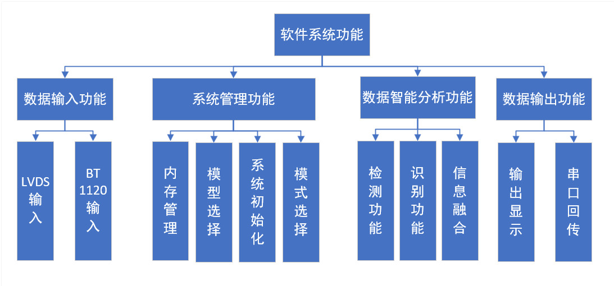
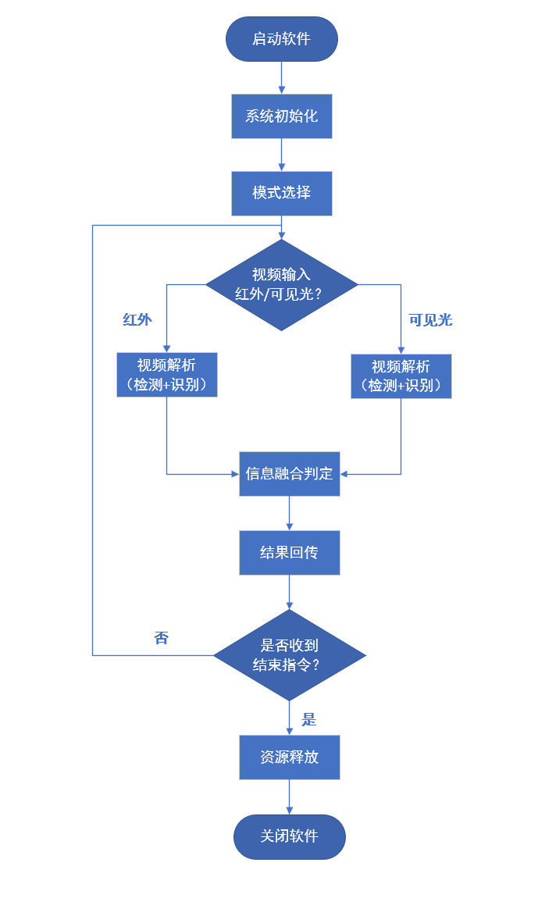
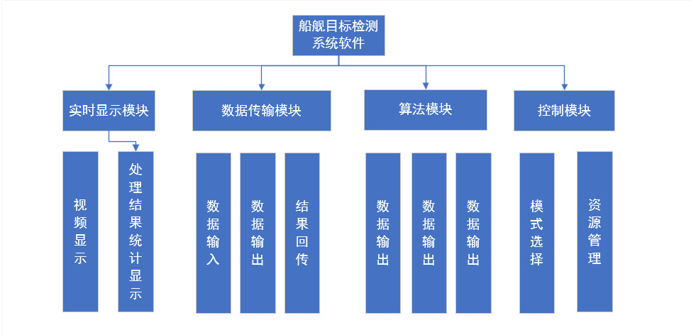
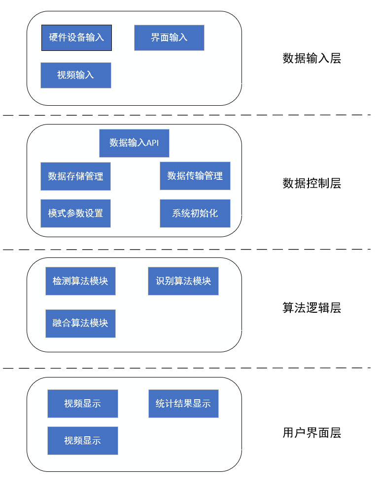

​	船检目标检测系统是基于赛灵思FPGA和华为海思3559A核心板卡完成图像处理任务，完成目标检测算法的嵌入式部署实现。海思侧主要负责嵌入式算法的部署实现，配套的软件完成数据流输入-处理-输出整个过程，在此基础上，依照下面的设计完成整个系统软件的设计.

## 一 总体框架

### 1 系统组成

​	整个舰船目标检测系统硬件上由FPGA+华为Hi3559A组成，海思一侧的系统由视频输入DEV（FPGA模拟sensor\AD），船舰目标检测软件系统，Hi3559A智能平台，显示传输设备四个部分组成。

- 视频输入DEV：模拟sensor\AD输入，将图像数据以LVDS或者BT1120发送给海思这一侧
- 船舰目标检测软件系统：负责目标检测算法的部署，内存分配，数据流控制，程序执行流程控制的终端软件
- Hi3559A智能平台：硬件层面完成数据流的传输，目标检测等任务
- 显示存储设备：负责处理检测算法的检测结果，包括显示、结果回传等任务

### 2 数据传输方式

​	船舰目标检测软件系统来控制整个数据流的流通，包括为其分配内存，接受输入，送图像数据去处理，输出处理结果。

- 视频输入DEV与船舰目标检测软件系统

    视频输入DEV通过LVDS或者BT1120将图像数据发送给船舰目标检测软件系统的缓存区，LVDS通过选择16对不同的差分线（Lane）来输入给Hi3559A，BT1120采用cmos0接入视频
    
- 船舰目标检测软件系统与显示传输设备通信

    船舰目标检测软件系统将保存在缓存区的处理结果送入显示，或者将结果回传给FPGA，通过HDMI输出至显示屏，或者通过串口将处理结果回传给FPGA

### 3 系统软件需求分析

​	目标检测软件系统的主要功能是对FPGA侧传输过来的图像/视频流进行船舰目标检测，并给出船舰的种类，方位等信息。除此之外，为了配合Hi3559A硬件平台的功能实现，软件系统需要与视频输入DEV进行通信，接收视频输入DEV传输过来的图像数据，并用不同的算法模型来对图像进行检测识别。软件系统还需要不同的工作模式，对于红外和可见光两种场景下的识别结果进行融合判定。综上所述，软件系统需要实现的功能有数据输入功能，数据结果输出功能，系统管理（内存分配、管理，算法模型选择）功能，数据智能分析功能（检测功能、识别功能、信息融合功能）。整体功能如下图所示：

​	软件系统各功能具体描述如下：

1. 数据输入功能：采用BT1120和LVDS两个协议来传输数据，对速率有高要求的推荐使用LVDS
2. 系统管理功能
    - 内存管理：整个软件系统的数据都保存在一个公共的缓存区当中，具体可划分为为输入缓存、处理缓存、输出缓存，针对不同的进程分配不同的存储空间，合理的分配和管理这些内存区域，使得程序正常运行。
    - 模型选择：针对于不同的算法模型，选择加载不同的离线模型，进行不同的检测识别任务
    - 系统初始化：当系统启动的时候需要进行一些初始化的工作，相关驱动的加载，设备的挂载，相关设备使能等初始化操作
    - 模式选择：针对于海思软件框架可选择不同的模式，例如在线、离线模式，红外、可见光检测识别模式选择==这个功能是否和模型选择合并==
3. 数据智能分析功能
    - 检测功能：运行检测网络，对船舰目标进行检测
    - 识别功能：运行识别网络，对船舰目标进行分类
    - 信息融合：在对可见光和红外图像进行目标检测之后结果，需要进行融合判定，对比两者的指标来最终对船舰目标进行检测识别结果输出
4. 数据输出功能
    - 输出显示：将标记之后的结果图像通过HDMI或者BT1120输出到显示屏显示，作为测试展示使用
    - 串口回传：将目标检测的结果图像，船舰目标数量、种类、方位等信息回传给FPGA，再由FPGA作进一步的处理

### 4 软件工作流程

​	船舰目标检测软件系统主要负责对输入的图像数据完成目标检测识别的任务，并将处理结果显示或者回传给FPGA，整个软件流程包括了初始化，模式选择，视频输入，视频解析，信息融合，结果回传等。

​	软件工作过程如下：

1. 启动软件；
2. 系统初始化，加载驱动，资源初始化等；
3. 选择模式，输入模型，算法模型，工作状态等；
4. 视频数据输入，分可见光和红外两种；
5. 视频智能机解析，包含检测和识别；
6. 对于可见光和红外图像的处理结果进行融合统一判定；
7. 结果显示或者结果回传；
8. 收到技术指令，转到9，未收到结束指令，转到4；
9. 资源释放，关闭软件。

### 5 系统软件框架设计

- 软件分模块设计

    根据软件工作原理和软件功能对软件系统进行模块划分，形成显示模块，数据传输模块，算法模块，控制模块4个模块，具体功能模块功能如下图所示：

    

    

- 软件分层设计

    整个软件系统初步划分为数据输入层，数据控制层，算法逻辑层，用户界面层四个层

