## 一 LVDS硬件特性

### 1.1 相关概念

- **Lane**：用于连接发送端和接收端的一堆告诉差分线，既可以是时钟 Lane，也可以是数据 Lane 

- **Link**：发送端和接收端之间的时钟Lane 和至少一个数据Lane 组成一个Link，本文中的 link 是一个软件概念，每一个link 包括两个数据lane。

- **LVDS**

>低压差分信号，低功耗、低误码率、低串扰和低辐射的差分信号技术，核心是采用极低的电压摆幅告诉差动传输数据，可实现点对点或点对多的连接。
>
>LVDS的基本工作原理如图 1-1所示，其源端驱动器由一个恒流源（通常约为3.5mA，最大不超过4mA）驱动一对差分信号线组成。接收端的接收器本身为高直流输入阻抗，所以几乎全部的驱动电流都流经**100Ω**的终端匹配电阻，并在接收器输入端产生约350mV的电压。当源端驱动状态反转变化时，流经匹配电阻的电流方向改变，于是在接收端产生高低逻辑状态的变化。
>
>
>
>​											                                         **图 1-1 LVDS基本工作原理**
>
>特点：
>
>- 高传输能力，理论极限 1.9Gbps
>- 低功耗特性，LVDS器件采用CMOS工艺实现
>- 供电电压低
>- 较强的抗噪声能力，差分信号固有的优点就是噪声以共模的方式在一对差分线上耦合出现，并在接收器中相减，从而可消除噪声，所以LVDS具有较强的抗共模噪声能力
>- 有效地抑制电磁干扰
>- 时序定位精确

### 1.2 MIPI/LVDS电气参数

Sub-LVDS/LVDS 差分 DC 电气参数如图 1-2 所示.（《Hi3559A╱C V100 ultra-HD Mobile Camera SoC 用户指南-2-25》）

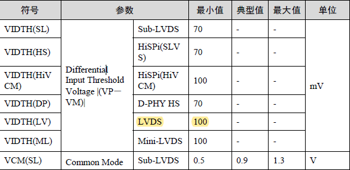

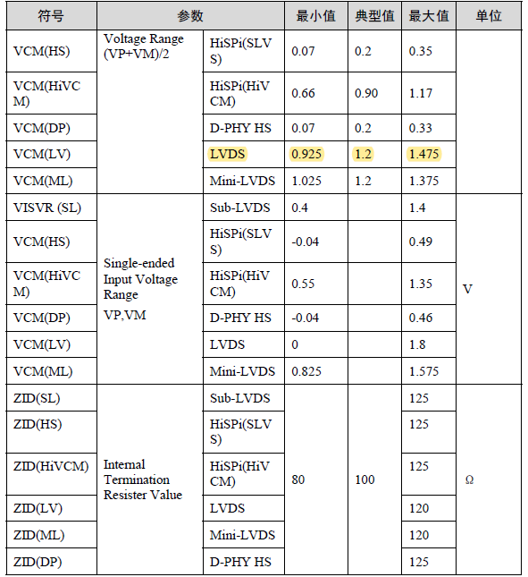

​																				                   **图 1-2 差分 DC 参数**

MIPI Rx支持的接口类型如表 1-1 所示：（《Hi3559A╱C V100 ultra-HD Mobile Camera SoC 用户指南-10-247》）

| Interface Type                 | Common mode voltage | Differential mode voltage | Maximum clock frequency | Maximum data rate per lane |
| ------------------------------ | ------------------- | ------------------------- | ----------------------- | -------------------------- |
| MIPI D-PHY                     | 200mV               | 200mV                     | 1250MHz                 | 2.5Gbps                    |
| sub-LVDS                       | 900mV               | 150mV                     | 750MHz                  | 1.5Gbps                    |
| LVDS                           | 1.25V               | 350mV                     | 750MHz                  | 1.5Gbps                    |
| HiSPi(HiVCM)               | 900mV               | 280mV                     | 750MHz                  | 1.5Gbps                    |
| HiSPi(SLVS)                    | 200mV               | 200mV                     | 750MHz                  | 1.5Gbps                    |

由上图可知 LVDS 共模电压为**典型值 1.25 V**，提供最小摆幅 100mV，**差模电压350mV**，在接收器的输入端连接有一个 100Ω 的电阻

### 1.3 接口时序

#### 1.3.1 VI 接口时序

VI 接口 CMOS 模式时序如图 1-3 所示。（Hi3559A╱C V100 ultra-HD Mobile Camera SoC 用户指南-2-46）

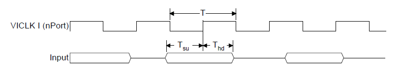

​																					**图 1 -3 VI CMOS 模式时序**

VI 接口时序参数如表 1-1 所示

​																						**表 1-2 VI 接口时序参数**

| 参数                 |      符号      | 最小值 | 典型值 | 最大值 | 单位 |
| -------------------- | :------------: | :----: | :----: | :----: | :--: |
| VICLK时钟周期        |       T        |  6.73  |   -    |   -    |  ns  |
| 输入信号建立时间要求 | Tsu |  1.9   |   -    |   -    |  ns  |
| 输入信号保持时间要求 | Thd |  0.8   |   -    |   -    |  ns  |

#### 1.3.2 MIPI Rx接口时序

MIPI Rx 接口时钟时序如图 1-4 所示：（《Hi3559A╱C V100 ultra-HD Mobile Camera SoC 用户指南-2-53》）

​																						**图 1-4 MIPI Rx 接口时钟时序**

图中的 Tskew 包括 Tdynamic_skew 和 Tstatic_skew

MIPI Rx 时序参数如表 1-2 所示：

​																						    **表 1-3 MIPI Rx 时序参数**

| 符号                     | 参数                                                         |                            最小值                            | 典型值 | 最大值 | 单位 |
| :----------------------- | :----------------------------------------------------------- | :----------------------------------------------------------: | :----: | :----: | :--: |
| FMAX                     | 数据率                                                       |                              -                               |   -    |  2.5G  | bps  |
| Tclk          | 差分时钟周期                                                 |                             0.8                              |   T    |   -    |  ns  |
| Tstatic_skew  | 静态skew时间（1.5Gbps<datarate<=2.5Gbps）                    |                            0.2*UI                            |   -    |   -    |  ns  |
| Tdynamic_skew | 动态skew时间    （Tsetup+Thold）  （1.5Gbps<datarate<=2.5Gbps） |                            0.2*UI                            |   -    |   -    |  ns  |
| Tsetup        | 差分时钟建立时间                                             | 0.15*UI（80Mbps<datarate<=1.0Gbps）0.2*UI（1.0Gbps<datarate<=1.5Gbps） |   -    |   -    |  ns  |
| Thold         | 差分始终保持时间                                             | 0.15*UI（80Mbps<datarate<=1.0Gbps）  0.2*UI（1.0Gbps<datarate<=1.5Gbps） |   -    |   -    |  ns  |

注：UI = T/2

### 1.4 硬件管脚连接

对于目标板，FPGA与海思的硬件连接关系如图 1-5 。（《17所目标板原理图-MPSoC_HiSilicon_board Sheet Zynq_B64_B65_B66 HP》)

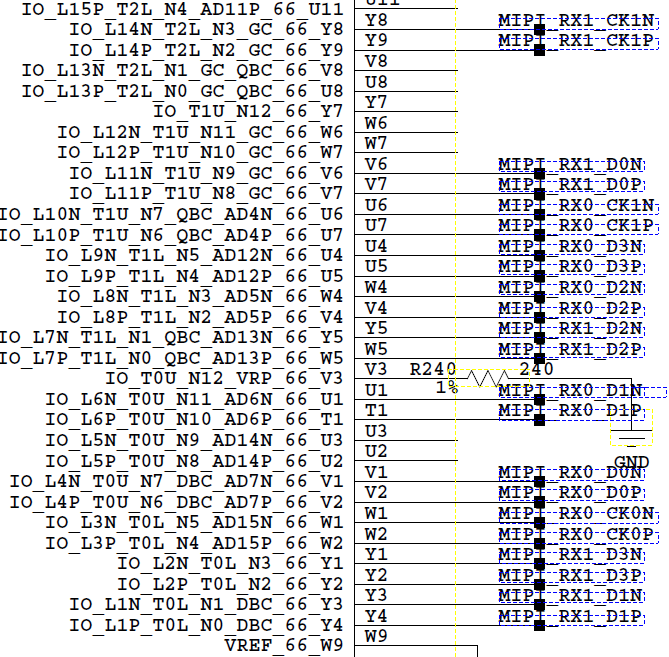

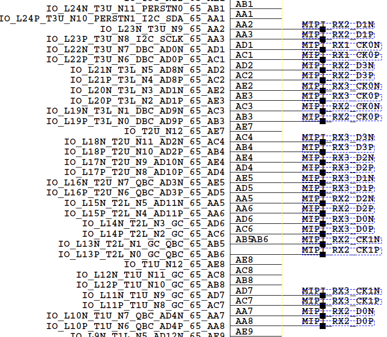

​																	**图 1-5  目标板 FPGA 与 海思的硬件连接**

海思侧的MIPI Rx 管脚定义如图 1-6 所示，以 4*4lane 为例介绍，详细配置参照《Hi3559A╱C V100 Sensor输入接口电平场景详细说明》

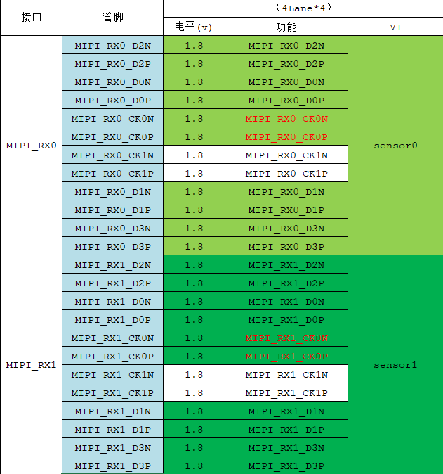

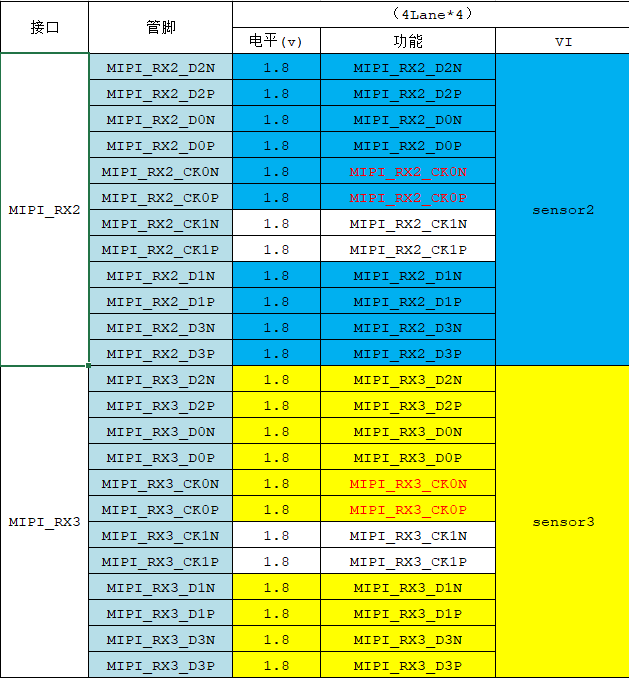

​																			**图 1-6 4lane 模式下的 MIPI Rx 管脚分配**

Hi3559AV100 的 MIPI Rx 最大支持 8Lane MIPI 输入或者 **16 Lane LVDS 输入**，MIPI Rx 能同时对接多个设备（sensor），Hi3559AV100 最多对接的设备数（sensor数）为 **8** 个。

MIPI Rx 最大能同时对接不同数量的设备 sensor，每个 sensor 需要的 Lane 数量也不同，因此需要用户确定 MIPI Rx 的 Lane 分布模式，具体的 Lane 分布模式如表 1-3 所示：

​																				        **表 1-3 MIPI Rx Lane 分布模式**

注：依据来自《MIPI使用指南-5》

采用 4Lane 分布模式情况下，对应于 图 1-6 的管脚分配。

首先将 MIPI Rx 分为 MIPI RX0、MIPI RX1、MIPI RX2、MIPI RX3 四个组，每个组中具有 4 Lane数据线和 2 Lane 时钟线。

MIPI_RX0_CK0P、MIPI_RX0_CK0N表示差分时钟周期管脚所在位置，MIPI_RX0_D0P、MIPI_RX0_D0N即表示第一对差分线，也就是Lane0；MIPI_RX0_D1P、MIPI_RX0_D1N即表示第二对差分线，也就是Lane1；依次类推，总共有 16 Lane，编号依次是L0、L1、L2、L3、L4、L5、L6、L7、L8、L9、L10、L11、L12、L13、L14、L15。

采用 4 Lane*4的模式，与 FPGA 的连接关系如表 1-4 所示：

​											             	**表 1-4 Hi3559AV100与FPGA连接关系举例（4Lane*4模式）**

| FPGA内部管脚                 | 外部接口引脚名 |  Hi3559AV100  |   Lane   |
| :--------------------------- | :------------: | :-----------: | :------: |
| IO_L3P_T0L_N4_AD15P_66_W2    |       W2       | MIPI_RX0_CK0P | 差分时钟 |
| IO_L3N_T0L_N5_AD15N_66_W1    |       W1       | MIPI_RX0_CK0N | 差分时钟 |
| IO_L4P_T0U_N6_DBC_AD7P_66_V2 |       V2       | MIPI_RX0_D0P  |  Lane0   |
| IO_L4N_T0U_N7_DBC_AD7N_66_V1 |       V1       | MIPI_RX0_D0N  |  Lane0   |
| IO_L6P_T0U_N10_AD6P_66_T1    |       T1       | MIPI_RX0_D1P  |  Lane1   |
| IO_L6N_T0U_N11_AD6N_66_U1    |       U1       | MIPI_RX0_D1N  |  Lane1   |
| IO_L8P_T1L_N2_AD5P_66_V4     |       V4       | MIPI_RX0_D2P  |  Lane2   |
| IO_L8N_T1L_N3_AD5N_66_W4     |       W4       | MIPI_RX0_D2N  |  Lane2   |
| IO_L9P_T1L_N4_AD12P_66_U5    |       U5       | MIPI_RX0_D3P  |  Lane3   |
| IO_L9N_T1L_N5_AD12N_66_U4    |       U4       | MIPI_RX0_D3N  |  Lane3   |

## 二 MIPI Rx 介绍

依据《Hi3559A╱C V100 ultra-HD Mobile Camera SoC 用户指南-10-244》

### 2.1 概述

MIPI Rx（移动行业处理器接口）通过低电压差分信号接受原始视频数据（BAYER RGB数据），并将其转化为 DC 时序后传递给下一级模块 VICAP。MIPI Rx包含combo-PHY和Controller两部分，功能框图及在系统中的位置如图 2-1 所示。

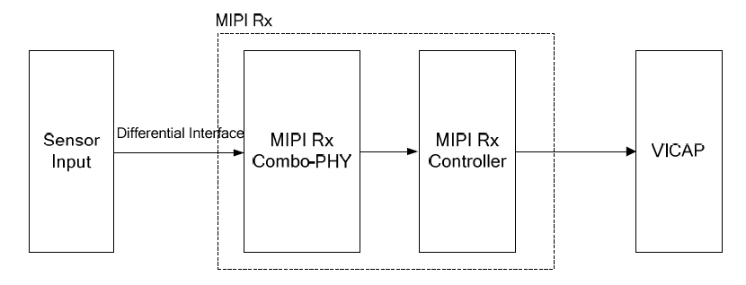

​																						**图 2-1 MIPI Rx 功能框图和在系统中的位置**

>一些概念的说明：
>
>- Lane指差分数据对，MIPI_Rx最多有16 条Lane
>- Link 指Lane的分组，每个分组中包含4对数据，MIPI_Rx有4 个Link
>- **通道指 MIPI_Rx内部的数据处理通道，对应连接到VICAP 通道，每个通道单独处理一个Sensor的数据**

MIPI Rx 的特点：

- 可同时支持8路sensor输入
- 单路最多支持8-Lane MIPI D-PHY 接口，最大支持2.5Gbps/Lane
- ==**单路最多支持16-Lane LVDS/ sub-LVDS /HiSPi 接口，最大支持1.5Gbps/Lane**==
- 支持RAW8/ RAW10/ RAW12/ RAW14/ RAW16 数据类型的解析
- 支持YUV420 8-bit/ YUV420 10-bit/ YUV422 8-bit/ YUV422 10-bit/Legacy YUV4208-bit数据类型的解析
- 支持 LVDS/HiSPi模式像素/同步码大小端配置
- **==通道 0支持一拍双像素输出==**

### 2.2 功能描述

MIPI Rx包括4 个D-PHY，每个PHY 各自有两对差分随路时钟（CLK0/CLK1），每对时钟对应2对数据。MIPI Rx 对接场景分类如图 2-2 所示。

​                      																			**图 2-2 MIPI Rx 对接场景分类**

MIPI Rx只完成接口的时序转换，不处理图像的数据格式。Combo-PHY 支持的**最大速率为2.5Gbps/Lane**，总共支持16 Lane 同时传输。对于 MIPI Rx 控制器的来说，**通道的最大工作时钟为600MHz**，所以内部最大处理速度 600M*2pixels/s。

### 2.3 LVDS 接口数据格式

电压差分信号通过同步码区分消隐区和有效区的数据。

MIPI Rx 的 **combo-PHY 将差分串行数据转换为并行数据**，**MIPI Rx控制器把并行数据拆分、拼接，然后提取同步码、解析出像素数据。**

在 LVDS 的传输模式中，行场同步信号集成在数据流中，数据流中的特殊码型 **SOF 和 EOF 分别表示帧的起始和结束，SOL 和 EOL 分别表示行的起始和结束**。

SOF/EOF/SOL/EOL由4 个字段构成，**每个字段的位宽与像素数据保持一致**；根据**第4个字段来区分帧/行的起始或结束**，LVDS 同步码格式如图 2-3 所示：

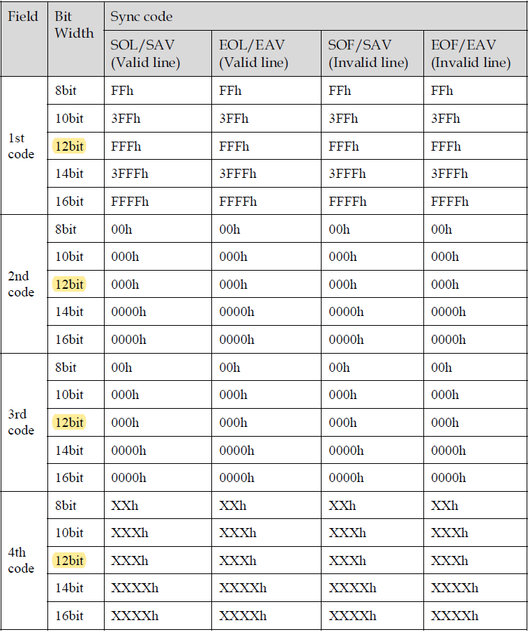

​																	         			**图 2-3 LVDS 同步码格式**																														

​	同步码前三个字段固定，第4个字段标识行场的起始或结束。第4个字段的值由图像传感器厂商确定，我们采用文档中的格式，如图 2-4 所示：

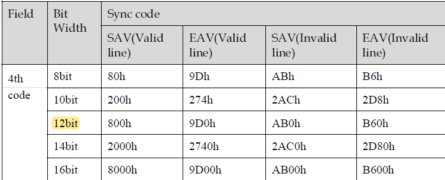

​																			        **图 2-4 LVDS 同步码的第四个字段格式**											

**注意：每个字段的数据位宽与像素数据保持一致**

以 4Lane 为例，LVDS 同步码和像素数据在各个 Lane 上传输方式如图 2-5 所示，H 表示同步码，P 表示像素，H 和 P 的位宽与图像传感器输出的单个像素的位宽一致。各个数据通道首先传输 4 个像素位宽的同步码，紧接着是像素数据，像素数据的分布与通道数有关。

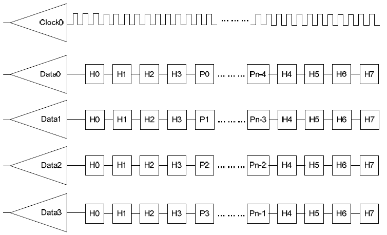

​																				       **图 2-5 LVDS 同步码和图像传输模式**

同步码和像素数据的传输是串行的，MIPI Rx支持数据的大小端可配置。以 RAW12、大端模式为例，图像传感器输出单个像素点的时序如图 2-6 所示。

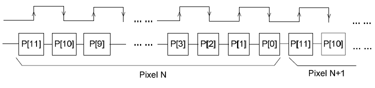

​																						 **图 2-6 LVDS 单个像素点时序**

### 2.4 LVDS接口线性模式

LVDS 有两种同步方式，一种使用 SAV（Invalid）和EAV（Invalid）标识消隐区的无效数据，使用SAV（Valid)和  EAV（Valid）标识有效像素区。同步方式如图 2-7 所示。

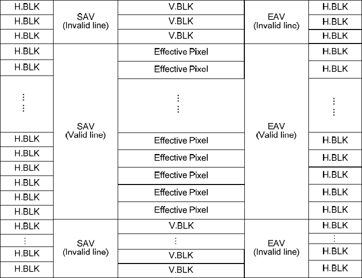                                                                                                                                                                                                                                                                                                                                                                                                                                                                                                                                                                                                                                                                                                                                                                                                                                                                                                                                                                                                                                                                                                                                                                                                                                                                                                                                                                                                                                                                                                                                                                                                                                                                                                                                                                                                                                                                                                                                                                                                                                                                                                                                                                                                                                                                                                                                                                                                                                                                                                                                                                                                                                                                                                                                                                                                                                                                                                                                                                                                                                  

​																								**图 2-7 LVDS 同步方式（SAV-EAV）**

### 2.5 LVDS模式配置流程

LVDS/HiSPi模式下需要配置RAW DATA 类型、数据大小端、同步方式、WDR类型和图像宽高等寄存器。LVDS 模式依靠同步码识别帧/行同步信息，根据RAW DATA 类型的不同，同步码可以为8/10/12/14/16-bit

- 步骤 1. 上电启动。
- 步骤 2. 根据使用场景将MISC_CTRL130 寄存器中相应通道的mipi_work_mode配置为LVDS模式。
- 步骤 3. 配置CRG寄存器中的PERI_CRG61，打开mipi_bus_clken、mipi_cil_clken 以及对应通道的mipi_pix_clken。配置mipi总线软复位，撤销复位；配置对应通道pix_core复位，撤销复位。
- 步骤 4. 配置CRG寄存器中的PERI_CRG69，配置sensor复位，撤销复位；打开sensor时钟门控，并配置时钟频率。
- 步骤 5. 配置CRG寄存器中的PERI_CRG60，选择MIP_Rx通道时钟频率。
- 步骤 6. 配置接收数据类型、WDR模式，图像宽高（==**LVDS模式下，配置的宽度是图像实际宽度除以Lane数-1**==）、同步头、Lane ID 等信息。
- 步骤 7. 配置PHY的工作模式（PHY_MODE_LINK*）、PHY 通道延迟调节（PHY_SKEW_LINK * ）、PHY通道使能（PHY_EN_LINK * ）、PHY均衡调节（PHY_EQ_LINK * ）、PHY 性能调节（PHY_CFG_LINK * ）；配置LVDS模式Lane同步头信息（PHY_SYNC_CODE * _LINK * ）。
- 步骤 8. 配置系统控制寄存器。场景模式选择（HS_MODE_SELECT）、PHY_EN、LANE_EN，打开PHY_CIL_CTRL、选择PHYCFG_MODE（对于LVDS 模式，应选择1）。
- 步骤 9. 配置对应的PHYCFG_EN。
- 步骤 10. 配置sensor序列。

**注意：统一采用单沿采样**，Hi3559AV100 侧需要软件层次的配置。

### 2.6 MIPI 使用指南

依据《MIPI使用指南-3》

MIPI Rx 是一个支持多种差分视频输入接口的采集单元，==**通过combo-PHY 接收MIPI/LVDS/sub-LVDS/HiSPi/DC 接口的数据**==，通过不同的功能模式配置，MIPI Rx 可以支持多种速度和分辨率的数据传输需求，支持多种外部输入设备。最大支持Lane 个数如表 2-1 所示。

​													                    		**表 2-1 最大支持的 Lane 数**

| 芯片类型    | 最大支持 lane 数                                    |
| ----------- | --------------------------------------------------- |
| Hi3559AV100 | MIPI Rx 最大支持8Lane MIPI 输入或16Lane LVDS 输入。 |

Hi3559AV100 最大能对接 8 个sensor，MIPI Rx 最大能同时对接不同数量的 sensor，每个 sensor 需要的 Lane 也不尽相同，需要自己定义 LANE 分布模式，具体的分布模式如图 2-8 所示。

​																	          	**图 2-8 MIPI Rx 的 Lane 分布模式**

​    **注意：我们采用 4lane*4 的分布模式，即模式 7**

**Lane id 的配置**

Lane id 的配置对应`mipi_dev_attr_t` 中的`short lane_id[MIPI_LANE_NUM]`，其中 lane_id 数组的索引号表示的是 sensor 的 Lane ID，lane_id 数组的值表示的是 MIPI Rx 的 LANE ID。

对接 sensor 时，未使用的 lane 将其对应的 lane_id 设置为 0。**根据硬件单板与实际sensor 输出通道的对应关系调整lane_id 的配**
**置。**下面将举例进行说明。sensor 与 MIPI Rx 的硬件连接关系如表 2-2 所示。

​																				**表 2-2 sensor 与 MIPI Rx管脚关系**

| MIPI Rx 管脚 | sensor 管脚 |
| ------------ | ----------- |
| MIPI_RX1_D0  | Lane 0      |
| MIPI_RX1_D1  | Lane 1      |
| MIPI_RX1_D2  | Lane 2      |
| MIPI_RX1_D3  | Lane 3      |

MIPI 的最大Lane 数为8，我们认为SENSOR 的Lane 数目最多8 个，由于sensor 实际只有4 个Lane，只输出数据到MIPI 的4 个Lane，需要将SENSOR 未连接的或者不存在的Lane 的lane_id 配置为-1，所以所以lane_id 配置如图 2-9 所示。

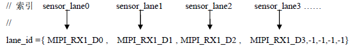

所以最终的 `lane_id = {4, 5, 6, 7, -1, -1, -1, -1}`

## 三 视频输入

视频输入（VI）模块实现的功能：**通过MIPI Rx**(含MIPI接口、LVDS接口和HISPI接口)，SLVS-EC，BT.1120，BT.656，BT.601，DC等接口接收视频数据。VI将接收到的数据存入到指定的内存区域，在此过程中，VI可以对接收到的原始视频图像数据进行处理，实现视频数据的采集。

### 3.1 功能描述

VI 在软件层次划分为 4 个部分，如图 3-1 所示。

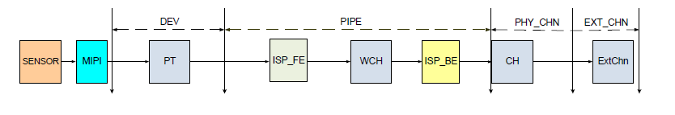

​																					**图 3-1 VI的软件层次划分**																					

VI从软件上划分了输入设备（DEV），输入PIPE(图示为物理PIPE，虚拟PIPE 只包含ISP_BE)、物理通道（PHY_CHN）、扩展通道（EXT_CHN）四个层级。Hi3559AV100 的设备、PIPE、通道个数如表 3-1 所示。

​																					**表 3-1 Hi3559AV100 的设备/PIPE/通道的个数**

| 芯片        | DEV  | PHY_PIPE | VIR_PIPE | PHY_CHN | EXT_CHN |
| ----------- | ---- | -------- | -------- | ------- | ------- |
| Hi3559AV100 | 8    | 8        | 2        | 1       | 8       |

>理解：
>
>- VI 包含 MIPI Rx 在内
>- MIPI Rx通过不同的分布模式，对接不同的sensor，通过内部的通道对接不同的 VI CAP，也就是对接 VI 在软件层次上面的 DEV ，DEV 通过绑定关系与 PIPE 绑定，来传输数据。

Hi3559AV100 的 VI 通道功能框图如图 3-2 所示。

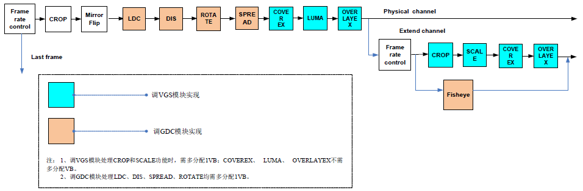

​																						**图 3-2 VI 通道功能框图**

- 视频输入设备：所有 VI 设备都是相互独立，支持时序解析

- 视频输入 PIPE：包含了 ISP 的相关处理功能，主要对图像数据进行流水线处理，输出 YUV 图像格式给通道

- 视频物理通道：Hi3559AV100 VI 只有一个物理通道，支持 8 个 扩展通道

- 视频扩展通道：扩展通道是物理通道的扩展，扩展通道具备缩放、裁剪、语言矫正等功能，通过绑定物理通道，将物理通道输出作为自己的输入，输出用户设置的目标图像

- 绑定关系：Hi3559AV100 的 DEV 与 MIPI 绑定关系是固定的，不能动态修改

- DEV 和 前端时序输入的接口有约束关系，。例如Hi3559AV100前端需要接入BT.1120，且选择了第0组BT.1120管脚，PIPE 应该和DEV5绑定，才能正常接收数据

- Hi3559AV100 DEV 和 MIPI/SLVS/BT.1120/BT.656/BT.601/DC接口的绑定关系如表 3-2 所示。

    ​									**表 3-2  DEV 和 MIPI/SLVS/BT.1120/BT.656/BT601/DC接口的绑定关系**

    | VI DEV | MIPI | SLVS | BT.1120/BT.656/BT.601 | DC   |
    | ------ | ---- | ---- | --------------------- | ---- |
    | 0      | 0    | 0    | x                     | x    |
    | 1      | 1    | x    | x                     | x    |
    | 2      | 2    | 1    | x                     | x    |
    | 3      | 3    | x    | 2                     | 2    |
    | 4      | 4    | 2    | x                     | x    |
    | 5      | 5    | x    | 0                     | 0    |
    | 6      | 6    | 3    | x                     | x    |
    | 7      | 7    | x    | 1                     | 1    |

    

**掩码配置**

掩码的高12bit对应着硬件线路的12个pin脚连接（D0到D15之间的任意连续12个pin 脚即可，例如D4～D15），用户需要根据实际连接情况设置恰当的掩码配置，掩码的最高比特位对应的pin为D15，例如10bit输入的Sensor连接的pin为D6~D15，掩码配置为0xFFC00000；同理如果是14bit输入时，对应的掩码配置为0xFFFC0000。

对应于代码中 `VI_DEV_ATTR_S LVDS_DEV_ATTR_IMX334_8M_BASE`，在这个结构体中修改有关掩码的配置。

- 1 路/2 路 5M 或 1080P 图像输入场景下（12 bit 输入）

    ​														**表 3-3 1 路/2 路 5M 或 1080P 图像输入场景下掩码配置**

    | 设备号 | 掩码 0     | 掩码 1 |
    | ------ | ---------- | ------ |
    | 0      | 0xFFF00000 | 0x0    |
    | 1      | 0xFFF00000 | 0x0    |

### 3.2 MIPI 数据流

- MIPI_Rx 通过Phy 接收sensor 的差分数据，Phy Controller 检测到同步头后，将每条lane 上的数据对齐；
- Pixel Controller 解析同步信息并按照raw data 的位宽将lane 上面的数据合并为Pixel 数据；Output 模式将Pixel 数据发送给后级模块。
- Phy PhyController PixelController 由sensor 的pixel clk 提供时钟，output 模块的时钟为称为随路时钟，与后级模块的工作时钟相同。MIPI_Rx 的crop 功能在Pixel Controller 的末端实现，所以Crop 后可以降低需要的随路时钟。

MIPI 数据流如图 3-3 所示。

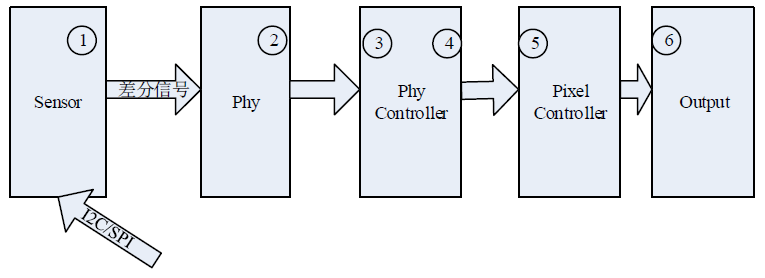

​															             **图 3-3 MIPI 的数据流**

### 3.3 VI模块

视频输入单元VI（Video Input），可以通过MIPI Rx（包含MIPI、LVDS、HiSPi、SLVS_EC）接口、BT.656/601、BT.1120接口和DC（Digital Camera）接收视频数据，存入指定的内存区域。VI内嵌ISP 图像处理单元，可以直接对接外部原始数据（BAYER RGB数据），VI的功能框图如图 3-4 所示。

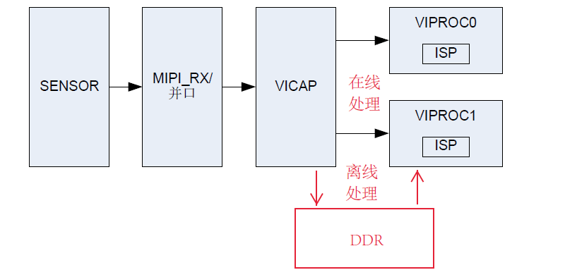

​												           		**图 3-4 VI 的功能框图**

VI分成两个物理子模块：捕获子模块VICAP 和处理子模块VIPROC 组成。其中：

- VICAP 完成多路视频输入的数据捕获功能，并将捕获的数据存放到DDR 或者在线送给VIPROC。VIPORC 用以支持离线模式（从DDR读取数据）或者在线模式（从VICAP 接收在线）视频数据处理。
- VIPROC有两个物理模块，可以同时支持两路数据处理或者在线双核模式并行处理一路数据。

**VICAP 的特点：**

- 输入最大分辨率为8192x8192。最大工作时钟600MHz。
- 最大支持八路sensor数据输入。（其中接口0支持MIPI_RX 的1 拍两像素模式输入）
- 输入支持最大数据位宽为14bit。
- 支持逐行输入模式。
- 数字接口支持BT.656、BT.601、BT.1120和DC。
    - 最大支持2路BT.1120或者2路BT.656输入（只有接口5和接口7支持）。
    - 输入时钟最高支持148.5Mhz。
    - 只支持单沿采样。不支持多路复合时序。
- 模拟接口支持MIPI、LVDS、HiSPi、SLVS-EC等时序。支持MIPI接口输入YUV422、YUV420 格式。
- 支持 flash trigger。
- 支持 shutter trigger。
- 支持 sensor主模式和从模式。
- 支持在线输出图像数据到VIPROC。
- 支持离线输出图像数据到DDR。
- 离线输出数据格式支持：
    - Semi-planar YCbCr 4:2:2模式
    - Semi-planar YCbCr 4:2:0模式
    - Semi-planar YCbCr 4:0:0模式
    - RAW 模式

**VIPROC特点：**

- 支持在线模式（数据来自VICAP 在线传输）。
- 支持离线模式处理（数据来自DDR）。
- 内嵌 ISP 处理功能。
- 支持 3DNR（三维去高斯噪声功能）。
- 支持通道CROP。
- 支持一个通道的视频输出。
- 支持输出图像数据到DDR。
- 输出数据格式支持：
    - Semi-planar YCbCr 4:2:2模式
    - Semi-planar YCbCr 4:2:0模式
    - Semi-planar YCbCr 4:0:0模式
    - RAW 模式